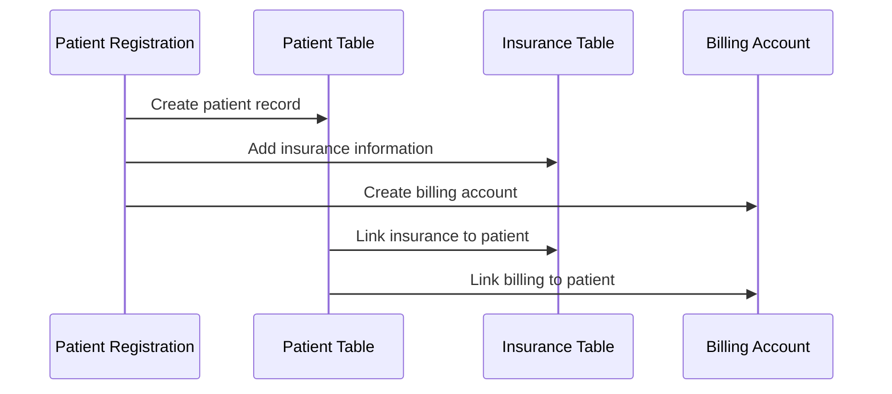
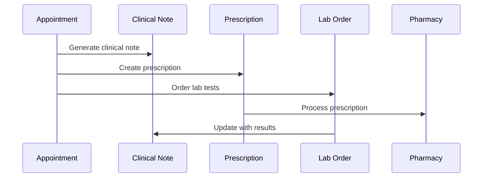
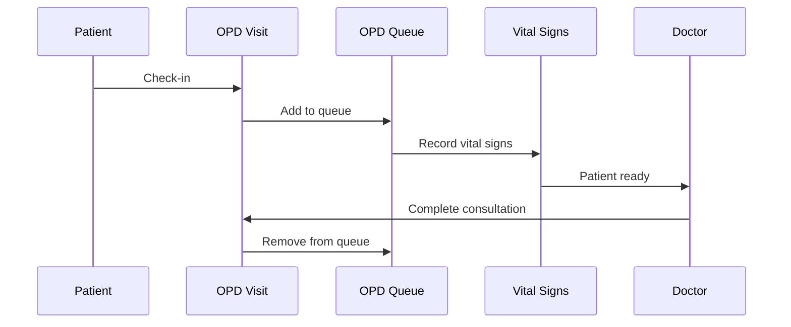
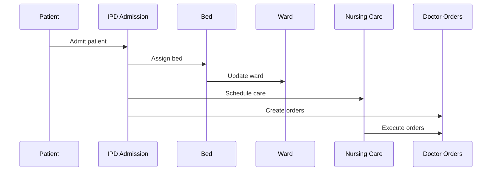
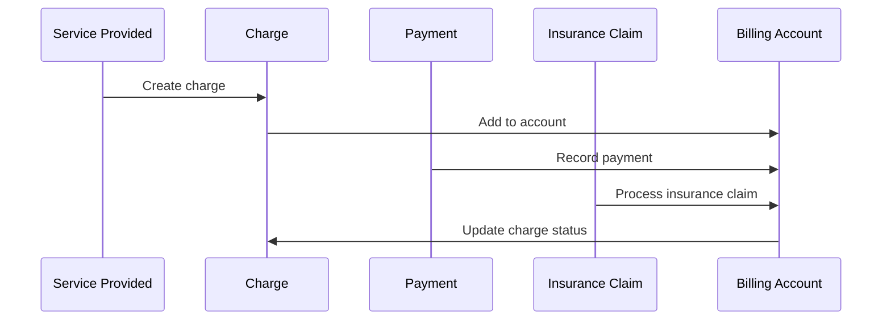

# Hospital Management System - Database Schema Overview

## Overview

This document provides a high-level overview of the database schema architecture for the Hospital Management System, showing the main modules and their interconnections.

**Database Technology**: MongoDB (NoSQL Document Database)
**ORM/ODM**: Mongoose
**Connection**: MongoDB Atlas or Local MongoDB Instance

## Database Schema Architecture

```mermaid
graph TB
    subgraph "Core Patient Management"
        PATIENT[Patient]
        INSURANCE[Patient Insurance]
        BILLING[Billing Account]
    end

    subgraph "Staff Management"
        STAFF[Staff]
        DOCTOR[Doctor]
        NURSE[Nurse]
        SCHEDULE[Schedule]
    end

    subgraph "Clinical Operations"
        APPOINTMENT[Appointment]
        CLINICAL_NOTE[Clinical Note]
        PRESCRIPTION[Prescription]
        MEDICATION[Medication]
    end

    subgraph "OPD Management"
        OPD_VISIT[OPD Visit]
        OPD_QUEUE[OPD Queue]
        VITAL_SIGNS[Vital Signs]
    end

    subgraph "IPD Management"
        IPD_ADMISSION[IPD Admission]
        BED[Bed]
        WARD[Ward]
        NURSING_CARE[Nursing Care]
        DOCTOR_ORDERS[Doctor Orders]
        PATIENT_TRANSFER[Patient Transfer]
    end

    subgraph "Laboratory Management"
        LAB_ORDER[Lab Order]
        LAB_SAMPLE[Lab Sample]
        LAB_RESULT[Lab Result]
    end

    subgraph "Pharmacy Management"
        DRUG_MASTER[Drug Master]
        PHARMACY_INVENTORY[Pharmacy Inventory]
        PHARMACY_DISPENSE[Pharmacy Dispense]
    end

    subgraph "Billing & Finance"
        CHARGE[Charge]
        PAYMENT[Payment]
        INSURANCE_CLAIM[Insurance Claim]
    end

    subgraph "Inventory Management"
        INVENTORY_ITEM[Inventory Item]
        INVENTORY_STOCK[Inventory Stock]
    end

    subgraph "Radiology & Imaging"
        RADIOLOGY_ORDER[Radiology Order]
        RADIOLOGY_STUDY[Radiology Study]
        RADIOLOGY_REPORT[Radiology Report]
    end

    subgraph "Operation Theatre"
        OT_SCHEDULE[OT Schedule]
        SURGICAL_PROCEDURE[Surgical Procedure]
    end

    subgraph "Emergency Management"
        EMERGENCY_VISIT[Emergency Visit]
    end

    %% Core Relationships
    PATIENT --> INSURANCE
    PATIENT --> BILLING
    PATIENT --> APPOINTMENT
    PATIENT --> CLINICAL_NOTE
    PATIENT --> PRESCRIPTION
    PATIENT --> MEDICATION
    PATIENT --> LAB_ORDER
    PATIENT --> RADIOLOGY_ORDER
    PATIENT --> OT_SCHEDULE
    PATIENT --> EMERGENCY_VISIT
    PATIENT --> OPD_VISIT
    PATIENT --> VITAL_SIGNS
    PATIENT --> IPD_ADMISSION
    PATIENT --> NURSING_CARE
    PATIENT --> DOCTOR_ORDERS
    PATIENT --> PATIENT_TRANSFER

    %% Staff Relationships
    STAFF --> DOCTOR
    STAFF --> NURSE
    STAFF --> SCHEDULE
    DOCTOR --> APPOINTMENT
    DOCTOR --> CLINICAL_NOTE
    DOCTOR --> PRESCRIPTION
    DOCTOR --> LAB_ORDER
    DOCTOR --> RADIOLOGY_ORDER
    DOCTOR --> OT_SCHEDULE

    %% Clinical Workflow
    APPOINTMENT --> CLINICAL_NOTE
    APPOINTMENT --> PRESCRIPTION
    APPOINTMENT --> LAB_ORDER
    APPOINTMENT --> RADIOLOGY_ORDER
    PRESCRIPTION --> MEDICATION
    PRESCRIPTION --> PHARMACY_DISPENSE

    %% Laboratory Workflow
    LAB_ORDER --> LAB_SAMPLE
    LAB_SAMPLE --> LAB_RESULT
    LAB_ORDER --> LAB_RESULT

    %% Pharmacy Workflow
    DRUG_MASTER --> PHARMACY_INVENTORY
    DRUG_MASTER --> PHARMACY_DISPENSE
    PHARMACY_INVENTORY --> PHARMACY_DISPENSE

    %% Billing Workflow
    BILLING --> CHARGE
    BILLING --> PAYMENT
    BILLING --> INSURANCE_CLAIM
    INSURANCE --> INSURANCE_CLAIM

    %% Inventory Workflow
    INVENTORY_ITEM --> INVENTORY_STOCK

    %% Radiology Workflow
    RADIOLOGY_ORDER --> RADIOLOGY_STUDY
    RADIOLOGY_STUDY --> RADIOLOGY_REPORT

    %% Operation Theatre Workflow
    OT_SCHEDULE --> SURGICAL_PROCEDURE

    %% OPD Workflow
    OPD_VISIT --> OPD_QUEUE
    OPD_VISIT --> VITAL_SIGNS
    DOCTOR --> OPD_VISIT
    DOCTOR --> OPD_QUEUE

    %% IPD Workflow
    IPD_ADMISSION --> NURSING_CARE
    IPD_ADMISSION --> DOCTOR_ORDERS
    IPD_ADMISSION --> PATIENT_TRANSFER
    BED --> IPD_ADMISSION
    WARD --> BED
    WARD --> IPD_ADMISSION
    NURSE --> NURSING_CARE
    DOCTOR --> DOCTOR_ORDERS
    DOCTOR --> IPD_ADMISSION

    %% Styling
    classDef coreModule fill:#e1f5fe,stroke:#01579b,stroke-width:2px
    classDef clinicalModule fill:#f3e5f5,stroke:#4a148c,stroke-width:2px
    classDef labModule fill:#e8f5e8,stroke:#1b5e20,stroke-width:2px
    classDef pharmacyModule fill:#fff3e0,stroke:#e65100,stroke-width:2px
    classDef billingModule fill:#fce4ec,stroke:#880e4f,stroke-width:2px
    classDef inventoryModule fill:#f1f8e9,stroke:#33691e,stroke-width:2px
    classDef radiologyModule fill:#e0f2f1,stroke:#004d40,stroke-width:2px
    classDef otModule fill:#f9fbe7,stroke:#827717,stroke-width:2px
    classDef emergencyModule fill:#ffebee,stroke:#b71c1c,stroke-width:2px
    classDef opdModule fill:#e3f2fd,stroke:#0277bd,stroke-width:2px
    classDef ipdModule fill:#f1f8e9,stroke:#388e3c,stroke-width:2px

    class PATIENT,INSURANCE,BILLING,STAFF,DOCTOR,NURSE,SCHEDULE coreModule
    class APPOINTMENT,CLINICAL_NOTE,PRESCRIPTION,MEDICATION clinicalModule
    class OPD_VISIT,OPD_QUEUE,VITAL_SIGNS opdModule
    class IPD_ADMISSION,BED,WARD,NURSING_CARE,DOCTOR_ORDERS,PATIENT_TRANSFER ipdModule
    class LAB_ORDER,LAB_SAMPLE,LAB_RESULT labModule
    class DRUG_MASTER,PHARMACY_INVENTORY,PHARMACY_DISPENSE pharmacyModule
    class CHARGE,PAYMENT,INSURANCE_CLAIM billingModule
    class INVENTORY_ITEM,INVENTORY_STOCK inventoryModule
    class RADIOLOGY_ORDER,RADIOLOGY_STUDY,RADIOLOGY_REPORT radiologyModule
    class OT_SCHEDULE,SURGICAL_PROCEDURE otModule
    class EMERGENCY_VISIT emergencyModule
```

## Module Dependencies and Data Flow

### 1. Patient Registration Flow

### 2. Clinical Workflow Data Flow

### 3. OPD Workflow Data Flow

### 4. IPD Workflow Data Flow

### 5. Billing and Revenue Cycle

## Database Design Principles

### 1. Normalization
- **Third Normal Form (3NF)**: All tables are normalized to eliminate redundancy
- **Referential Integrity**: Foreign key constraints ensure data consistency
- **Atomic Values**: Each field contains a single, indivisible value

### 2. Performance Optimization
- **Strategic Indexing**: Indexes on frequently queried columns
- **Composite Indexes**: Multi-column indexes for complex queries
- **Partitioning**: Large tables partitioned by date for better performance

### 3. Data Integrity
- **Primary Keys**: Unique identifiers for all entities
- **Foreign Keys**: Enforce referential integrity
- **Check Constraints**: Validate data ranges and formats
- **Unique Constraints**: Prevent duplicate data where appropriate

### 4. Audit and Compliance
- **Audit Trails**: Created_at and updated_at timestamps
- **Digital Signatures**: For clinical documentation
- **Status Tracking**: Workflow status for all processes
- **Data Retention**: Configurable retention policies

## Security Considerations

### 1. Data Encryption
- **At Rest**: Database-level encryption for sensitive data
- **In Transit**: SSL/TLS for all database connections
- **Application Level**: Encryption for PHI (Protected Health Information)

### 2. Access Control
- **Role-Based Access**: Different access levels for different user types
- **Row-Level Security**: Patients can only access their own data
- **Audit Logging**: Track all data access and modifications

### 3. Compliance
- **HIPAA Compliance**: Protected Health Information handling
- **GDPR Compliance**: Data privacy and right to be forgotten
- **SOX Compliance**: Financial data integrity and audit trails

## Scalability and Performance

### 1. Horizontal Scaling
- **Read Replicas**: Multiple read-only database instances
- **Sharding**: Distribute data across multiple database servers
- **Microservices**: Separate databases for different modules

### 2. Vertical Scaling
- **Index Optimization**: Regular index maintenance and optimization
- **Query Optimization**: Efficient query design and execution plans
- **Connection Pooling**: Manage database connections efficiently

### 3. Caching Strategy
- **Application Cache**: Cache frequently accessed data
- **Database Cache**: Query result caching
- **CDN**: Static content delivery

## Backup and Recovery

### 1. Backup Strategy
- **Full Backups**: Daily complete database backups
- **Incremental Backups**: Hourly incremental backups
- **Transaction Log Backups**: Continuous transaction log backups

### 2. Recovery Procedures
- **Point-in-Time Recovery**: Restore to any specific timestamp
- **Disaster Recovery**: Cross-region backup replication
- **High Availability**: Automatic failover mechanisms

### 3. Testing and Validation
- **Backup Testing**: Regular backup restoration testing
- **Recovery Drills**: Simulated disaster recovery exercises
- **Data Validation**: Verify data integrity after recovery

## Monitoring and Maintenance

### 1. Performance Monitoring
- **Query Performance**: Monitor slow queries and optimization opportunities
- **Resource Usage**: CPU, memory, and disk usage monitoring
- **Connection Monitoring**: Track database connections and sessions

### 2. Health Checks
- **Database Health**: Regular health check procedures
- **Data Integrity**: Automated data integrity verification
- **Security Scanning**: Regular security vulnerability assessments

### 3. Maintenance Tasks
- **Index Maintenance**: Regular index rebuilding and optimization
- **Statistics Updates**: Keep database statistics current
- **Cleanup Tasks**: Remove old audit logs and temporary data

This database schema overview provides a comprehensive foundation for the Hospital Management System, ensuring scalability, security, and compliance with healthcare industry standards.
