# Hospital Management System - Entity Relationship Diagram (ERD)

## Overview

This Entity Relationship Diagram represents the comprehensive database schema for the Hospital Management System, showing all major entities and their relationships based on the PRD and sequence diagrams analysis.

## Core Entities and Relationships

```mermaid
erDiagram
    %% Core Patient Management
    PATIENT {
        string patient_id PK
        string first_name
        string last_name
        string middle_name
        date date_of_birth
        string gender
        string phone_number
        string email
        string address
        string emergency_contact
        string emergency_phone
        string blood_type
        string allergies
        string medical_history
        string photo_url
        datetime created_at
        datetime updated_at
        string status
    }

    PATIENT_INSURANCE {
        string insurance_id PK
        string patient_id FK
        string insurance_provider
        string policy_number
        string group_number
        date effective_date
        date expiry_date
        string coverage_type
        decimal copay_amount
        decimal deductible_amount
        boolean is_primary
        datetime created_at
        datetime updated_at
    }

    %% Staff and Provider Management
    STAFF {
        string staff_id PK
        string first_name
        string last_name
        string middle_name
        string email
        string phone_number
        string department
        string position
        string license_number
        string specialization
        date hire_date
        string status
        datetime created_at
        datetime updated_at
    }

    DOCTOR {
        string doctor_id PK
        string staff_id FK
        string medical_license
        string specialization
        string sub_specialization
        string dea_number
        string npi_number
        string board_certification
        date certification_date
        string status
    }

    NURSE {
        string nurse_id PK
        string staff_id FK
        string nursing_license
        string certification
        string unit_assignment
        string shift_preference
        string status
    }

    %% Appointment and Scheduling
    APPOINTMENT {
        string appointment_id PK
        string patient_id FK
        string doctor_id FK
        datetime appointment_date
        string appointment_type
        string status
        string reason_for_visit
        string notes
        decimal consultation_fee
        datetime created_at
        datetime updated_at
    }

    SCHEDULE {
        string schedule_id PK
        string staff_id FK
        date schedule_date
        time start_time
        time end_time
        string shift_type
        string status
        datetime created_at
        datetime updated_at
    }

    %% Clinical Management
    CLINICAL_NOTE {
        string note_id PK
        string patient_id FK
        string doctor_id FK
        string appointment_id FK
        string chief_complaint
        text history_of_present_illness
        text review_of_systems
        text physical_examination
        text assessment
        text plan
        string digital_signature
        datetime created_at
        datetime updated_at
    }

    PRESCRIPTION {
        string prescription_id PK
        string patient_id FK
        string doctor_id FK
        string appointment_id FK
        string drug_name
        string dosage
        string frequency
        string duration
        string instructions
        string status
        datetime prescribed_date
        datetime created_at
        datetime updated_at
    }

    MEDICATION {
        string medication_id PK
        string patient_id FK
        string prescription_id FK
        string drug_name
        string dosage
        string frequency
        date start_date
        date end_date
        string status
        string notes
        datetime created_at
        datetime updated_at
    }

    %% Laboratory Management
    LAB_ORDER {
        string order_id PK
        string patient_id FK
        string doctor_id FK
        string appointment_id FK
        string test_name
        string test_code
        string priority
        string status
        text clinical_notes
        datetime ordered_date
        datetime created_at
        datetime updated_at
    }

    LAB_SAMPLE {
        string sample_id PK
        string order_id FK
        string sample_type
        string collection_date
        string collection_time
        string collector_id FK
        string accession_number
        string status
        text collection_notes
        datetime created_at
        datetime updated_at
    }

    LAB_RESULT {
        string result_id PK
        string order_id FK
        string sample_id FK
        string test_name
        string result_value
        string unit
        string reference_range
        string status
        string critical_flag
        text interpretation
        string verified_by FK
        datetime result_date
        datetime created_at
        datetime updated_at
    }

    %% Pharmacy Management
    DRUG_MASTER {
        string drug_id PK
        string drug_name
        string generic_name
        string drug_class
        string dosage_form
        string strength
        string manufacturer
        string ndc_number
        decimal unit_price
        string prescription_required
        string controlled_substance
        string status
        datetime created_at
        datetime updated_at
    }

    PHARMACY_INVENTORY {
        string inventory_id PK
        string drug_id FK
        string batch_number
        date expiry_date
        decimal quantity_on_hand
        decimal reorder_level
        decimal unit_cost
        string supplier
        string location
        datetime created_at
        datetime updated_at
    }

    PHARMACY_DISPENSE {
        string dispense_id PK
        string prescription_id FK
        string drug_id FK
        string pharmacist_id FK
        decimal quantity_dispensed
        string batch_number
        date dispense_date
        string status
        text counseling_notes
        datetime created_at
        datetime updated_at
    }

    %% Billing and Finance
    BILLING_ACCOUNT {
        string account_id PK
        string patient_id FK
        string account_type
        decimal balance
        string status
        datetime created_at
        datetime updated_at
    }

    CHARGE {
        string charge_id PK
        string account_id FK
        string patient_id FK
        string service_type
        string service_code
        string description
        decimal amount
        date service_date
        string status
        datetime created_at
        datetime updated_at
    }

    PAYMENT {
        string payment_id PK
        string account_id FK
        string patient_id FK
        decimal amount
        string payment_method
        string payment_type
        string transaction_id
        date payment_date
        string status
        datetime created_at
        datetime updated_at
    }

    INSURANCE_CLAIM {
        string claim_id PK
        string account_id FK
        string patient_id FK
        string insurance_id FK
        string claim_number
        decimal claim_amount
        decimal approved_amount
        string status
        date submitted_date
        date processed_date
        datetime created_at
        datetime updated_at
    }

    %% Inventory Management
    INVENTORY_ITEM {
        string item_id PK
        string item_name
        string item_category
        string item_type
        string unit_of_measure
        decimal unit_cost
        string supplier
        string status
        datetime created_at
        datetime updated_at
    }

    INVENTORY_STOCK {
        string stock_id PK
        string item_id FK
        string location
        decimal quantity_on_hand
        decimal reorder_level
        decimal max_stock_level
        date last_restocked
        string status
        datetime created_at
        datetime updated_at
    }

    %% Radiology and Imaging
    RADIOLOGY_ORDER {
        string radiology_order_id PK
        string patient_id FK
        string doctor_id FK
        string appointment_id FK
        string study_type
        string body_part
        string clinical_indication
        string priority
        string status
        datetime ordered_date
        datetime created_at
        datetime updated_at
    }

    RADIOLOGY_STUDY {
        string study_id PK
        string radiology_order_id FK
        string study_type
        string modality
        string body_part
        string technique
        string contrast_used
        string status
        datetime study_date
        datetime created_at
        datetime updated_at
    }

    RADIOLOGY_REPORT {
        string report_id PK
        string study_id FK
        string radiologist_id FK
        text findings
        text impression
        text recommendations
        string report_status
        datetime report_date
        datetime created_at
        datetime updated_at
    }

    %% Operation Theatre Management
    OT_SCHEDULE {
        string ot_schedule_id PK
        string patient_id FK
        string surgeon_id FK
        string anesthesiologist_id FK
        string ot_room
        datetime scheduled_date
        time start_time
        time end_time
        string procedure_type
        string status
        datetime created_at
        datetime updated_at
    }

    SURGICAL_PROCEDURE {
        string procedure_id PK
        string ot_schedule_id FK
        string procedure_name
        string procedure_code
        text procedure_notes
        string status
        datetime created_at
        datetime updated_at
    }

    %% OPD Management
    OPD_VISIT {
        string opd_visit_id PK
        string patient_id FK
        string doctor_id FK
        string appointment_id FK
        string token_number
        string queue_position
        string vital_signs
        string chief_complaint
        string status
        datetime check_in_time
        datetime consultation_start
        datetime consultation_end
        datetime created_at
        datetime updated_at
    }

    OPD_QUEUE {
        string queue_id PK
        string opd_visit_id FK
        string doctor_id FK
        string queue_position
        string status
        datetime estimated_wait_time
        datetime created_at
        datetime updated_at
    }

    VITAL_SIGNS {
        string vital_id PK
        string patient_id FK
        string opd_visit_id FK
        string recorded_by FK
        decimal temperature
        decimal blood_pressure_systolic
        decimal blood_pressure_diastolic
        decimal heart_rate
        decimal respiratory_rate
        decimal oxygen_saturation
        decimal weight
        decimal height
        string notes
        datetime recorded_at
        datetime created_at
        datetime updated_at
    }

    %% IPD Management
    IPD_ADMISSION {
        string admission_id PK
        string patient_id FK
        string doctor_id FK
        string bed_id FK
        string ward_id FK
        string admission_type
        string admission_reason
        string diagnosis
        string status
        datetime admission_date
        datetime discharge_date
        datetime created_at
        datetime updated_at
    }

    BED {
        string bed_id PK
        string ward_id FK
        string bed_number
        string bed_type
        string status
        string equipment
        string notes
        datetime created_at
        datetime updated_at
    }

    WARD {
        string ward_id PK
        string ward_name
        string ward_type
        string department
        string location
        string capacity
        string status
        datetime created_at
        datetime updated_at
    }

    NURSING_CARE {
        string care_id PK
        string patient_id FK
        string admission_id FK
        string nurse_id FK
        string care_type
        text care_notes
        string status
        datetime care_date
        datetime created_at
        datetime updated_at
    }

    DOCTOR_ORDERS {
        string order_id PK
        string patient_id FK
        string admission_id FK
        string doctor_id FK
        string order_type
        text order_details
        string priority
        string status
        datetime order_date
        datetime created_at
        datetime updated_at
    }

    PATIENT_TRANSFER {
        string transfer_id PK
        string patient_id FK
        string from_ward_id FK
        string to_ward_id FK
        string from_bed_id FK
        string to_bed_id FK
        string transfer_reason
        string status
        datetime transfer_date
        datetime created_at
        datetime updated_at
    }

    %% Emergency Management
    EMERGENCY_VISIT {
        string emergency_id PK
        string patient_id FK
        string triage_level
        string chief_complaint
        string vital_signs
        string status
        datetime arrival_time
        datetime discharge_time
        datetime created_at
        datetime updated_at
    }

    %% Relationships
    PATIENT ||--o{ PATIENT_INSURANCE : "has"
    PATIENT ||--o{ APPOINTMENT : "schedules"
    PATIENT ||--o{ CLINICAL_NOTE : "has"
    PATIENT ||--o{ PRESCRIPTION : "receives"
    PATIENT ||--o{ MEDICATION : "takes"
    PATIENT ||--o{ LAB_ORDER : "has"
    PATIENT ||--o{ BILLING_ACCOUNT : "has"
    PATIENT ||--o{ RADIOLOGY_ORDER : "has"
    PATIENT ||--o{ OT_SCHEDULE : "scheduled_for"
    PATIENT ||--o{ EMERGENCY_VISIT : "visits"
    PATIENT ||--o{ OPD_VISIT : "visits"
    PATIENT ||--o{ VITAL_SIGNS : "has"
    PATIENT ||--o{ IPD_ADMISSION : "admitted_to"
    PATIENT ||--o{ NURSING_CARE : "receives"
    PATIENT ||--o{ DOCTOR_ORDERS : "has"
    PATIENT ||--o{ PATIENT_TRANSFER : "transferred"

    STAFF ||--o| DOCTOR : "is"
    STAFF ||--o| NURSE : "is"
    STAFF ||--o{ SCHEDULE : "has"
    STAFF ||--o{ CLINICAL_NOTE : "writes"
    STAFF ||--o{ PRESCRIPTION : "prescribes"
    STAFF ||--o{ LAB_ORDER : "orders"
    STAFF ||--o{ RADIOLOGY_ORDER : "orders"
    STAFF ||--o{ RADIOLOGY_REPORT : "writes"

    DOCTOR ||--o{ APPOINTMENT : "has"
    DOCTOR ||--o{ OT_SCHEDULE : "performs"

    APPOINTMENT ||--o{ CLINICAL_NOTE : "generates"
    APPOINTMENT ||--o{ PRESCRIPTION : "generates"
    APPOINTMENT ||--o{ LAB_ORDER : "generates"
    APPOINTMENT ||--o{ RADIOLOGY_ORDER : "generates"

    LAB_ORDER ||--o{ LAB_SAMPLE : "requires"
    LAB_SAMPLE ||--o{ LAB_RESULT : "produces"
    LAB_ORDER ||--o{ LAB_RESULT : "generates"

    PRESCRIPTION ||--o{ PHARMACY_DISPENSE : "dispensed_as"
    DRUG_MASTER ||--o{ PHARMACY_INVENTORY : "stored_as"
    DRUG_MASTER ||--o{ PHARMACY_DISPENSE : "dispensed_as"
    PHARMACY_INVENTORY ||--o{ PHARMACY_DISPENSE : "dispensed_from"

    BILLING_ACCOUNT ||--o{ CHARGE : "has"
    BILLING_ACCOUNT ||--o{ PAYMENT : "receives"
    BILLING_ACCOUNT ||--o{ INSURANCE_CLAIM : "submits"
    PATIENT_INSURANCE ||--o{ INSURANCE_CLAIM : "covers"

    INVENTORY_ITEM ||--o{ INVENTORY_STOCK : "stored_as"

    RADIOLOGY_ORDER ||--o{ RADIOLOGY_STUDY : "generates"
    RADIOLOGY_STUDY ||--o{ RADIOLOGY_REPORT : "produces"

    OT_SCHEDULE ||--o{ SURGICAL_PROCEDURE : "includes"

    %% OPD Workflow
    OPD_VISIT ||--o{ OPD_QUEUE : "queued_in"
    OPD_VISIT ||--o{ VITAL_SIGNS : "has"
    DOCTOR ||--o{ OPD_VISIT : "sees"
    DOCTOR ||--o{ OPD_QUEUE : "manages"

    %% IPD Workflow
    IPD_ADMISSION ||--o{ NURSING_CARE : "requires"
    IPD_ADMISSION ||--o{ DOCTOR_ORDERS : "has"
    IPD_ADMISSION ||--o{ PATIENT_TRANSFER : "involves"
    BED ||--o{ IPD_ADMISSION : "assigned_to"
    WARD ||--o{ BED : "contains"
    WARD ||--o{ IPD_ADMISSION : "admits"
    NURSE ||--o{ NURSING_CARE : "provides"
    DOCTOR ||--o{ DOCTOR_ORDERS : "writes"
    DOCTOR ||--o{ IPD_ADMISSION : "admits"
```

## Key Relationships Explained

### 1. Patient-Centric Relationships
- **Patient** is the central entity connected to all clinical and administrative processes
- **Patient Insurance** manages multiple insurance policies per patient
- **Billing Account** tracks financial transactions for each patient

### 2. Clinical Workflow Relationships
- **Appointment** → **Clinical Note** → **Prescription** → **Lab Order** represents the typical clinical workflow
- **Staff** (Doctor/Nurse) are linked to all clinical activities they perform
- **Medication** tracks ongoing medication therapy for patients

### 3. Laboratory Relationships
- **Lab Order** → **Lab Sample** → **Lab Result** represents the complete lab workflow
- Each step is tracked with status and timestamps for quality control

### 4. Pharmacy Relationships
- **Drug Master** contains the formulary of available medications
- **Pharmacy Inventory** tracks stock levels and batch information
- **Pharmacy Dispense** records actual medication dispensing with FEFO (First Expired, First Out) tracking

### 5. Financial Relationships
- **Billing Account** aggregates all financial activities for a patient
- **Charge** → **Payment** → **Insurance Claim** represents the revenue cycle
- Multiple payment methods and insurance claims are supported

### 6. Inventory Relationships
- **Inventory Item** → **Inventory Stock** tracks supplies and equipment
- Multi-location inventory management is supported

### 7. OPD Management Relationships
- **OPD Visit** → **OPD Queue** → **Vital Signs** represents the outpatient workflow
- **Token System** manages patient flow and queue positions
- **Vital Signs** are recorded for each OPD visit
- **Doctor** consultations are tracked through OPD visits

### 8. IPD Management Relationships
- **IPD Admission** → **Bed Assignment** → **Ward Management** for inpatient workflow
- **Nursing Care** and **Doctor Orders** are linked to admissions
- **Patient Transfer** manages inter-ward movements
- **Bed Management** tracks bed availability and assignments

### 9. Specialized Clinical Relationships
- **Radiology Order** → **Radiology Study** → **Radiology Report** for imaging workflow
- **OT Schedule** → **Surgical Procedure** for operation theatre management
- **Emergency Visit** for emergency department workflow

## Data Integrity and Constraints

### Primary Keys
- All entities have unique primary keys (PK)
- Composite keys are used where appropriate (e.g., schedule_id + date)

### Foreign Keys
- All relationships are properly defined with foreign keys (FK)
- Referential integrity is maintained across all entities

### Status Fields
- Most entities include status fields for workflow management
- Status values are standardized across the system

### Audit Fields
- Created_at and updated_at timestamps are included for audit trails
- Digital signatures are captured for clinical documentation

## Scalability Considerations

### Indexing Strategy
- Primary keys are indexed for fast lookups
- Foreign keys are indexed for join performance
- Status and date fields are indexed for reporting queries

### Partitioning Strategy
- Large tables (clinical_notes, lab_results) can be partitioned by date
- Patient data can be partitioned by patient_id for distributed systems

### Data Archival
- Historical data can be archived while maintaining referential integrity
- Audit trails are preserved for regulatory compliance
