# Appointment Scheduling Module - End-to-End Sequence Diagram

## Online Appointment Booking Flow

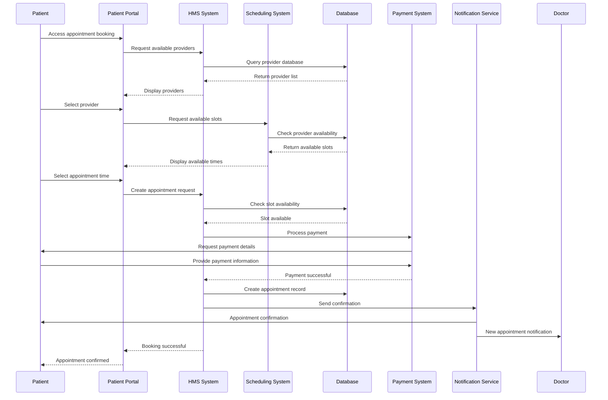

## Phone Booking System Flow

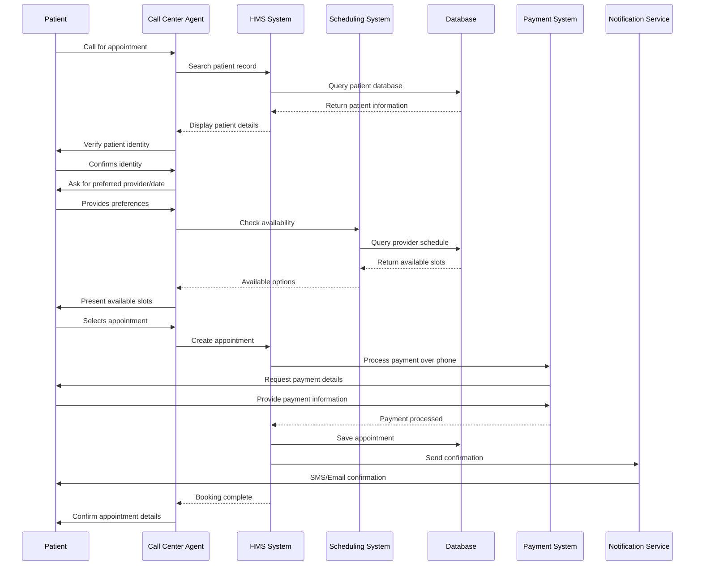

## Walk-in Appointment Flow

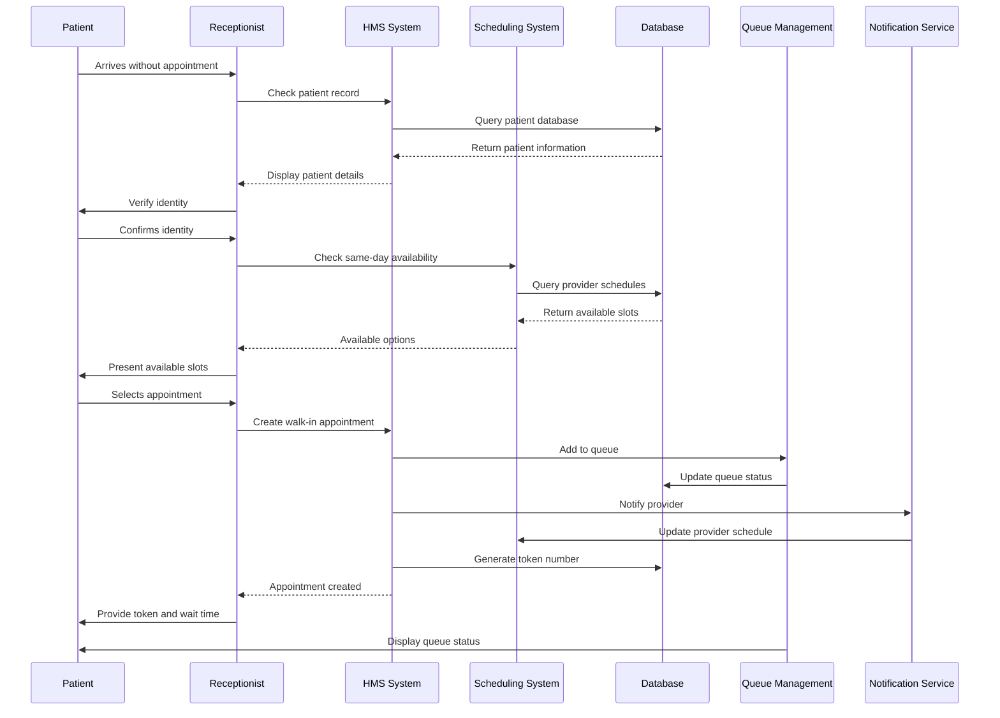

## Appointment Rescheduling Flow

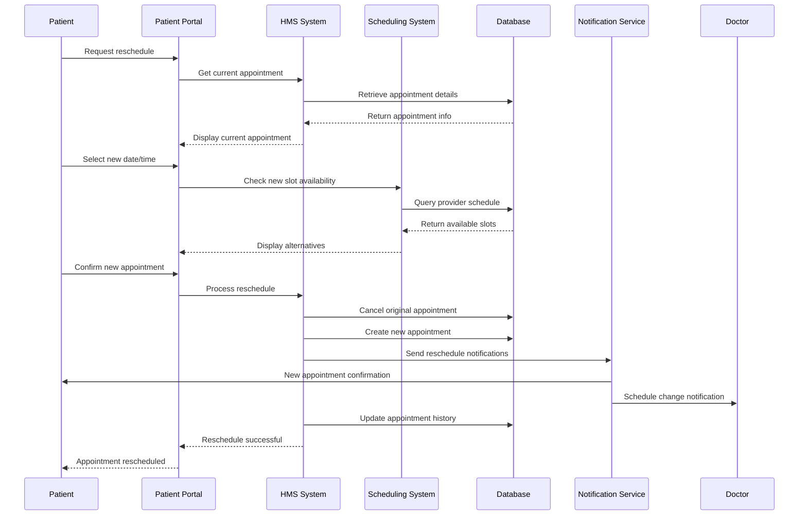

## Appointment Cancellation Flow

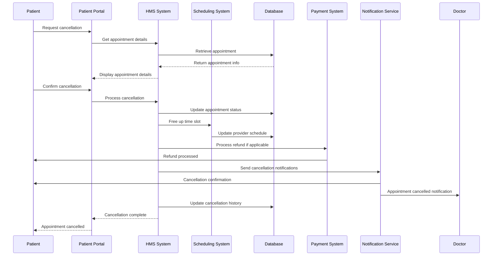

## Queue Management Flow

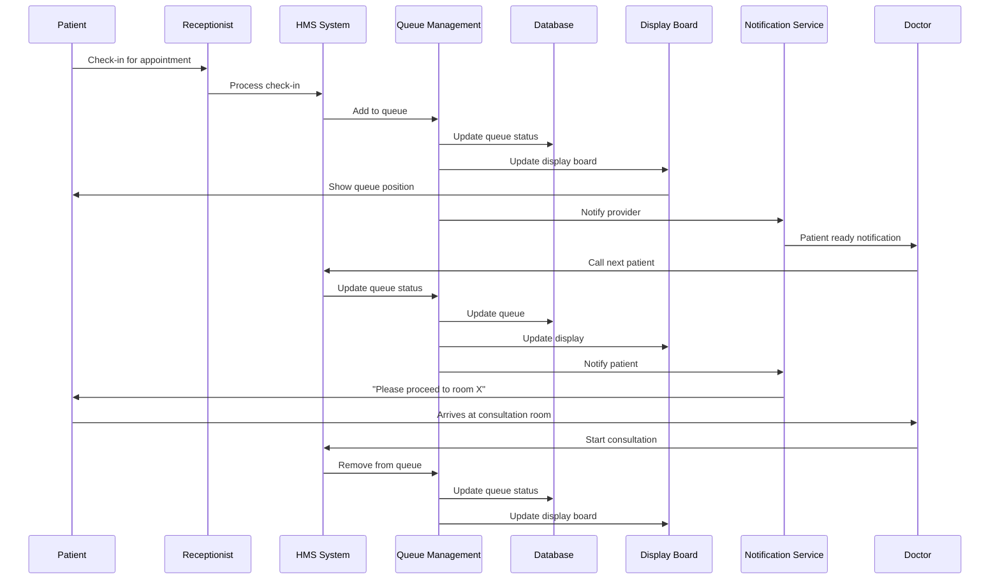

## Provider Schedule Management Flow

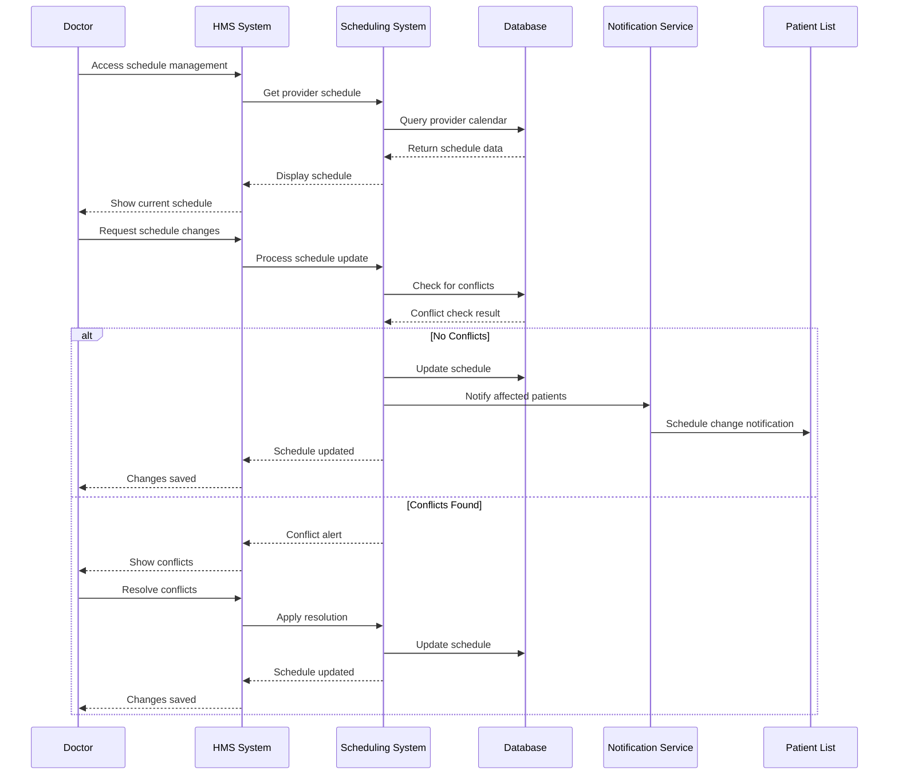

## Appointment Reminder Flow

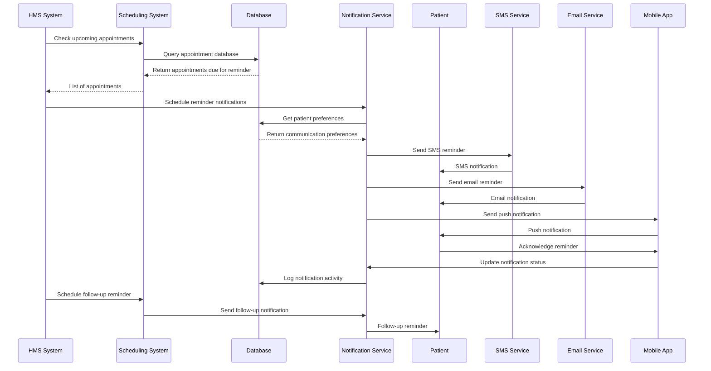

## Telemedicine Appointment Flow

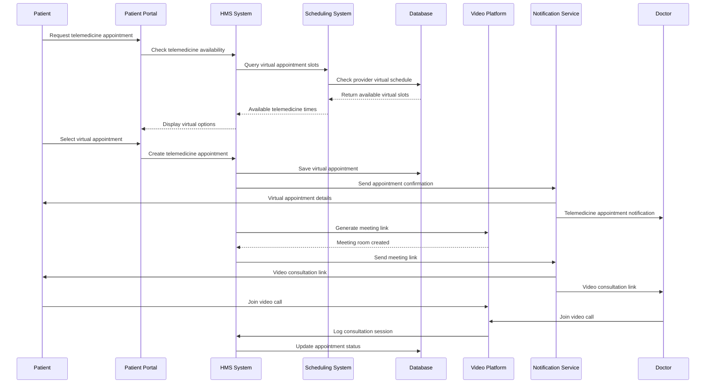

## Group Appointment Flow

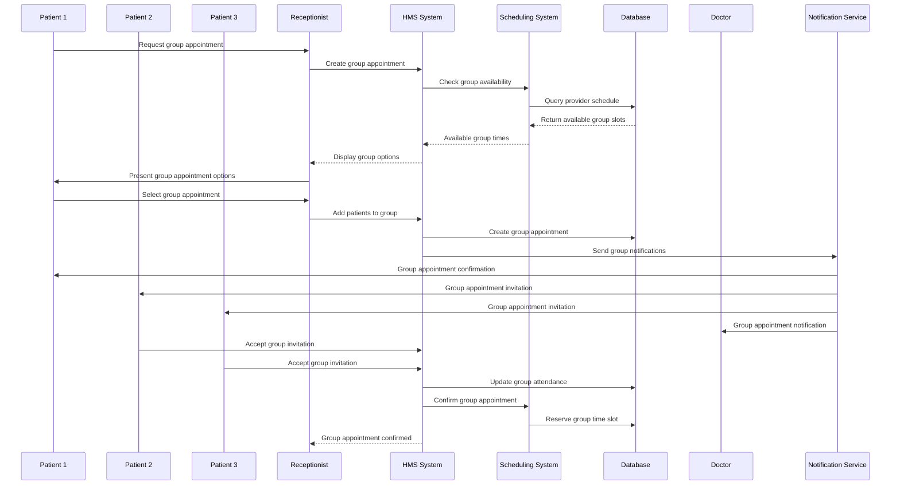

## Appointment Analytics Flow

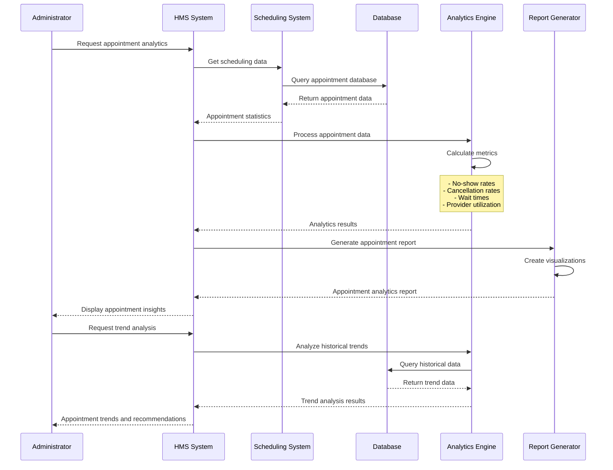
