# Billing & Finance Module - End-to-End Sequence Diagram

## Patient Billing Flow

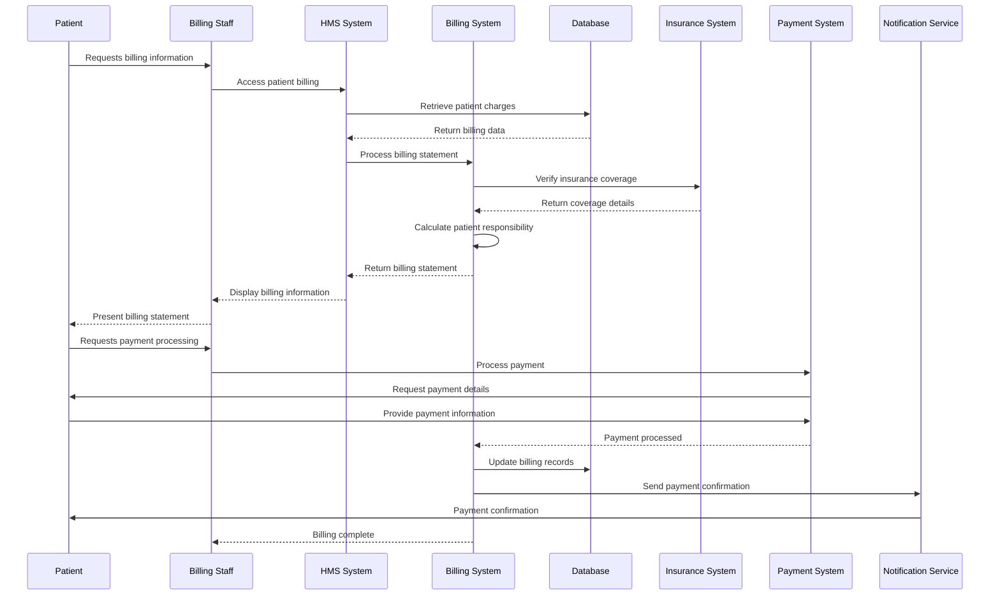

## Insurance Claims Processing Flow

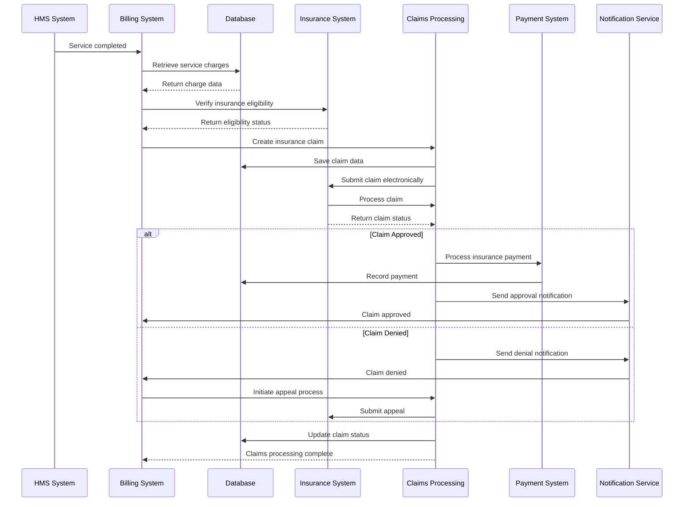

## Payment Processing Flow

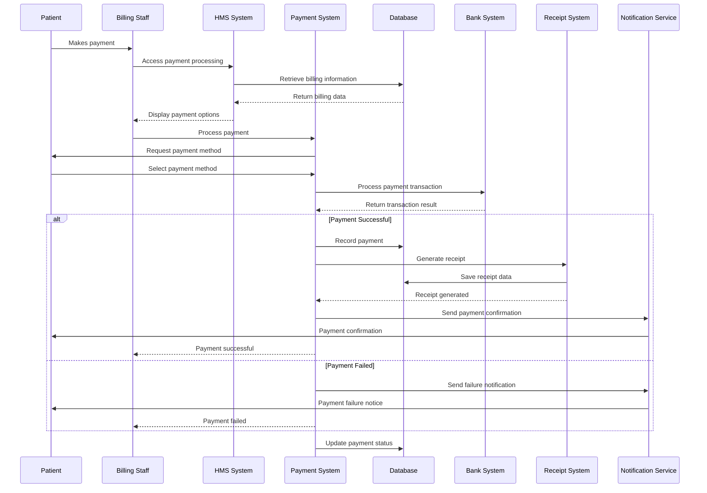

## Revenue Cycle Management Flow

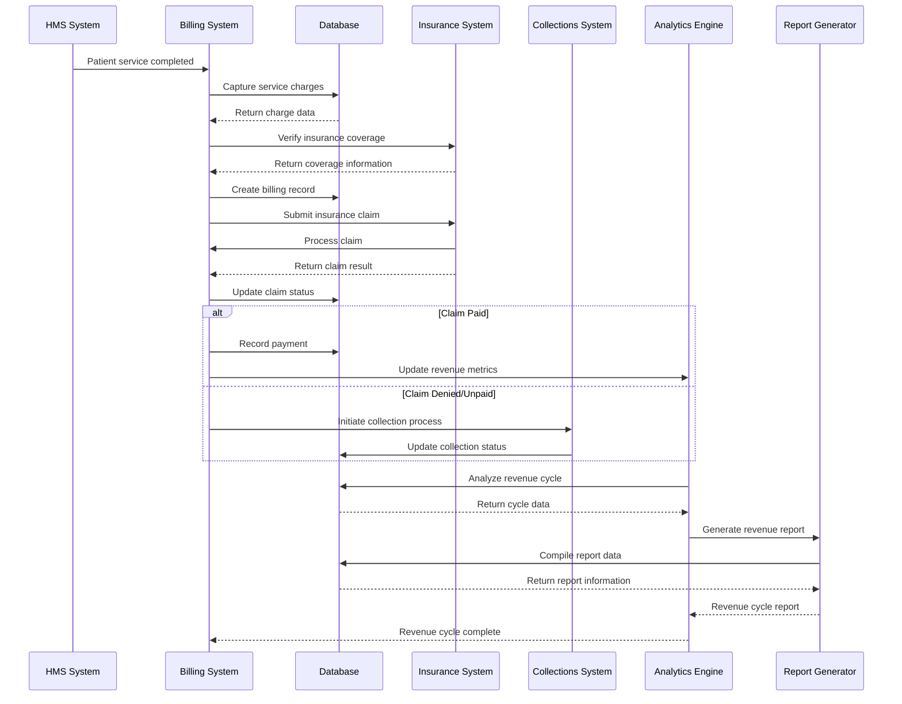

## Accounts Receivable Management Flow

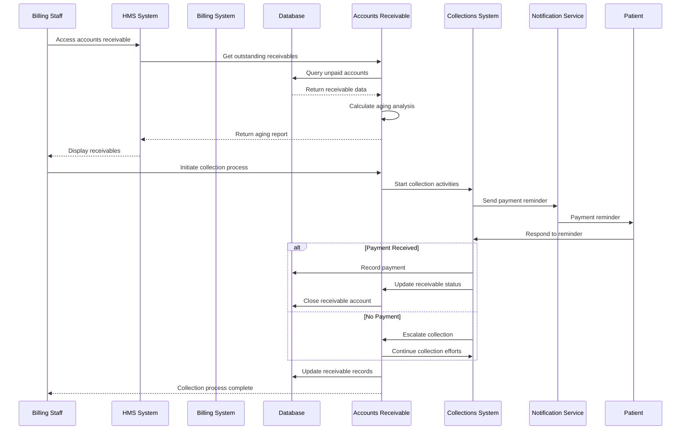

## Financial Reporting Flow

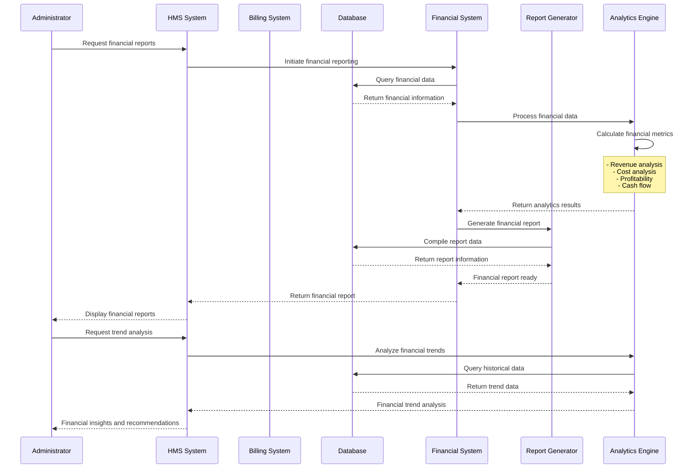

## Budget Management Flow

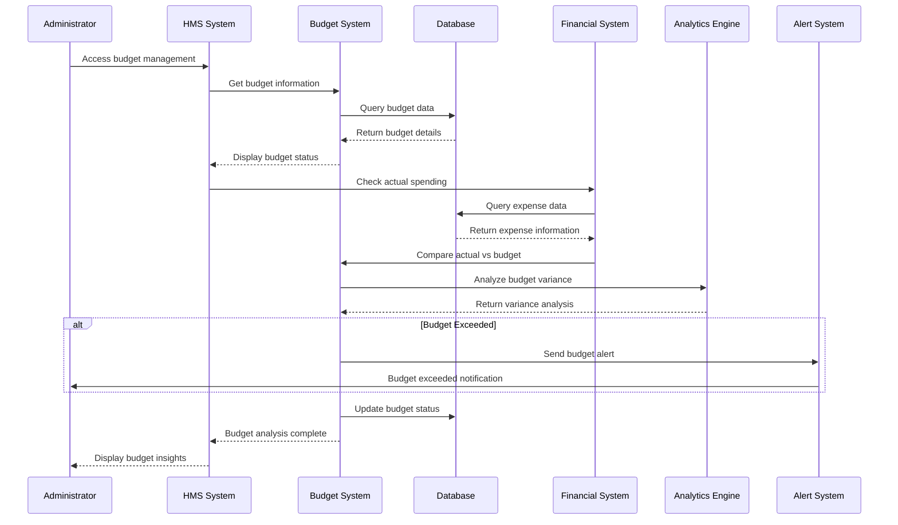

## Cost Management Flow

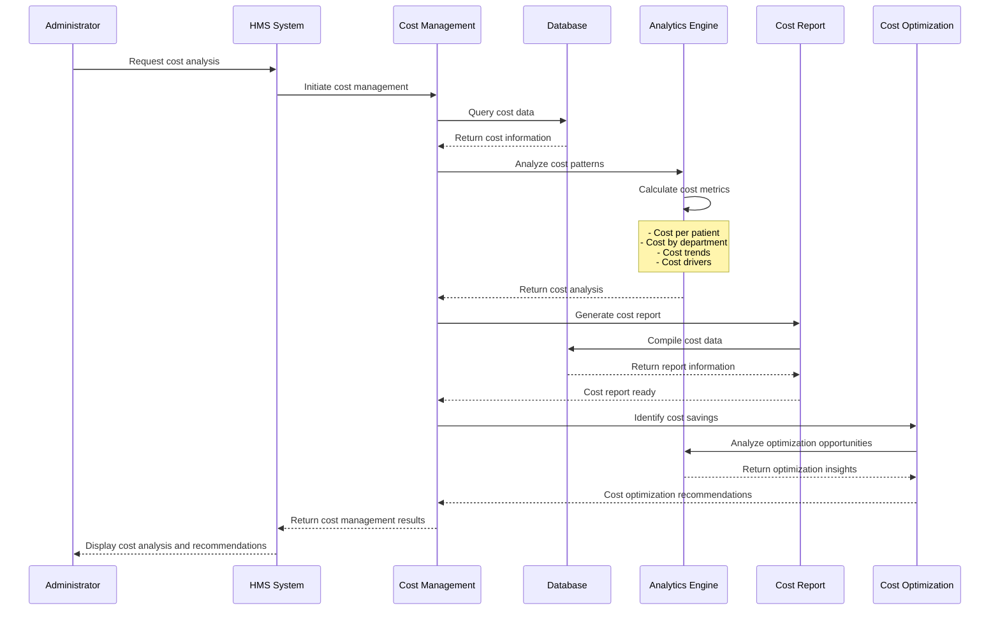

## Insurance Verification Flow

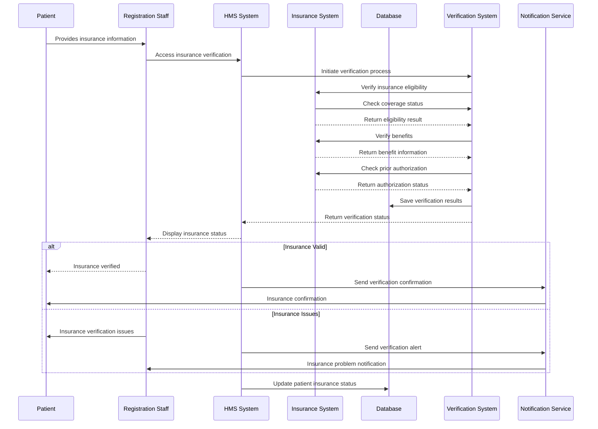

## Refund Processing Flow

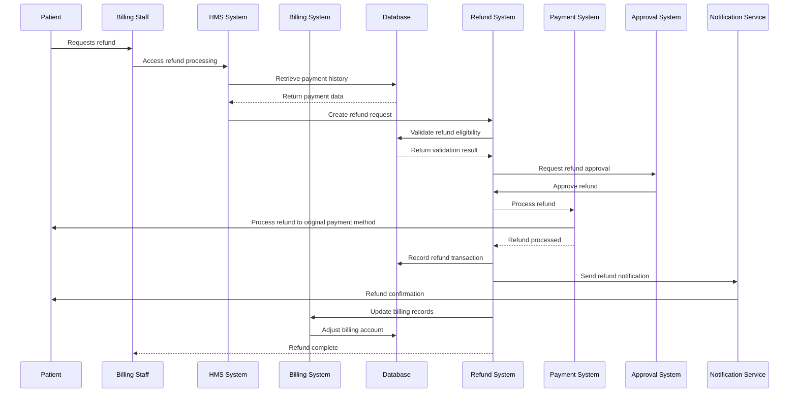

## Package Pricing Flow

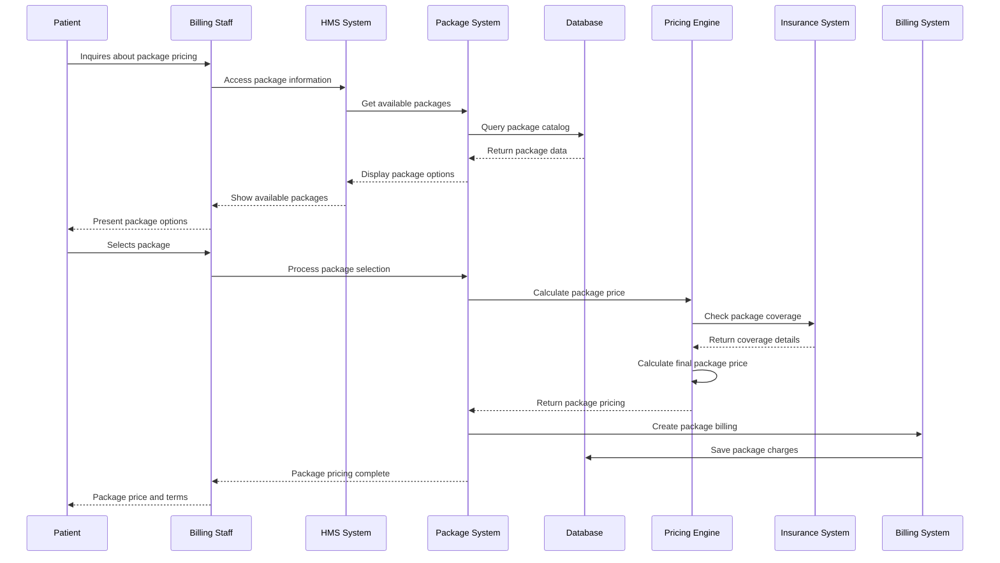

## Financial Audit Flow

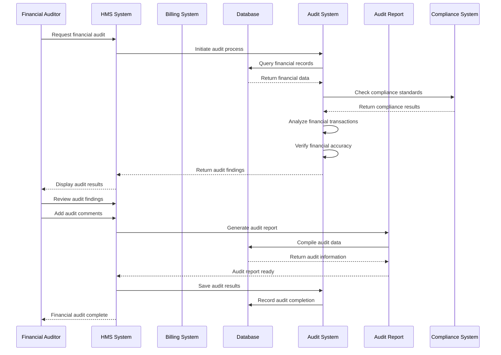

## Revenue Optimization Flow

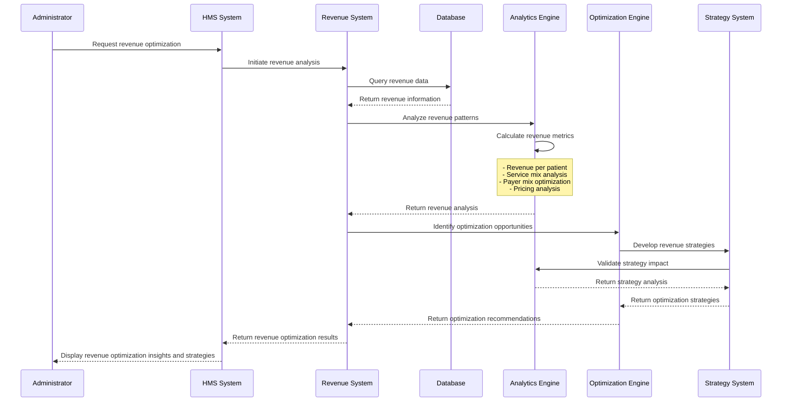
