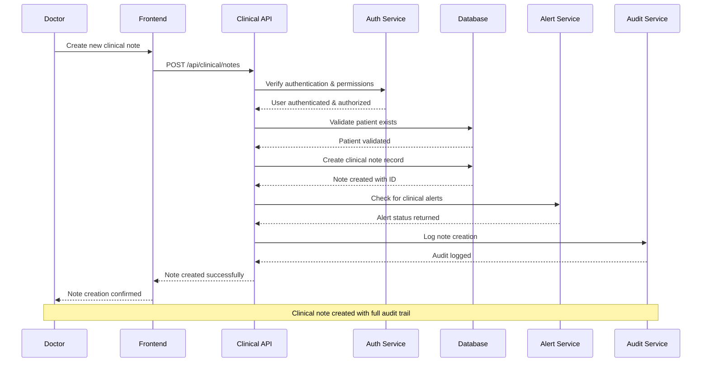
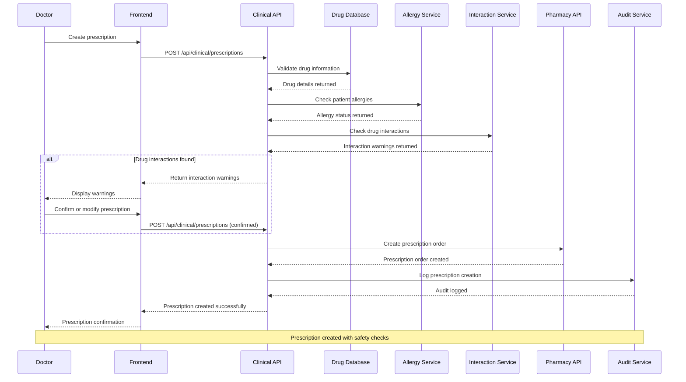
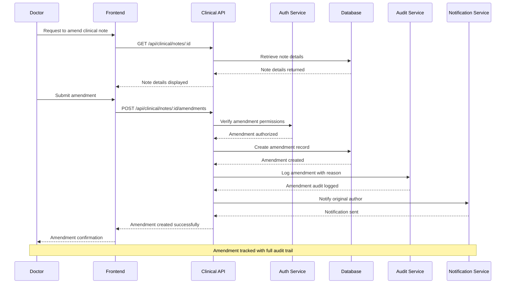
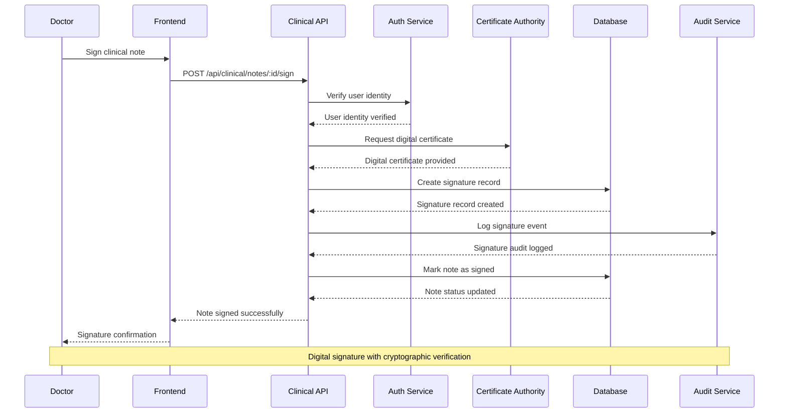
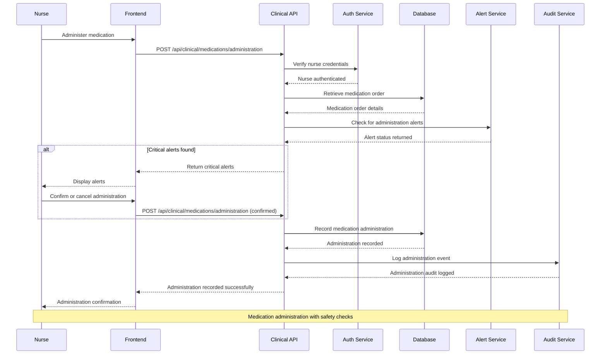
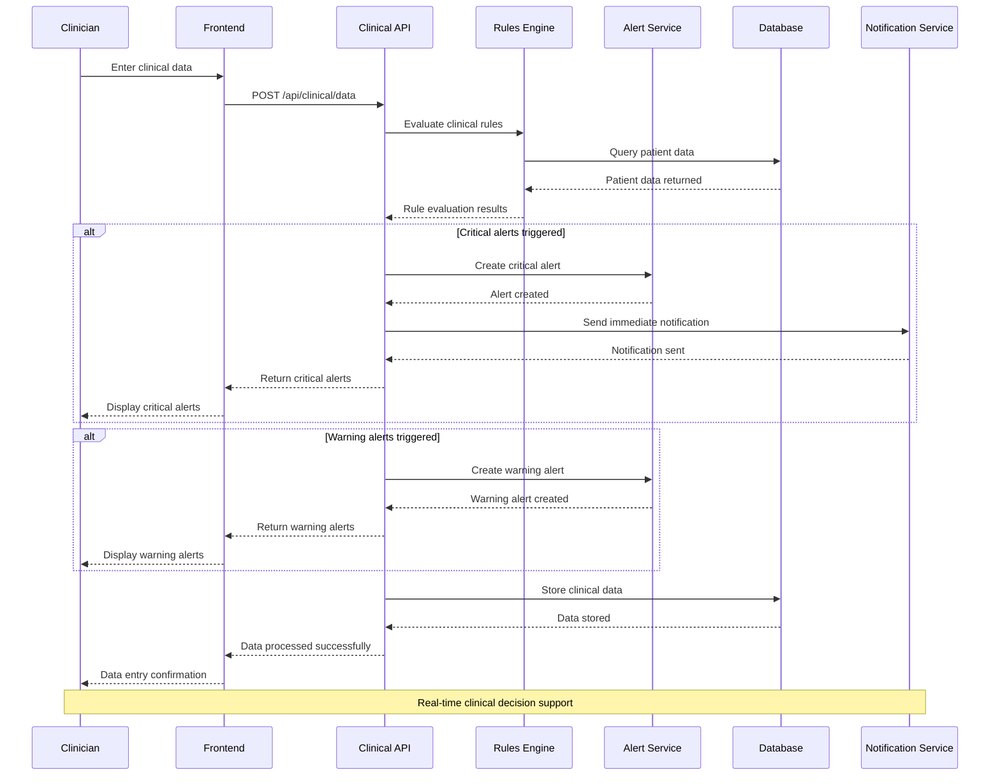
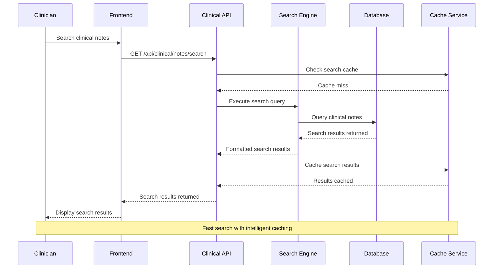
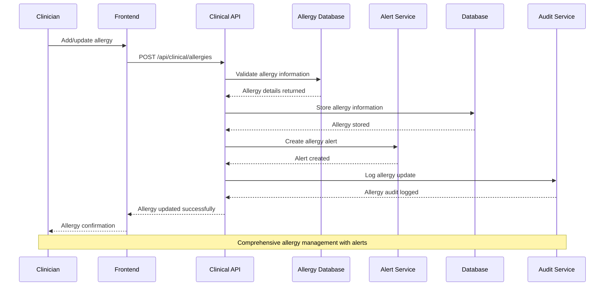
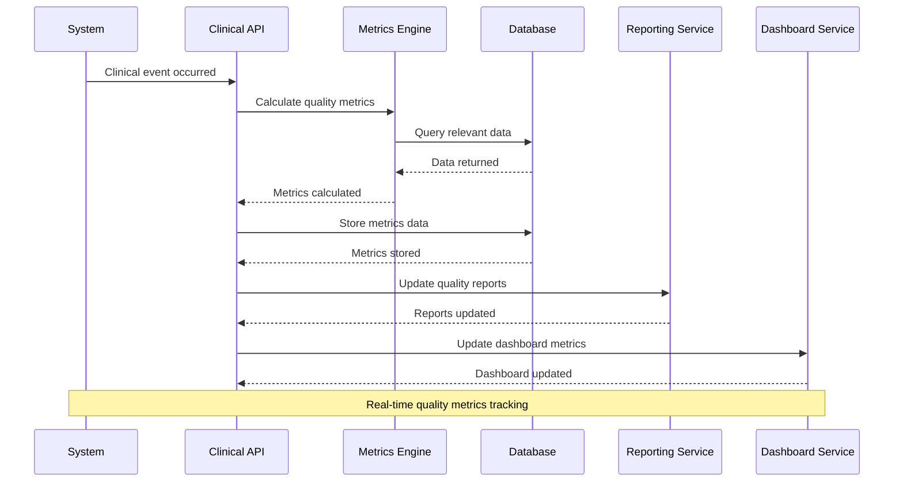
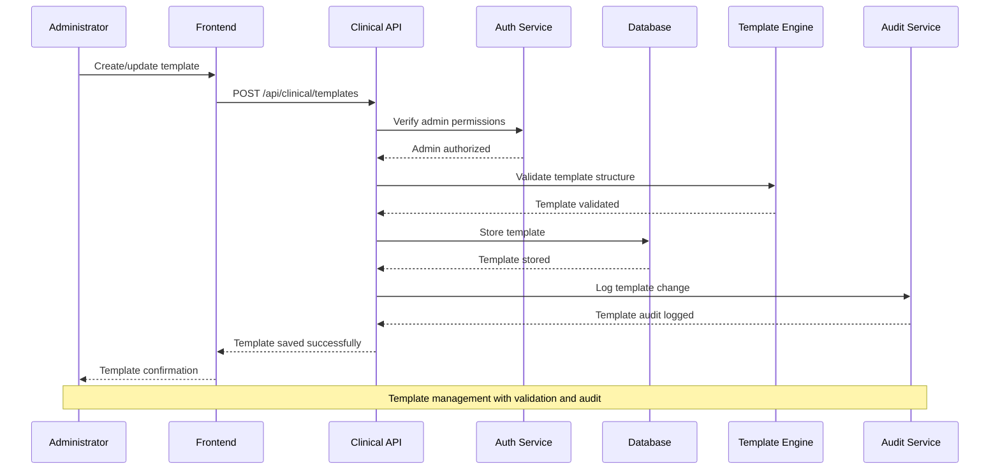

# Clinical Management Module - Enhanced Sequence Diagrams

## 1. Clinical Note Creation Workflow

## 2. Prescription Creation with Drug Interaction Check

## 3. Clinical Note Amendment Workflow

## 4. Digital Signature Workflow

## 5. Medication Administration Workflow

## 6. Clinical Decision Support Alert Workflow

## 7. Clinical Note Search and Retrieval

## 8. Allergy Management Workflow

## 9. Clinical Quality Metrics Tracking

## 10. Clinical Note Template Management

## Key Features of These Sequence Diagrams

### 1. **Comprehensive Workflow Coverage**
- Clinical note creation, editing, and signing
- Prescription management with safety checks
- Medication administration tracking
- Clinical decision support alerts
- Allergy management
- Quality metrics tracking

### 2. **Security and Compliance**
- Authentication and authorization at every step
- Complete audit trail for all clinical actions
- Digital signature with cryptographic verification
- HIPAA-compliant data handling

### 3. **Real-time Decision Support**
- Drug interaction checking
- Allergy alerts
- Clinical rule evaluation
- Critical value notifications

### 4. **Performance Optimization**
- Intelligent caching for search operations
- Efficient database queries
- Asynchronous processing for non-critical operations

### 5. **Integration Points**
- Drug database integration
- Pharmacy system integration
- Notification services
- Reporting and analytics

These sequence diagrams provide a comprehensive view of the clinical management workflows, ensuring that all clinical processes are properly documented, secure, and efficient.
