# Clinical Management Module - End-to-End Sequence Diagram

## Clinical Documentation Flow

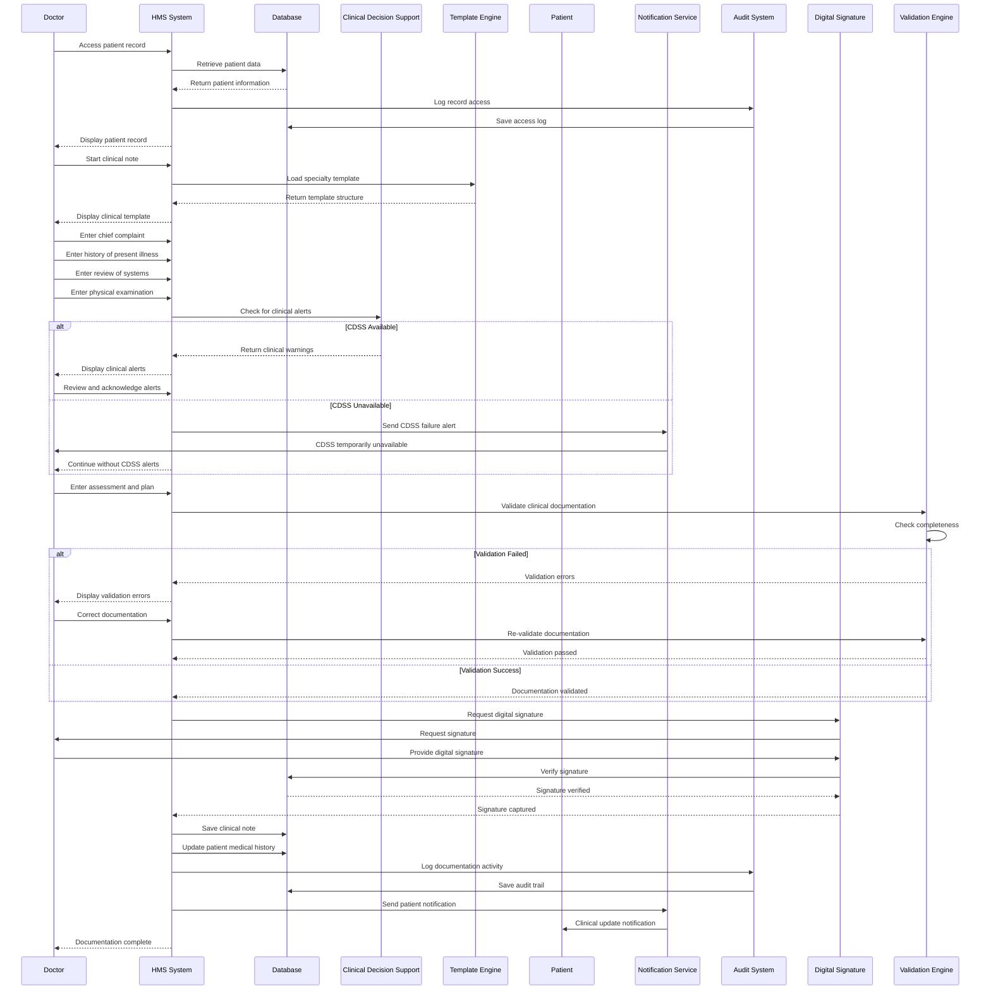

## Prescription Management Flow

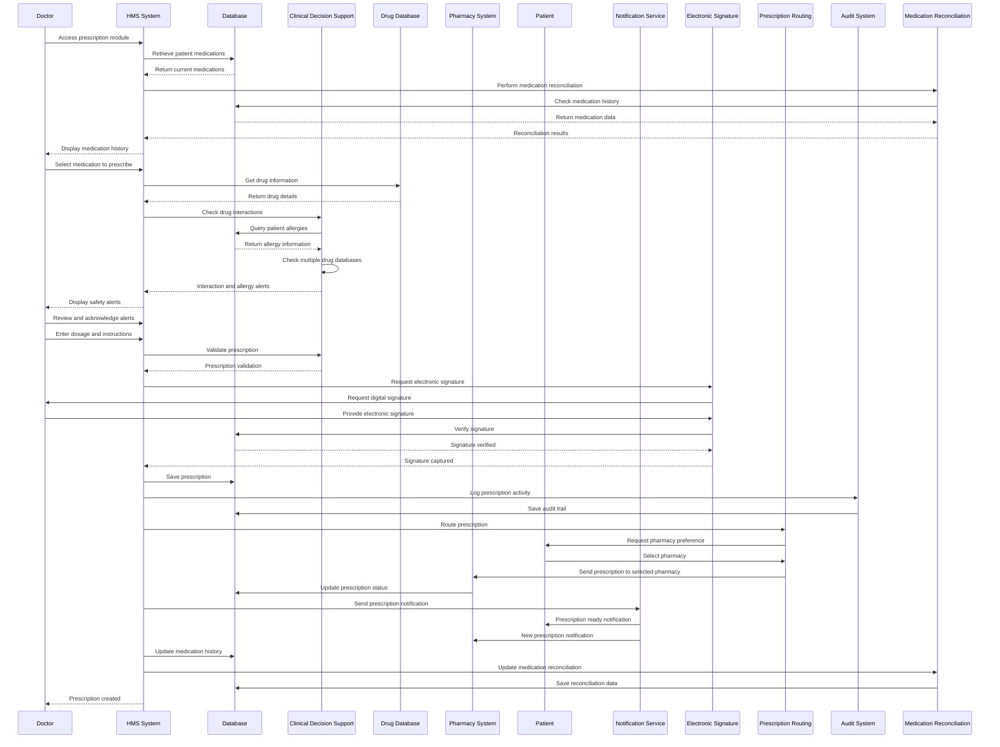

## Care Plan Development Flow

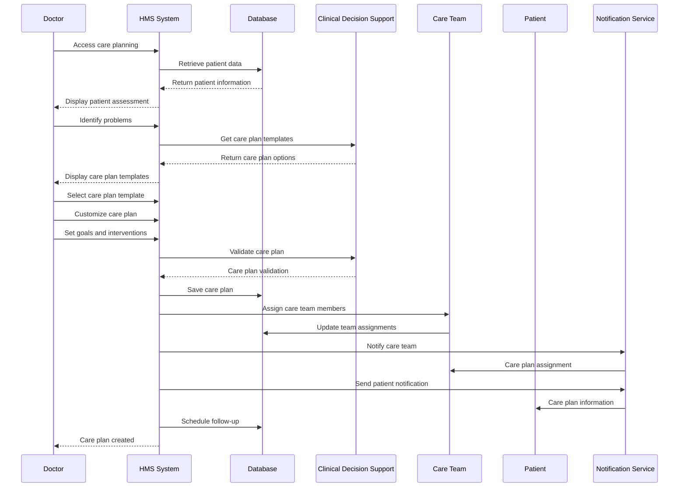

## Clinical Decision Support Flow

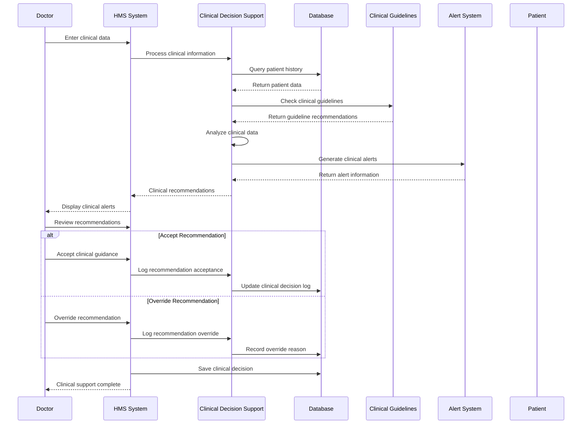

## Medication Reconciliation Flow

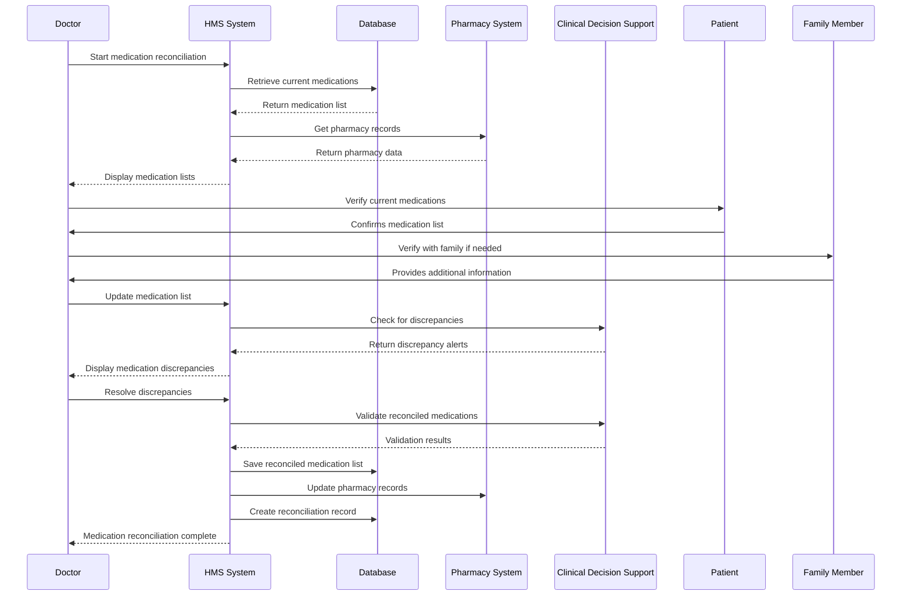

## Clinical Quality Measures Flow

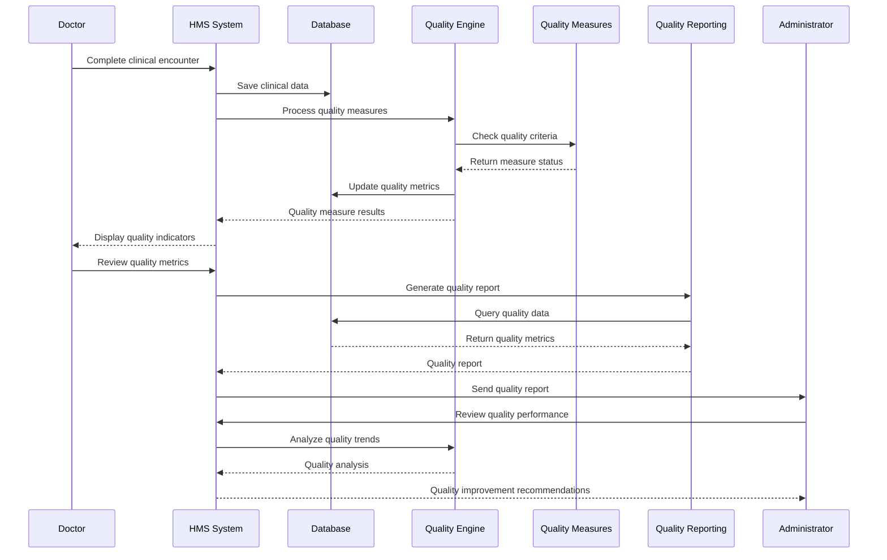

## Telemedicine Consultation Flow

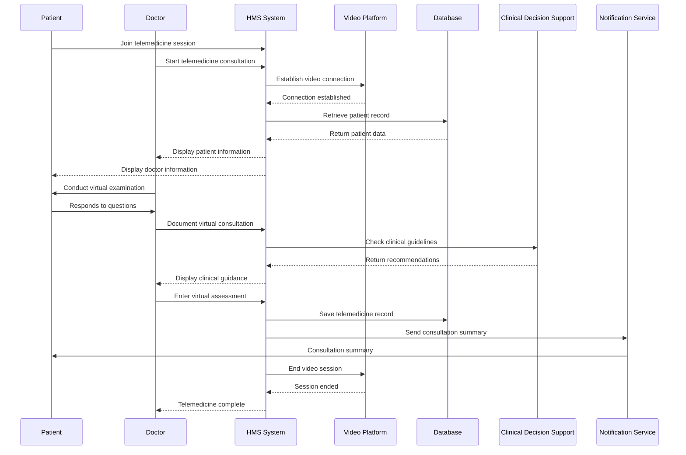

## Clinical Handoff Flow

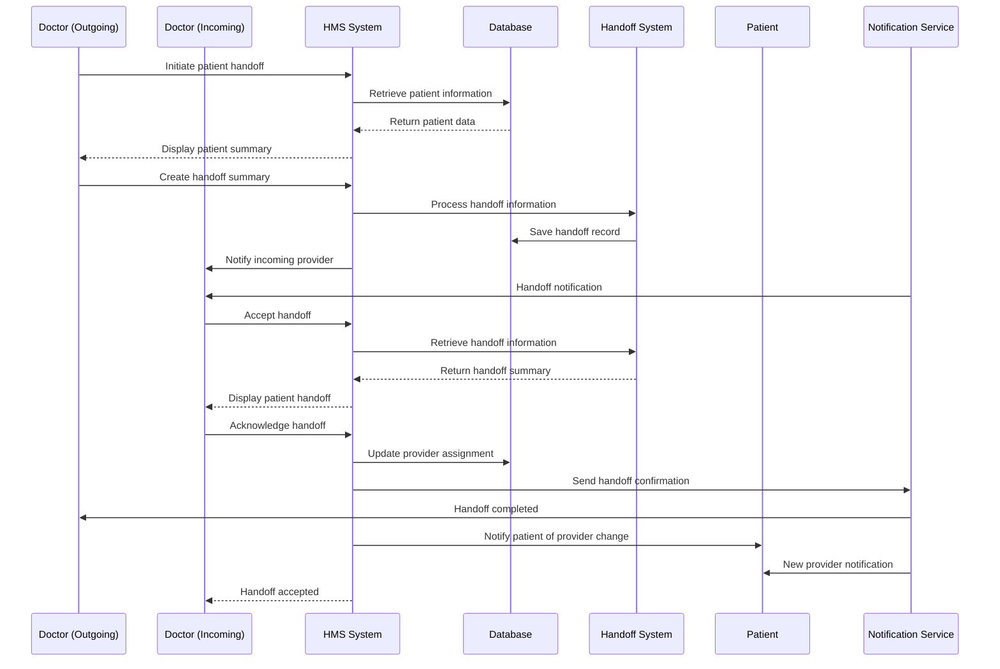

## Clinical Audit Flow

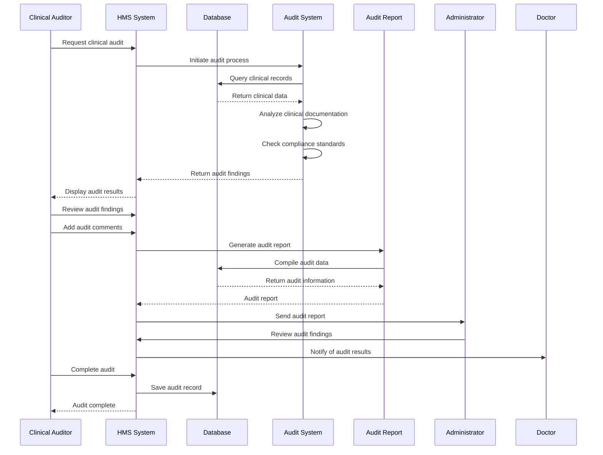

## Clinical Research Flow

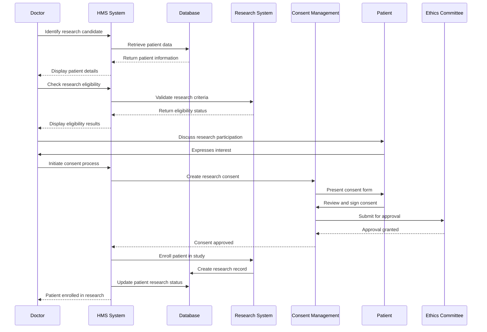

## Clinical Outcomes Tracking Flow

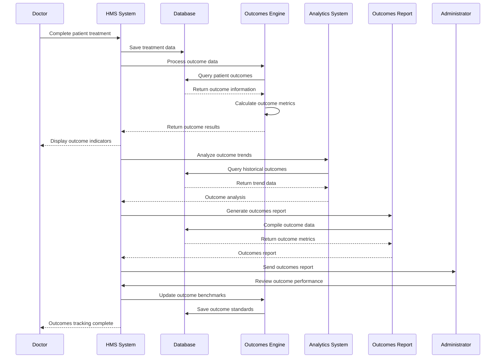
