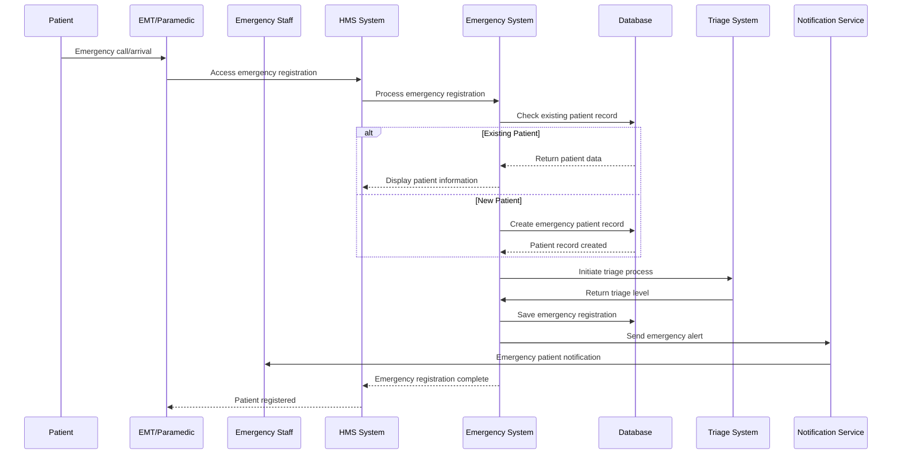
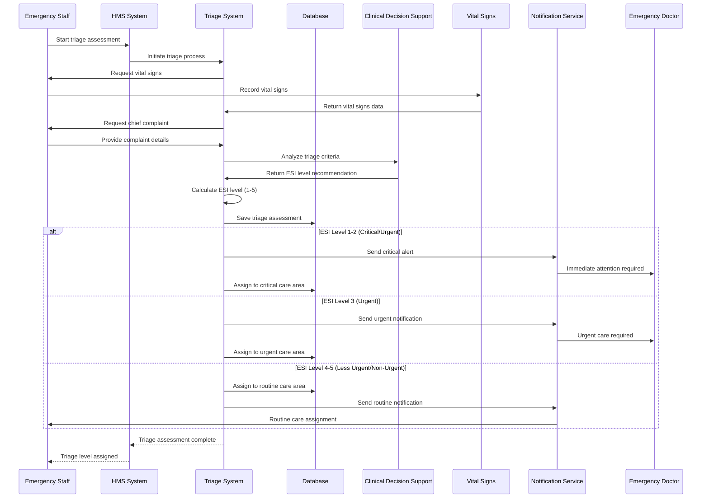
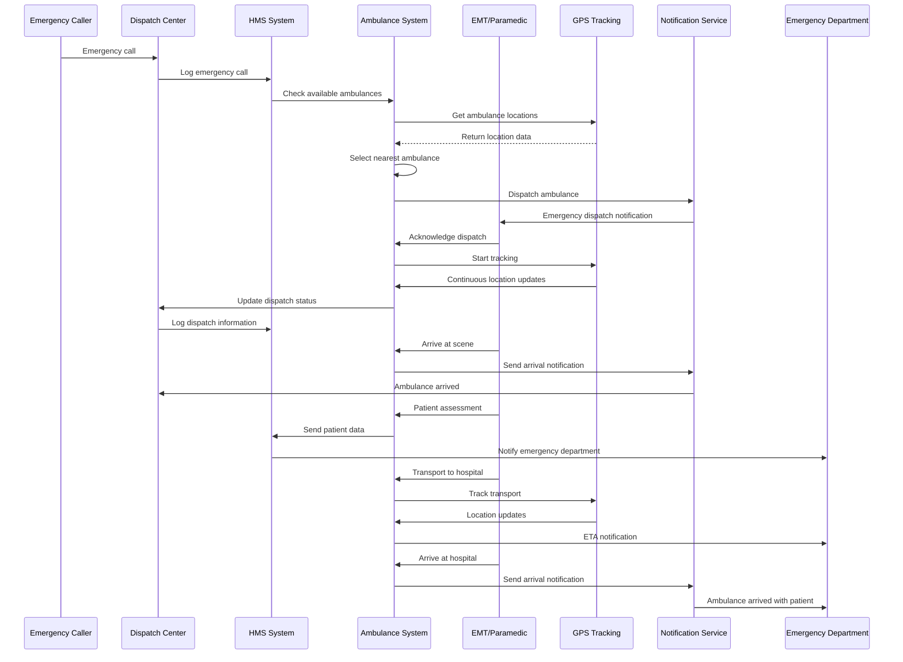
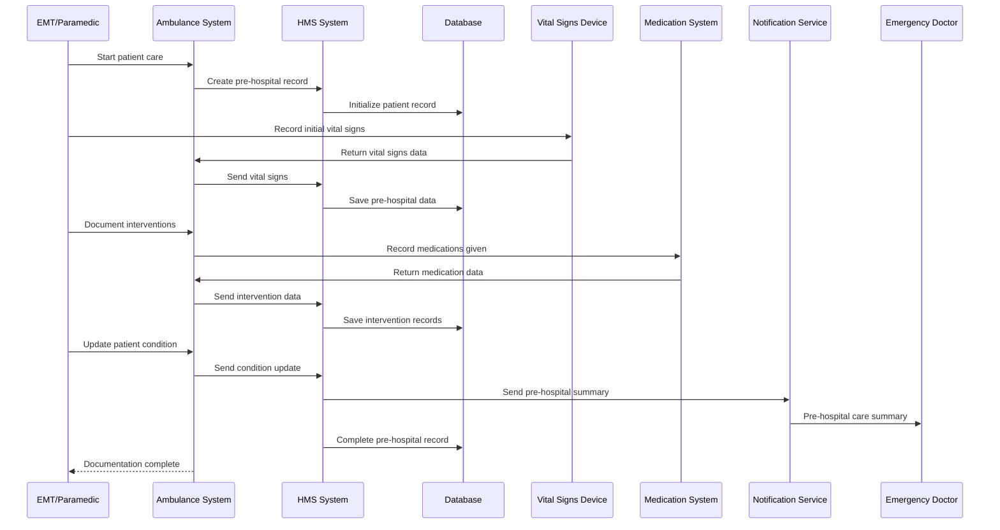
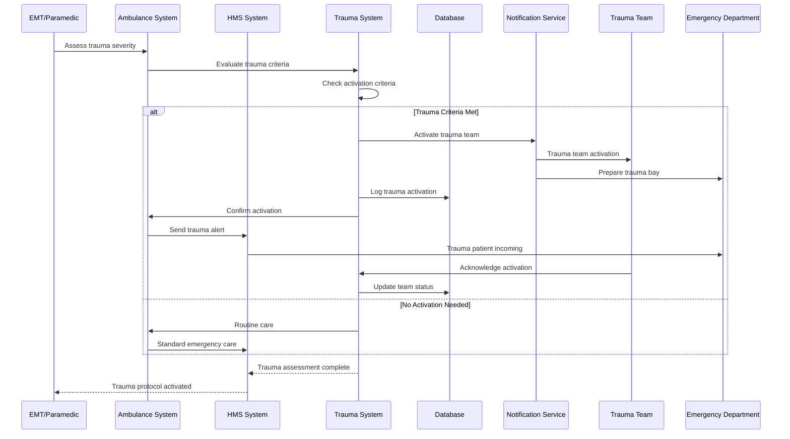
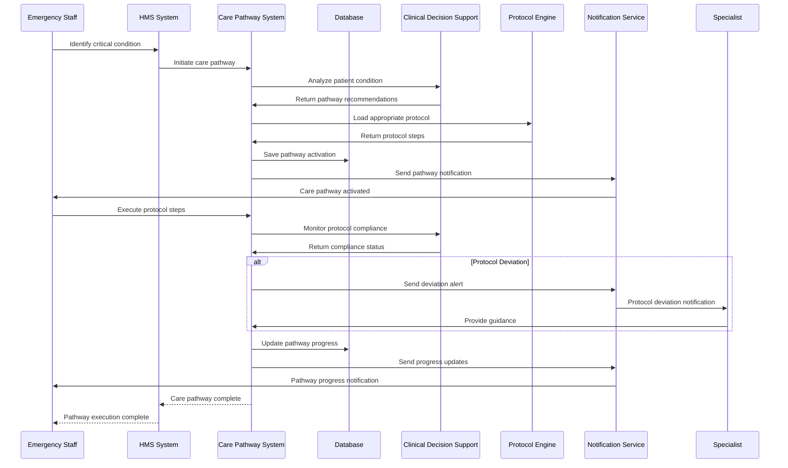
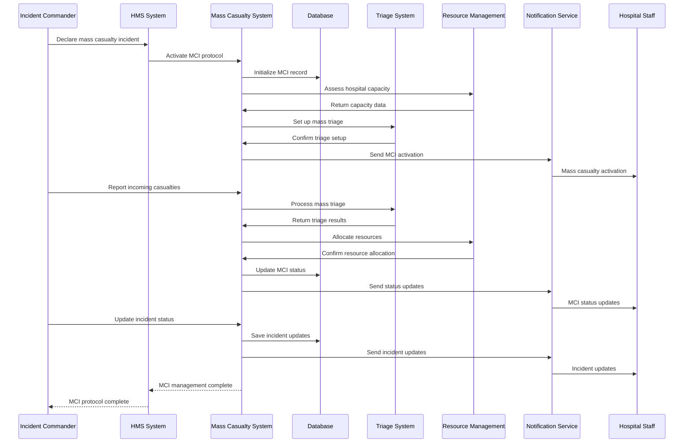
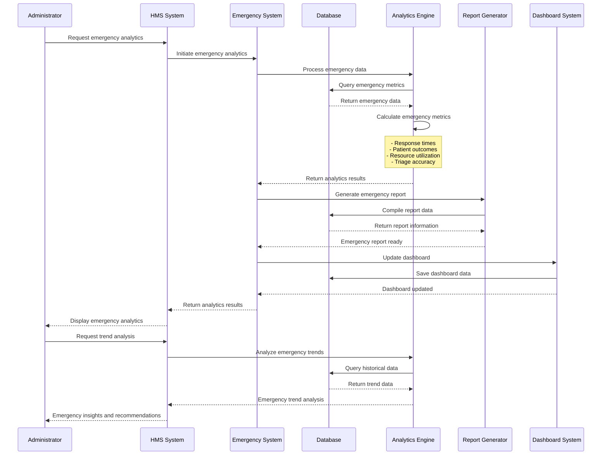
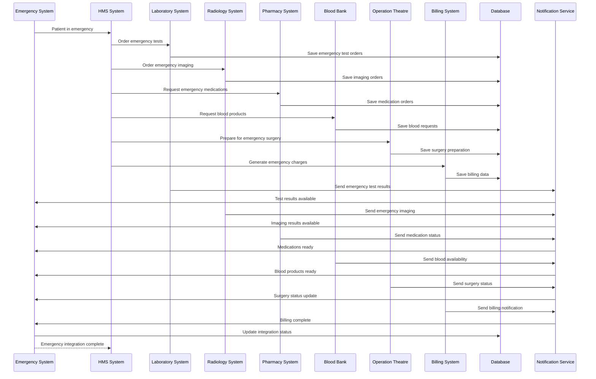

# Emergency & Ambulance Management Module - End-to-End Sequence Diagram

## Emergency Patient Registration Flow

## Advanced Triage System Flow (ESI 5-Level)

## Ambulance Dispatch and Tracking Flow

## Pre-Hospital Care Documentation Flow

## Trauma Team Activation Flow

## Critical Care Pathway Flow

## Mass Casualty Incident Management Flow

## Emergency Analytics and Reporting Flow

## Emergency Integration Flow

