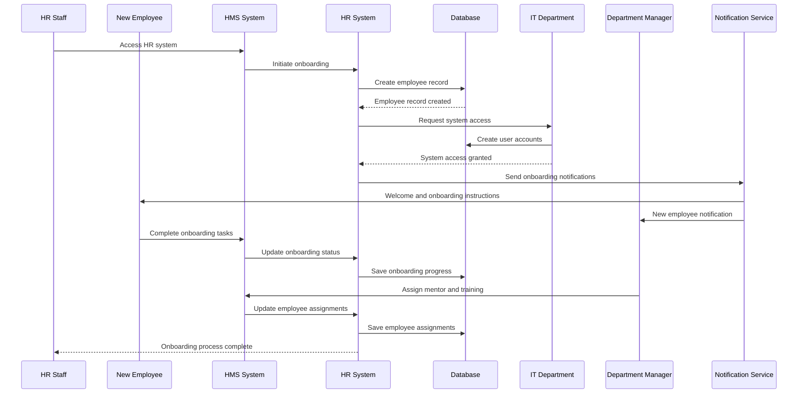
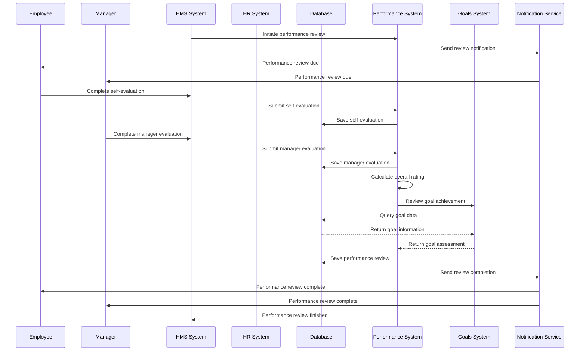
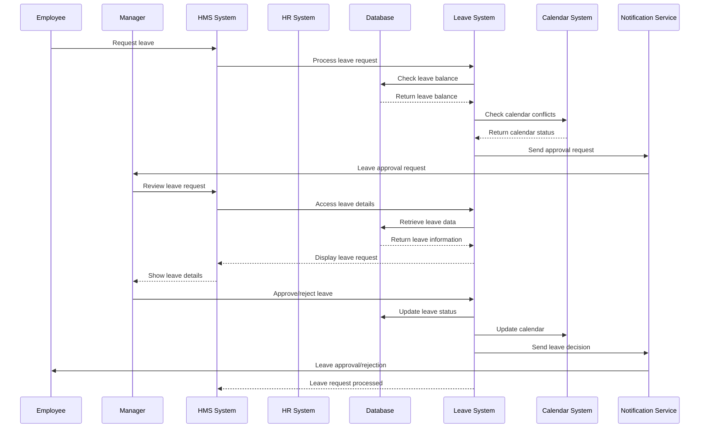
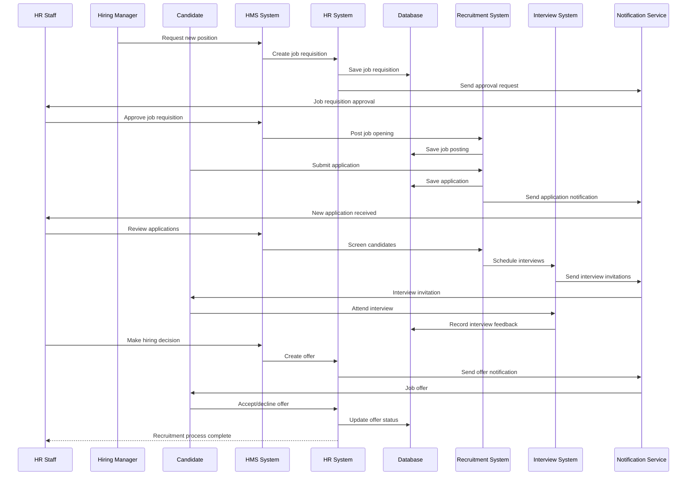
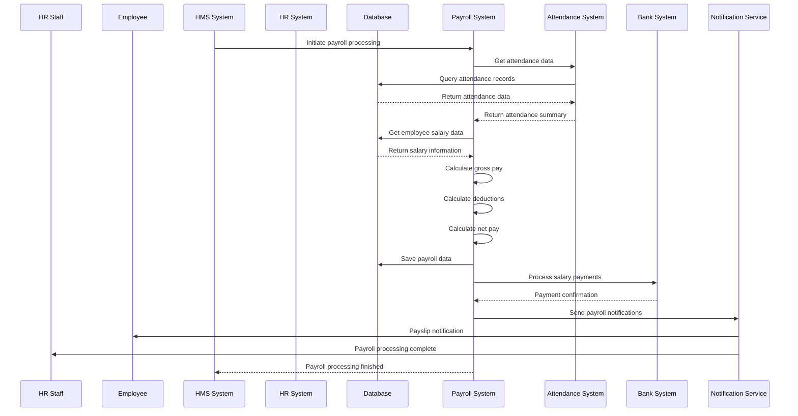
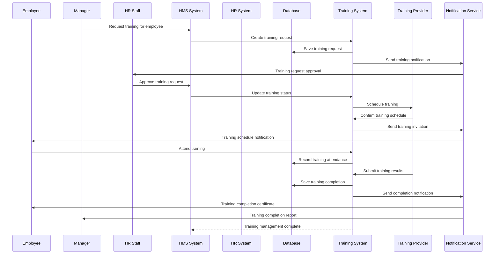
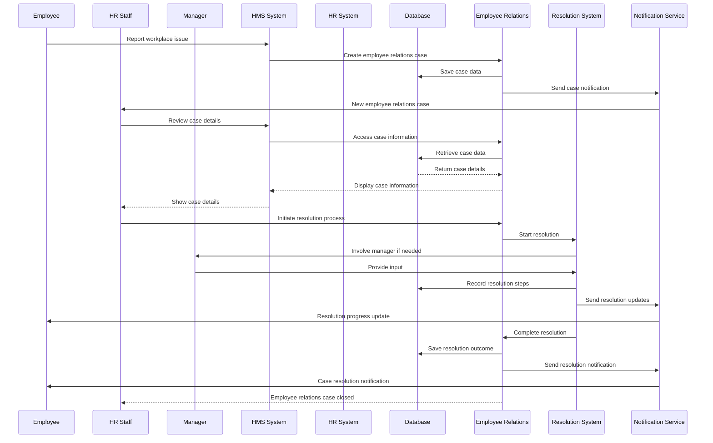
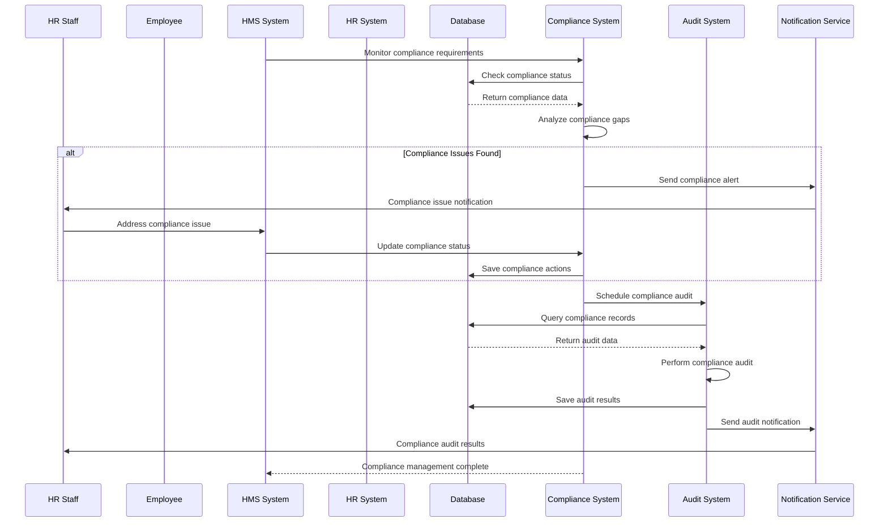
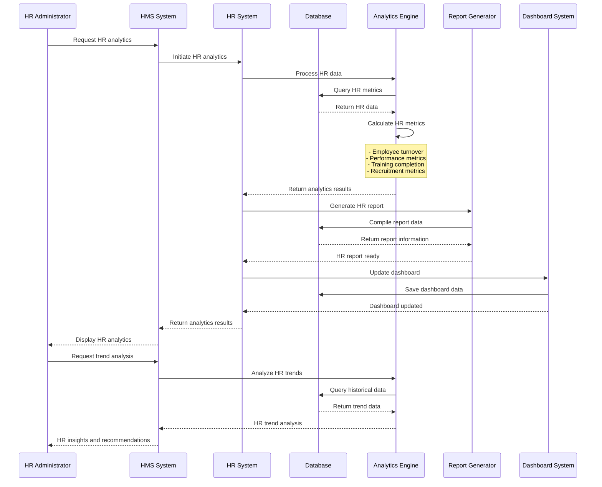
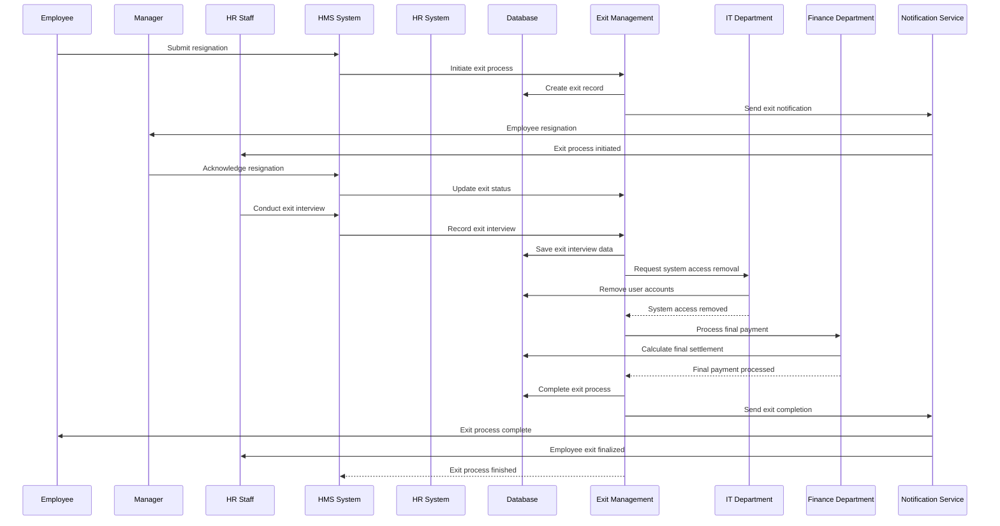

# Human Resources Module - End-to-End Sequence Diagram

## Employee Onboarding Flow

## Employee Performance Review Flow

## Leave Management Flow

## Recruitment Process Flow

## Payroll Processing Flow

## Training Management Flow

## Employee Relations Flow

## Compliance Management Flow

## HR Analytics Flow

## Employee Exit Process Flow

