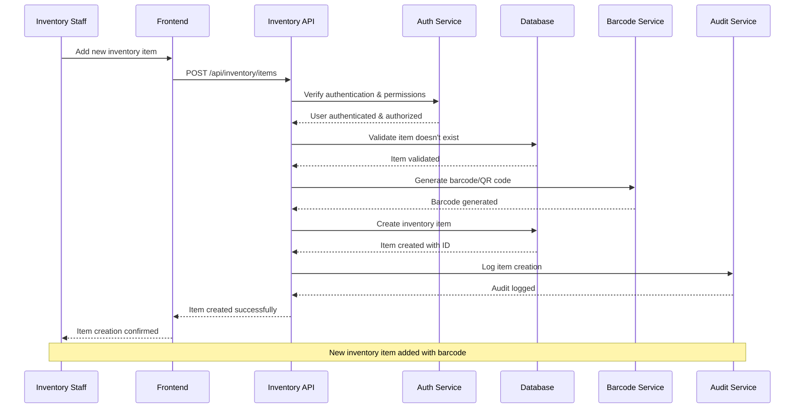
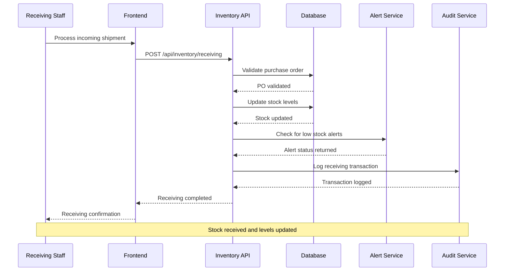
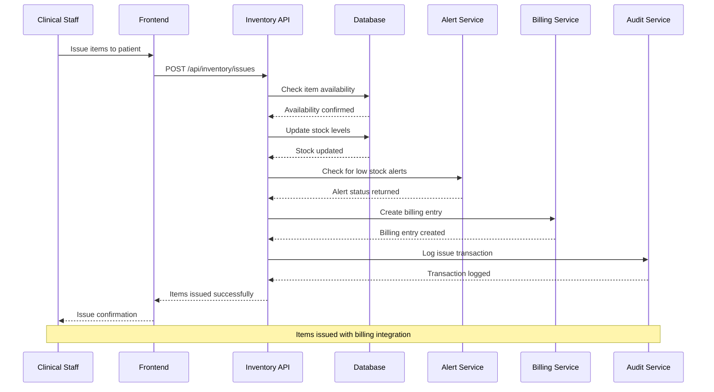
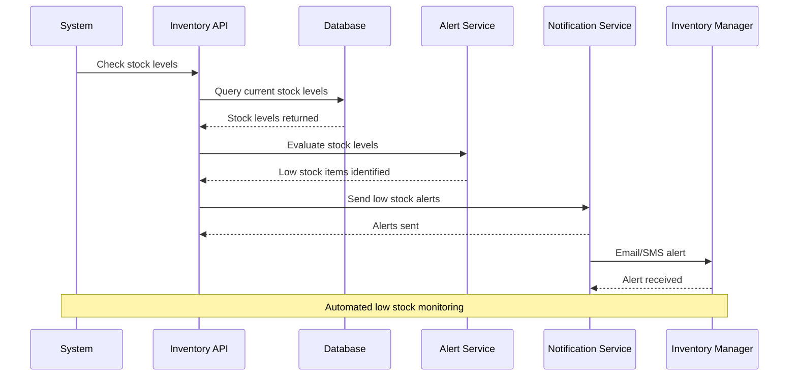
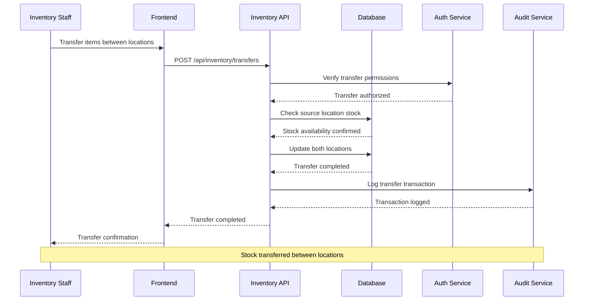
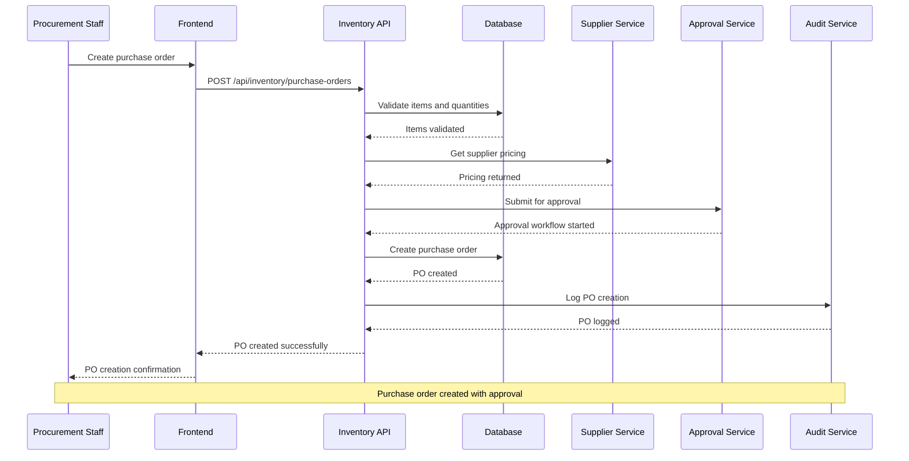
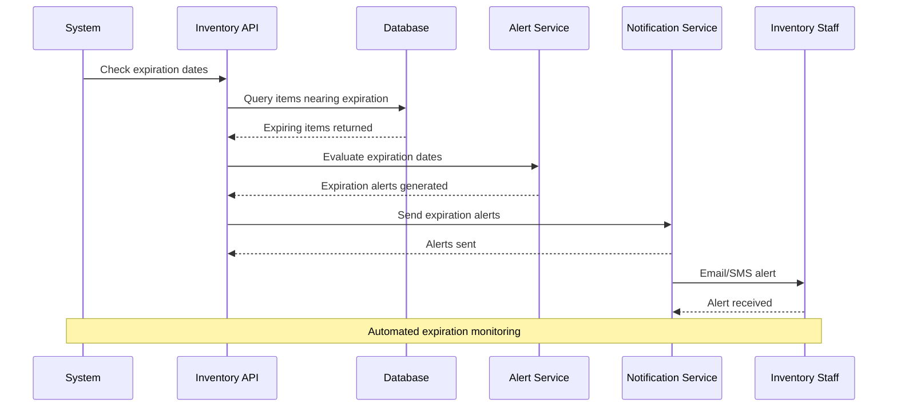
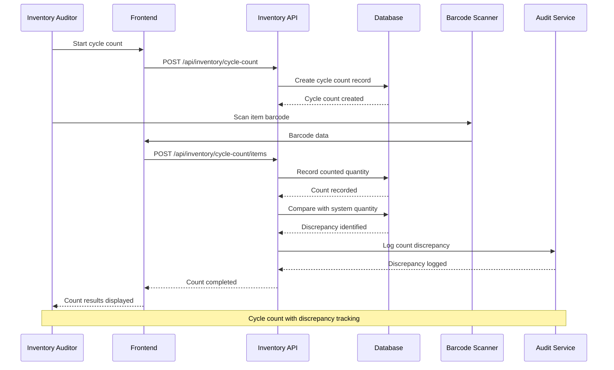
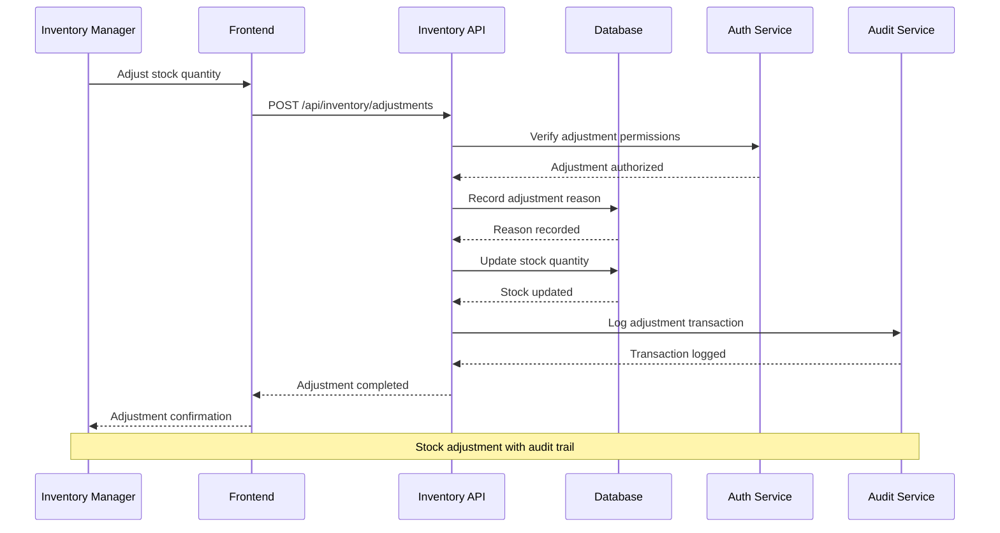
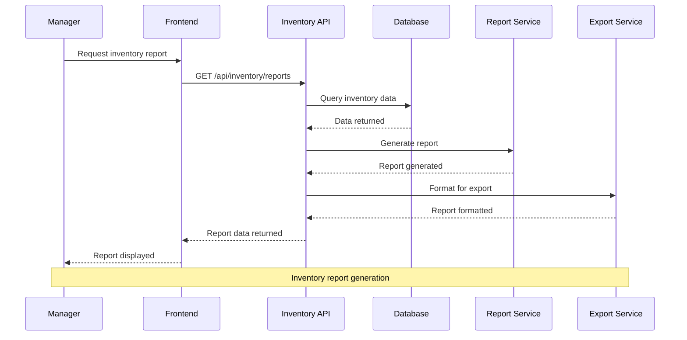

# Inventory Management System - Sequence Diagrams

## 1. Add New Inventory Item Workflow

## 2. Stock Receiving Workflow

## 3. Item Issue Workflow

## 4. Low Stock Alert Workflow

## 5. Stock Transfer Workflow

## 6. Purchase Order Creation Workflow

## 7. Expiration Alert Workflow

## 8. Cycle Count Workflow

## 9. Stock Adjustment Workflow

## 10. Inventory Report Generation Workflow

## Key Features of These Sequence Diagrams

### 1. **Comprehensive Inventory Operations**
- Item management with barcode generation
- Stock receiving and issuing processes
- Stock transfers and adjustments
- Purchase order management

### 2. **Automated Monitoring**
- Low stock alerts and notifications
- Expiration date monitoring
- Cycle counting and reconciliation
- Automated reorder suggestions

### 3. **Integration Points**
- Barcode scanning integration
- Billing system integration
- Supplier system integration
- Approval workflow integration

### 4. **Audit and Compliance**
- Complete audit trail for all transactions
- Regulatory compliance tracking
- Data integrity and validation
- Security and access control

### 5. **User Experience**
- Intuitive workflows for inventory staff
- Mobile support for barcode scanning
- Real-time updates and notifications
- Comprehensive reporting capabilities

These sequence diagrams provide a complete view of the inventory management workflows, ensuring that all inventory operations are properly documented, secure, and efficient.
