# Inventory Management Module - End-to-End Sequence Diagram

## Stock Receipt Flow

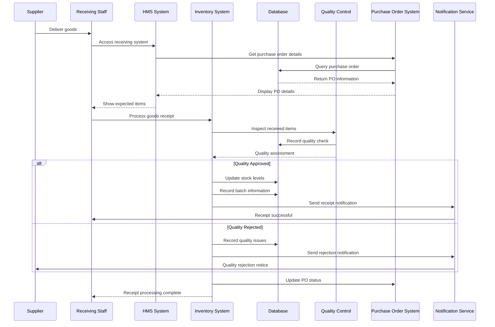

## Stock Issue Flow

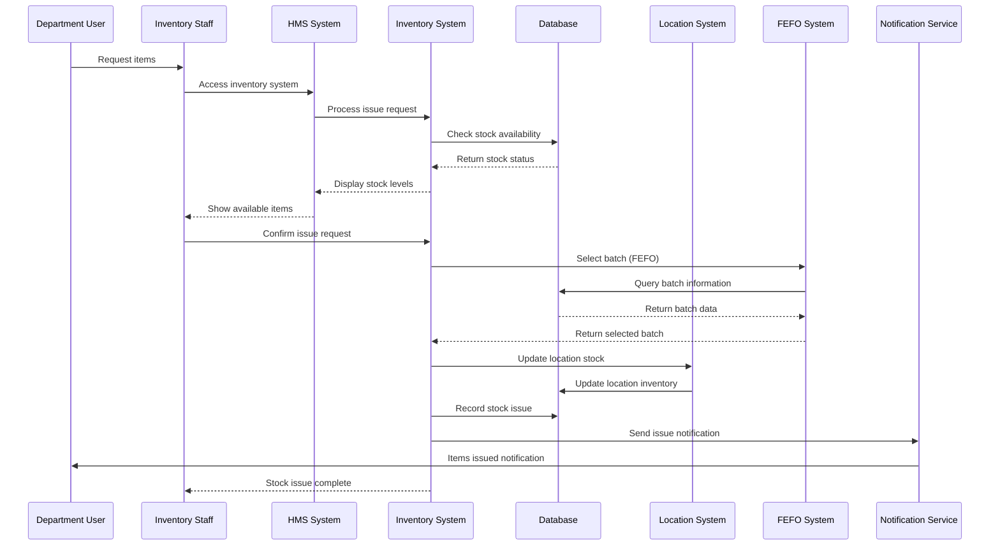

## Stock Transfer Flow

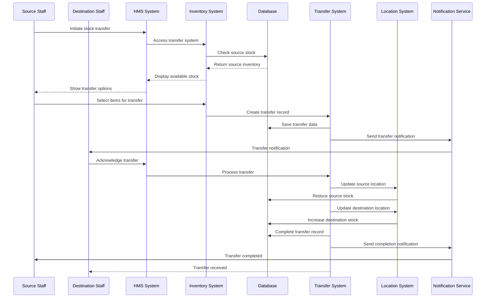

## Requisition Management Flow

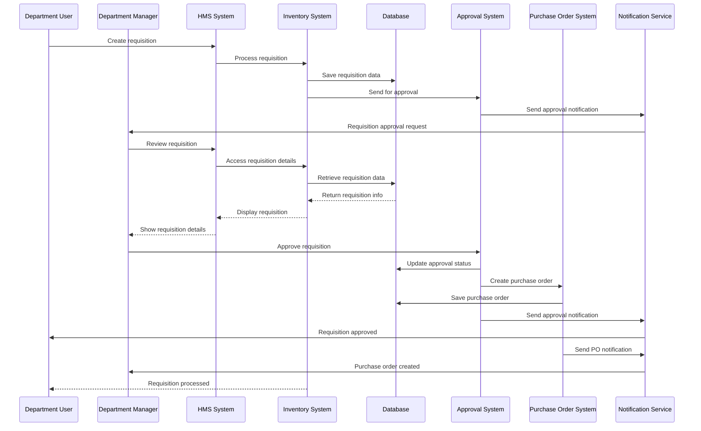

## Purchase Order Management Flow

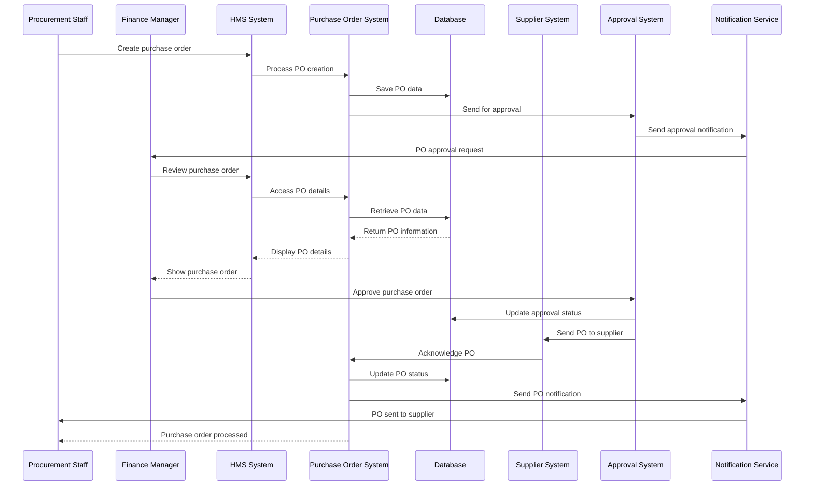

## Inventory Audit Flow

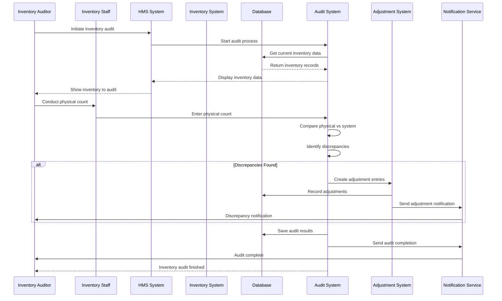

## Supplier Management Flow

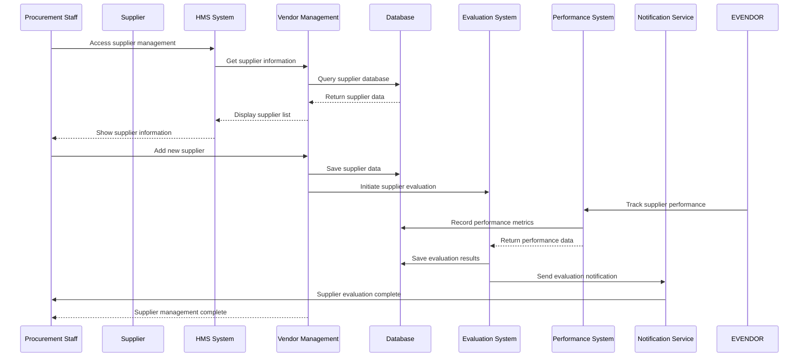

## Asset Management Flow

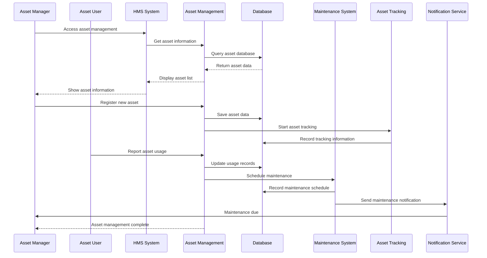

## Expiry Management Flow

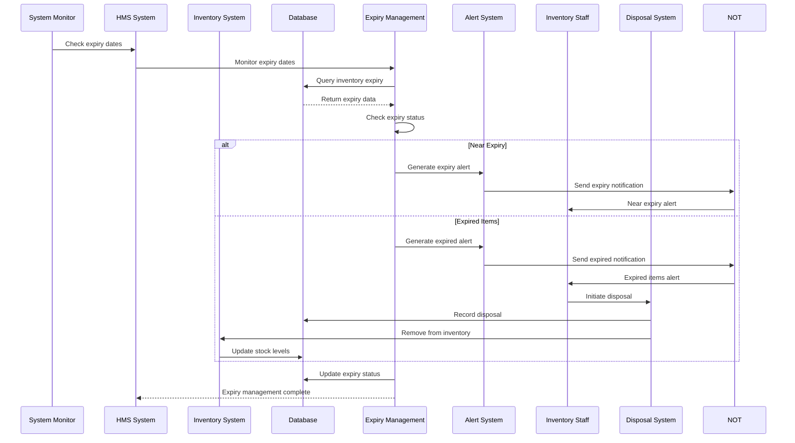

## Inventory Optimization Flow

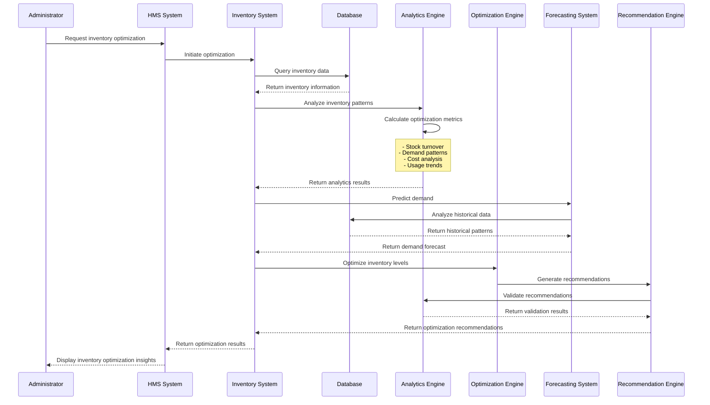

## Multi-Location Inventory Flow

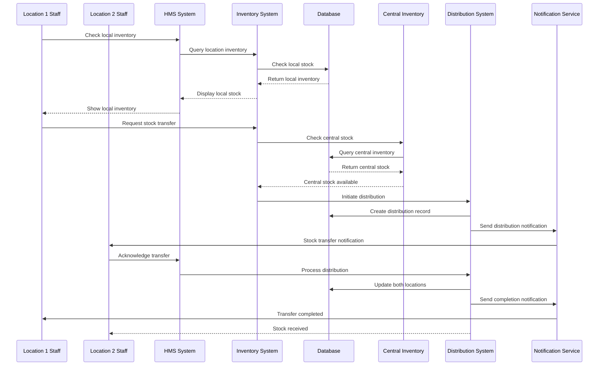

## Inventory Analytics Flow

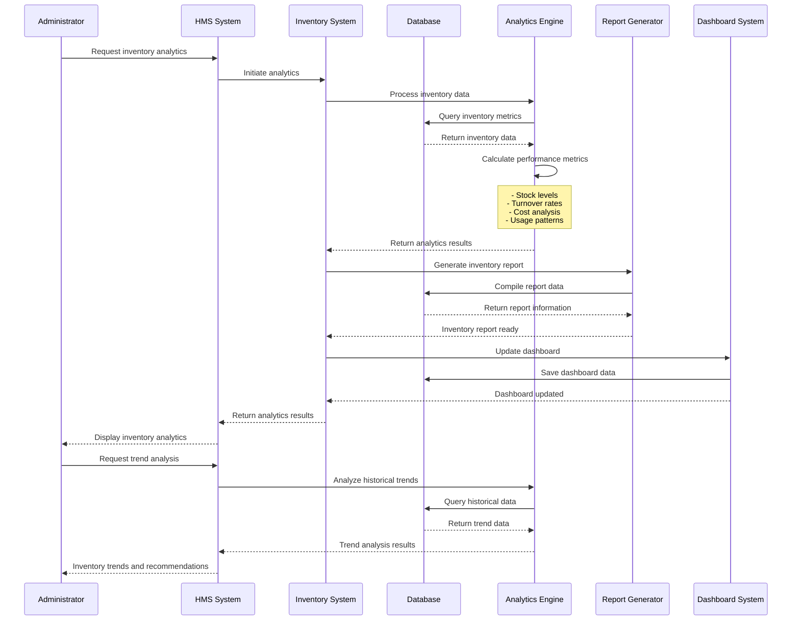
