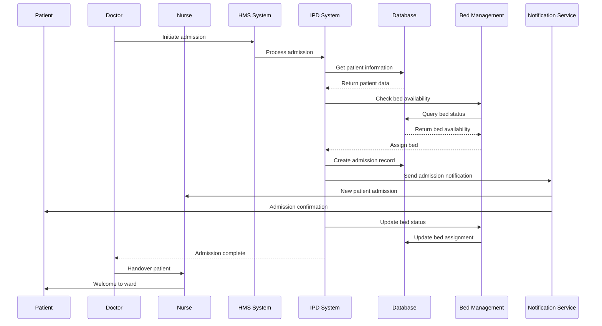
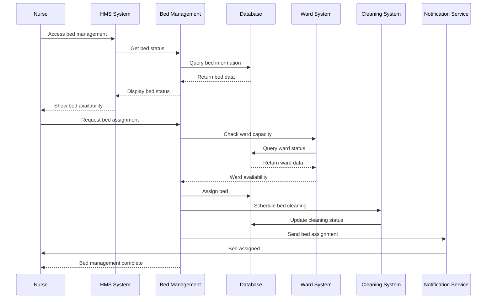
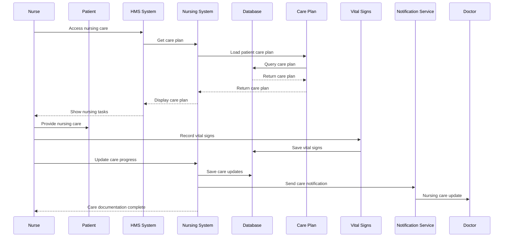
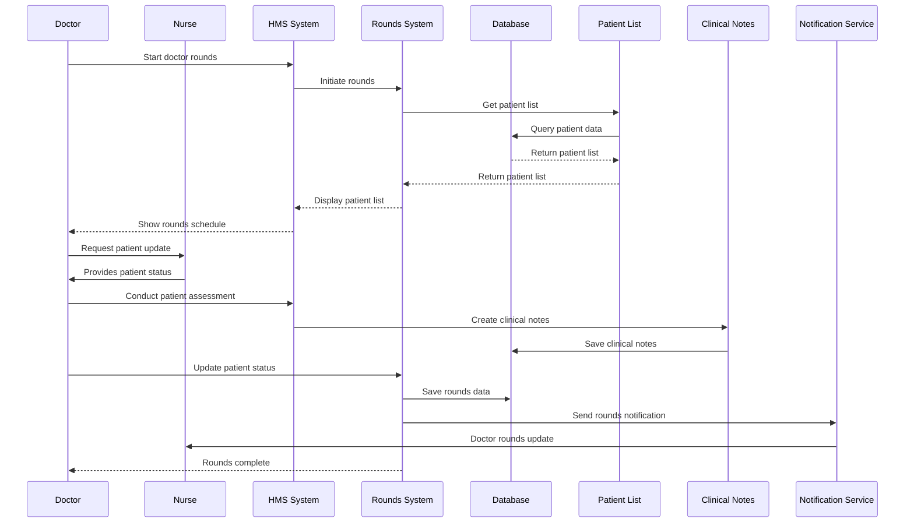
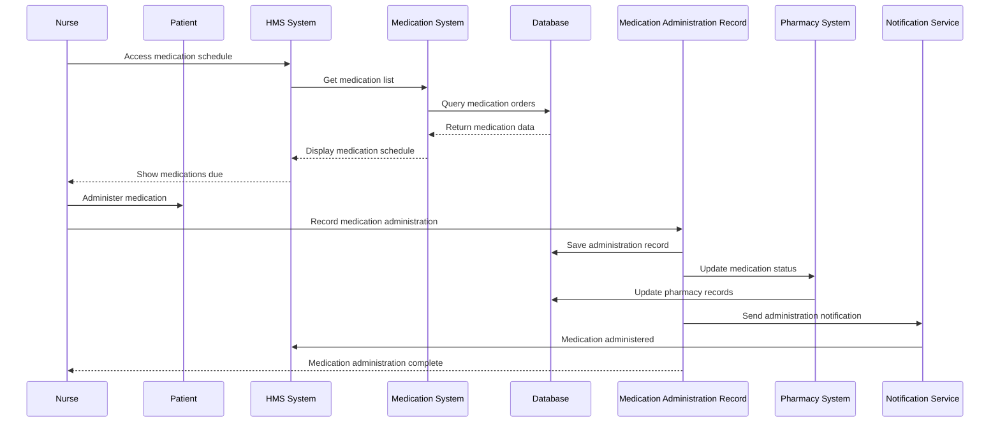
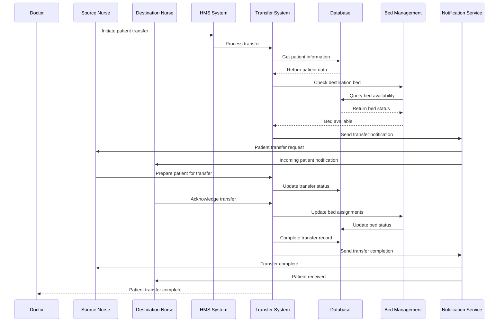
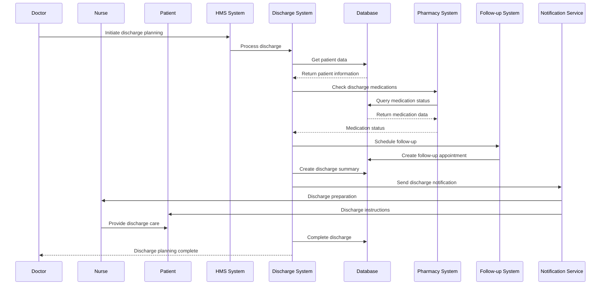
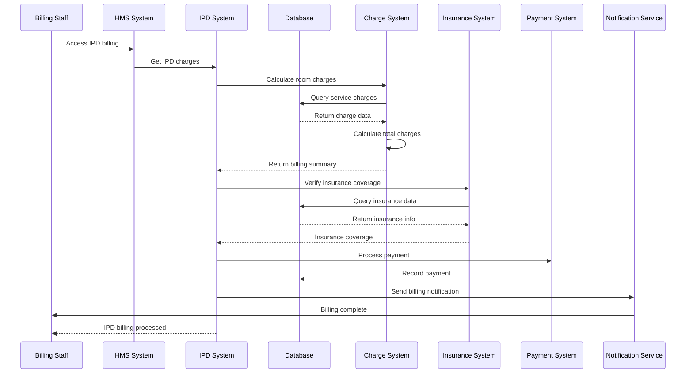
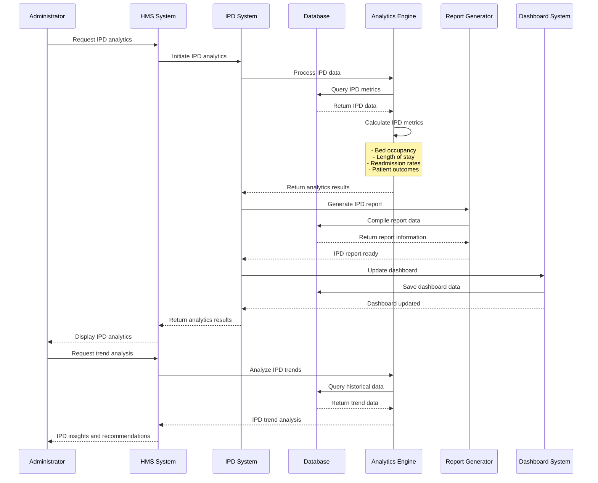
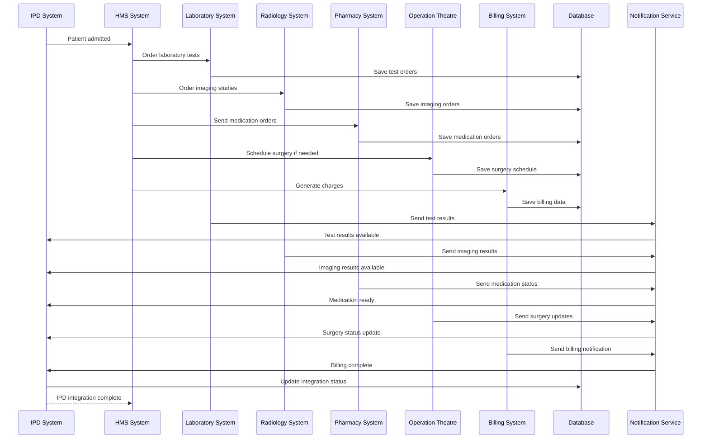

# IPD Management Module - End-to-End Sequence Diagram

## Patient Admission Flow

## Bed Management Flow

## Nursing Care Flow

## Doctor Rounds Flow

## Medication Administration Flow

## Patient Transfer Flow

## Discharge Planning Flow

## IPD Billing Flow

## IPD Analytics Flow

## IPD Integration Flow

