# Laboratory Management Module - End-to-End Sequence Diagram

## Test Ordering Flow

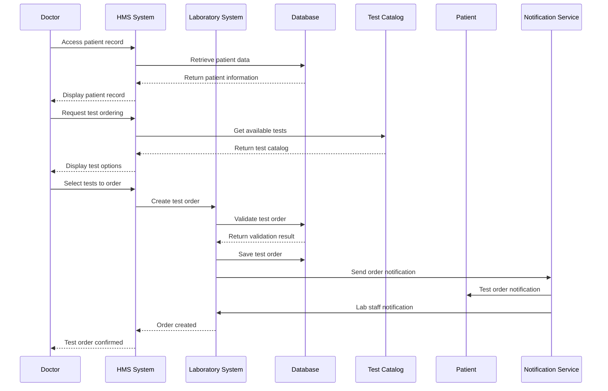

## Sample Collection Flow

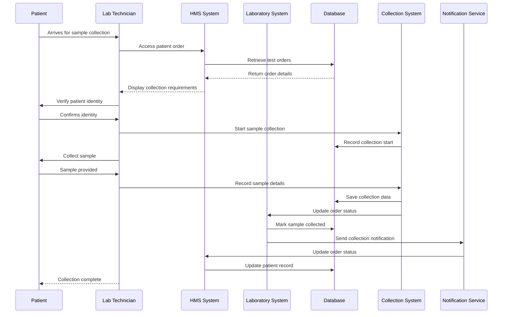

## Sample Reception and Accessioning Flow

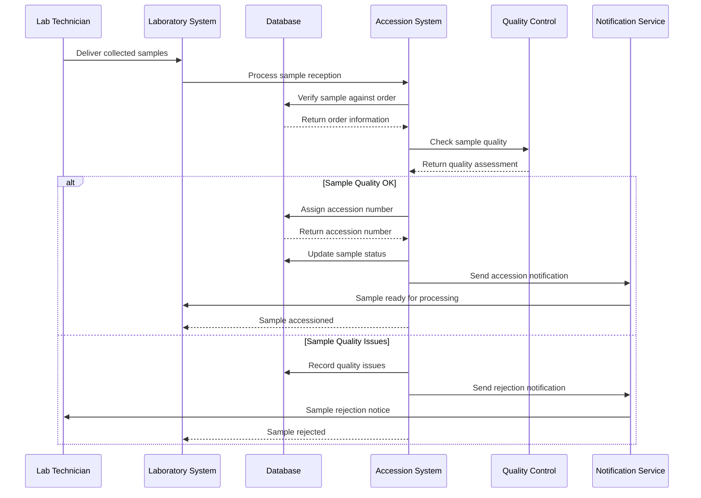

## Laboratory Processing Flow

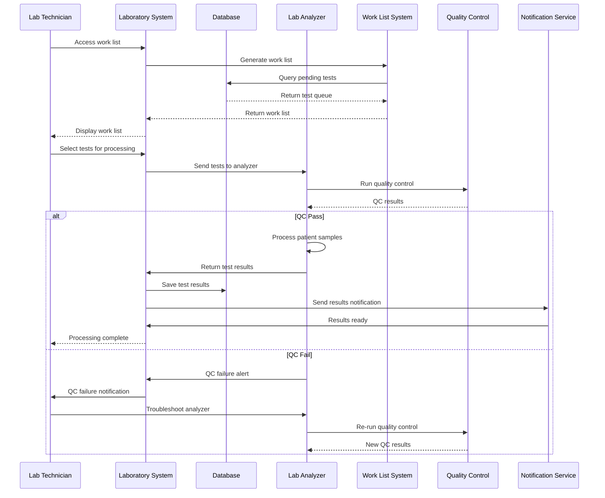

## Result Entry and Validation Flow

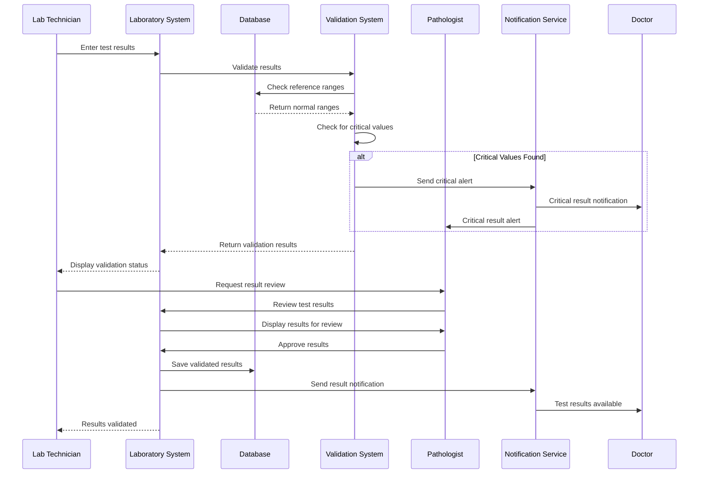

## Report Generation and Distribution Flow

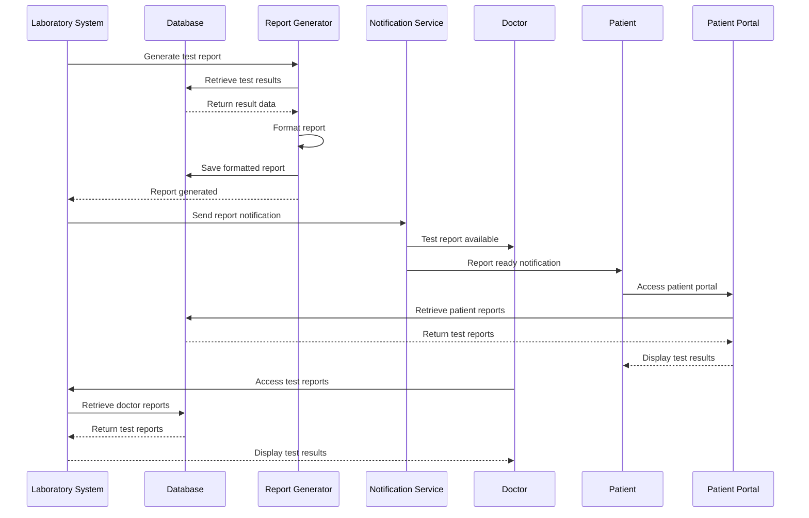

## Critical Result Communication Flow

```mermaid
sequenceDiagram
    participant ANALYZER as Lab Analyzer
    participant LAB as Laboratory System
    participant DB as Database
    participant CRITICAL as Critical Alert System
    participant NOT as Notification Service
    participant DR as Doctor
    participant NURSE as Nurse
    participant PATH as Pathologist
    participant ESCALATION as Escalation System
    participant AUDIT as Audit System
    participant SMS as SMS Service
    participant EMAIL as Email Service
    participant PHONE as Phone System

    ANALYZER->>LAB: Critical result detected
    LAB->>CRITICAL: Process critical alert
    CRITICAL->>DB: Log critical result
    CRITICAL->>AUDIT: Log critical alert
    AUDIT->>DB: Save audit trail
    CRITICAL->>NOT: Send critical alert
    NOT->>SMS: Send SMS alert
    SMS->>DR: SMS notification
    NOT->>EMAIL: Send email alert
    EMAIL->>DR: Email notification
    NOT->>PHONE: Make phone call
    PHONE->>DR: Phone call
    NOT->>NURSE: Critical result notification
    NOT->>PATH: Critical result alert
    CRITICAL->>ESCALATION: Start escalation timer
    ESCALATION->>ESCALATION: Wait for acknowledgment
    alt No Acknowledgment Within Time Limit
        ESCALATION->>NOT: Send escalation alert
        NOT->>DR: Escalation notification
        NOT->>PATH: Escalation alert
        ESCALATION->>DB: Log escalation
    end
    DR->>LAB: Acknowledge critical result
    LAB->>CRITICAL: Record acknowledgment
    CRITICAL->>DB: Update critical result status
    CRITICAL->>ESCALATION: Stop escalation timer
    DR->>LAB: Take clinical action
    LAB->>DB: Record clinical response
    CRITICAL->>NOT: Send follow-up notification
    NOT->>PATH: Follow-up critical result
    PATH->>LAB: Confirm critical result
    LAB->>DB: Final critical result status
    CRITICAL->>AUDIT: Log critical result completion
    AUDIT->>DB: Save completion audit
```

## Microbiology Culture Flow

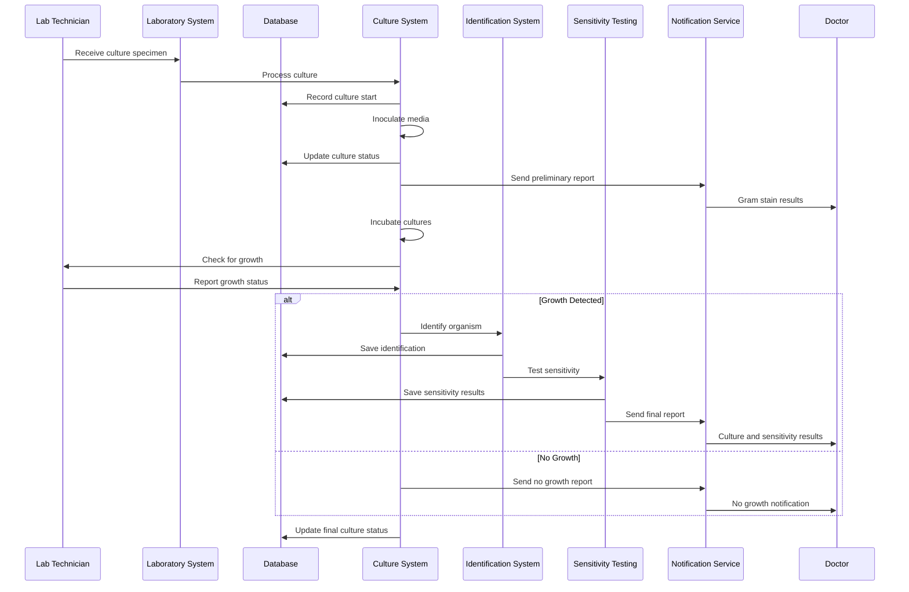

## Quality Control Flow

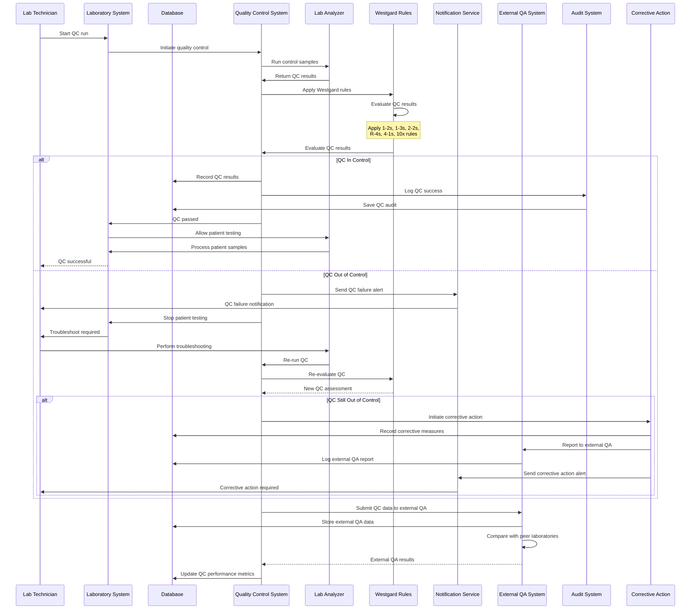

## External Quality Assurance Flow

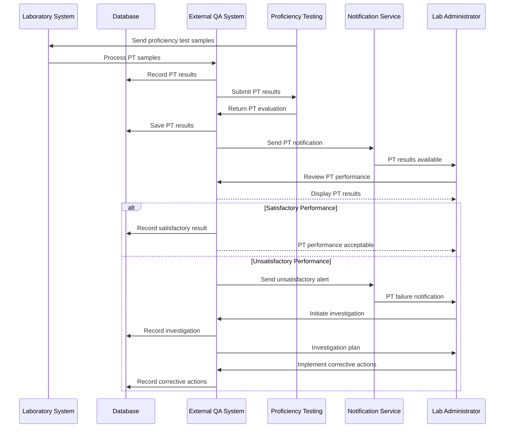

## Laboratory Equipment Maintenance Flow

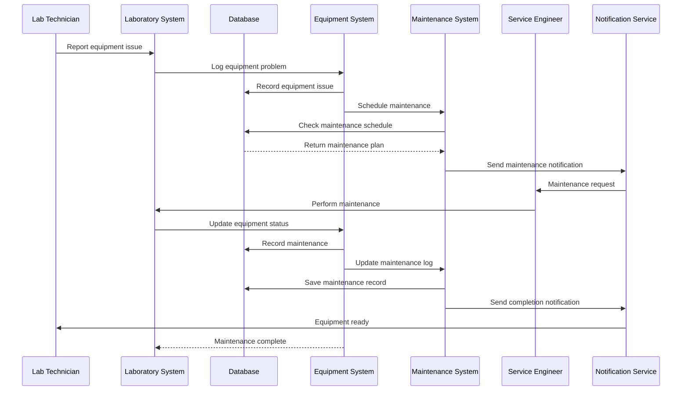

## Laboratory Inventory Management Flow

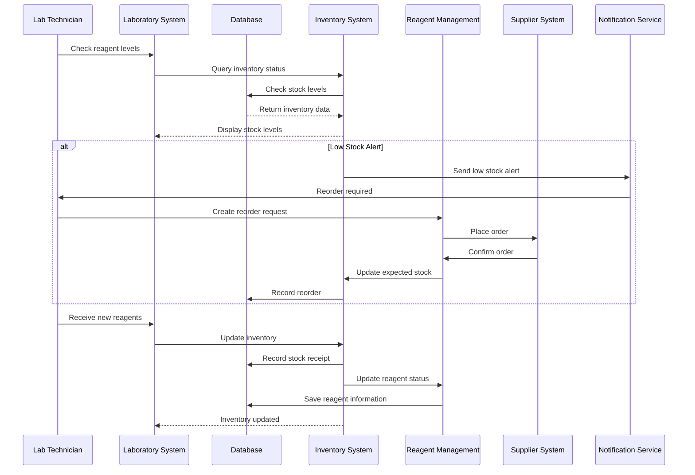

## Laboratory Analytics and Reporting Flow

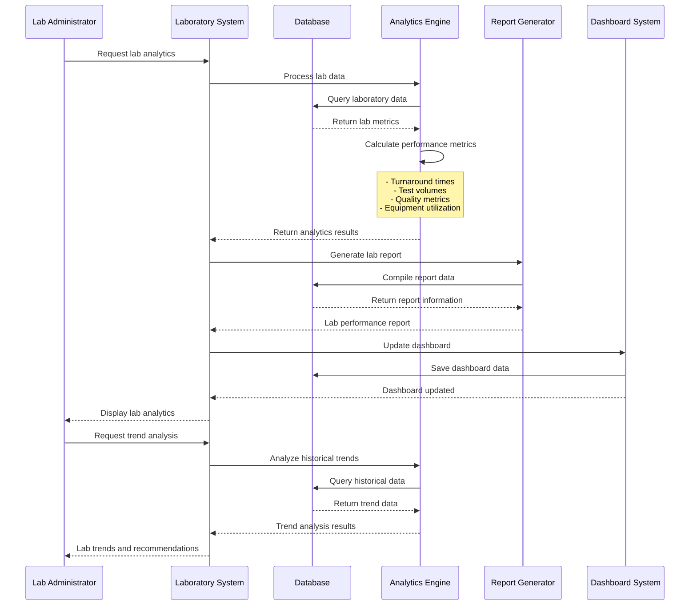
