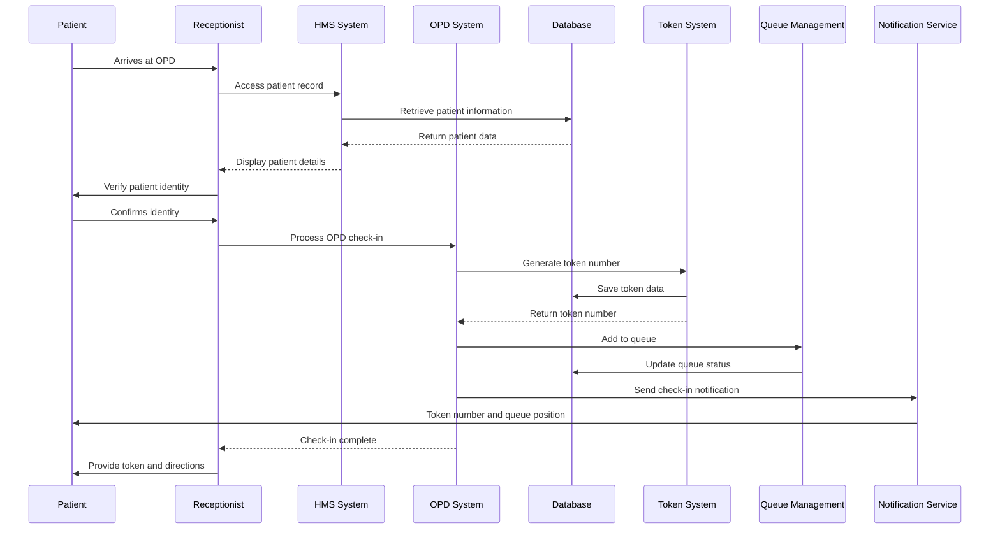
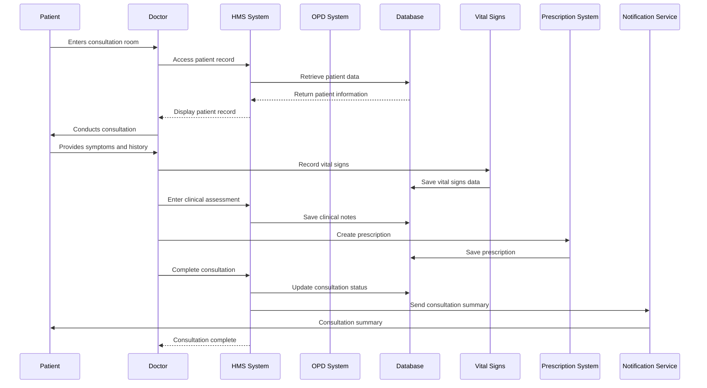
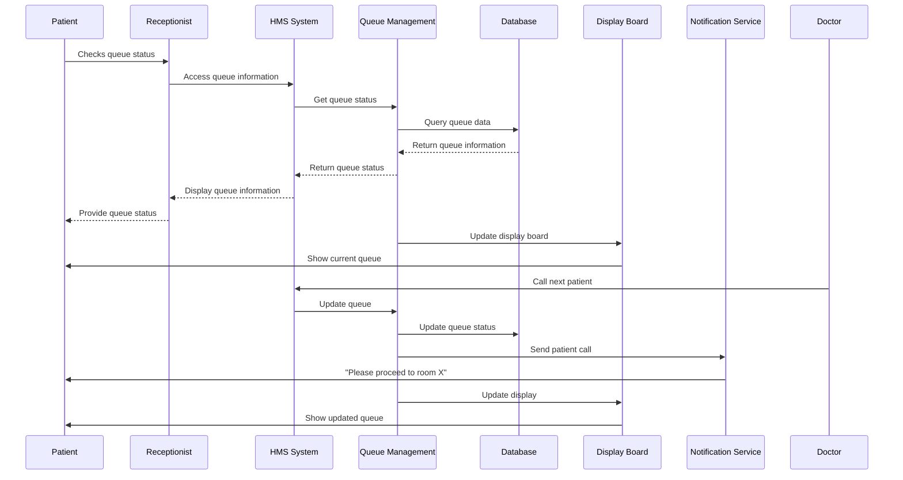
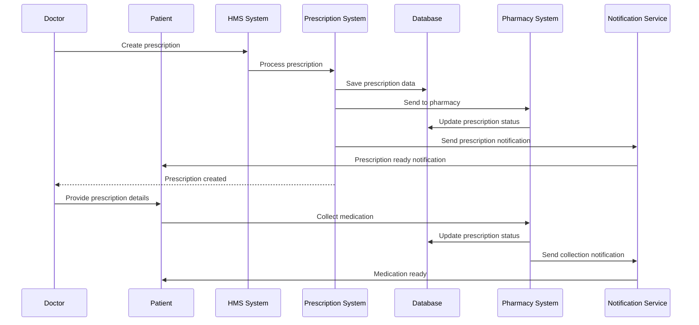
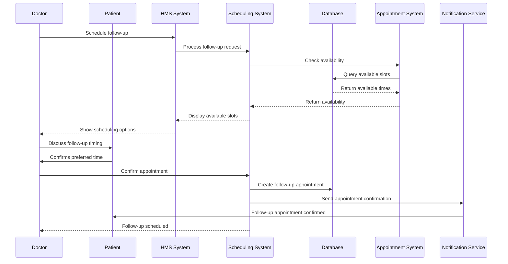
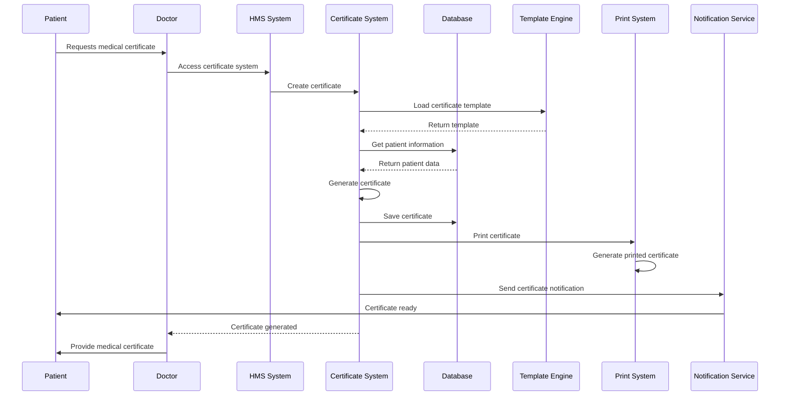
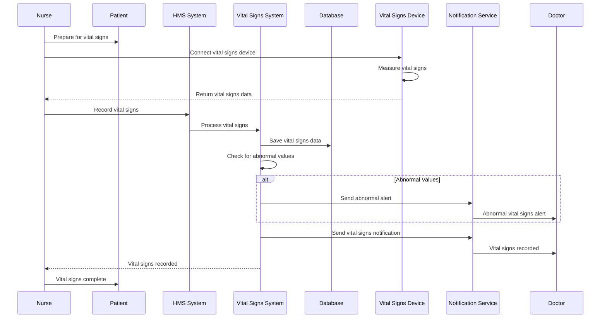
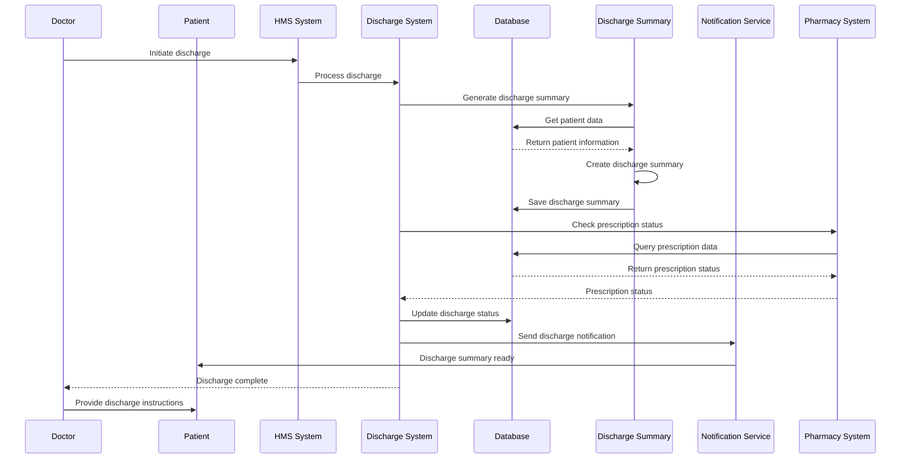
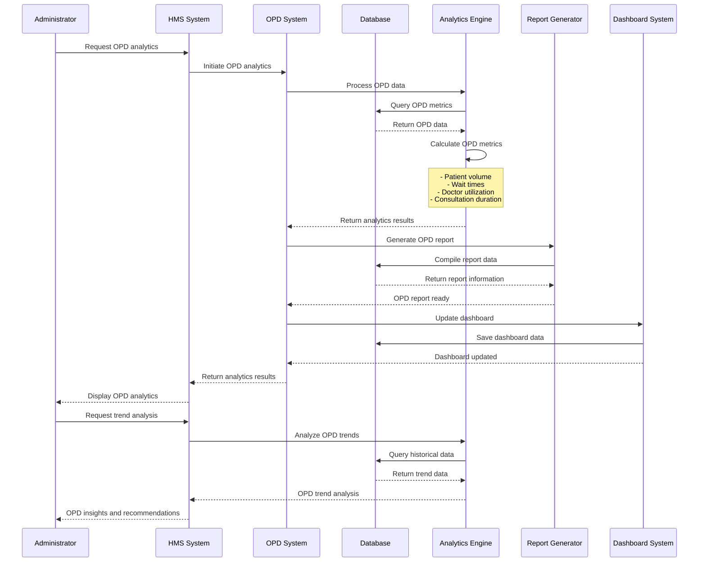
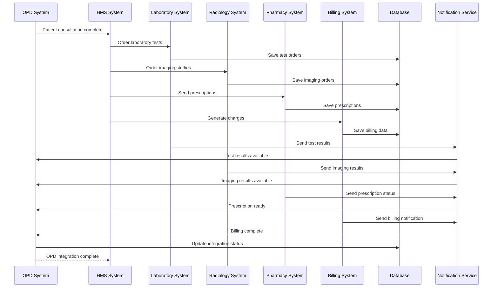

# OPD Management Module - End-to-End Sequence Diagram

## OPD Patient Check-in Flow

## OPD Consultation Flow

## OPD Queue Management Flow

## OPD Prescription Flow

## OPD Follow-up Scheduling Flow

## OPD Medical Certificate Flow

## OPD Vital Signs Recording Flow

## OPD Discharge Flow

## OPD Analytics Flow

## OPD Integration Flow

