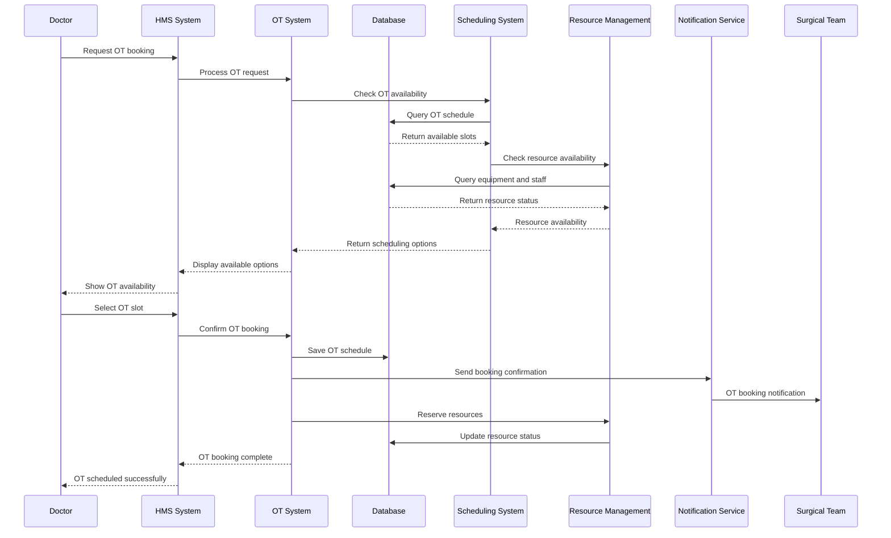
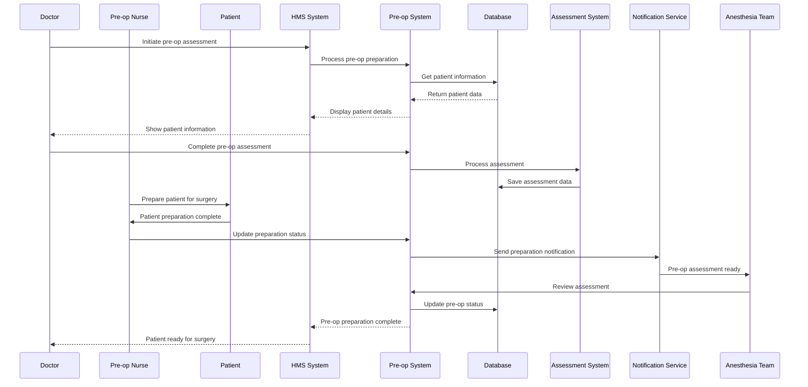
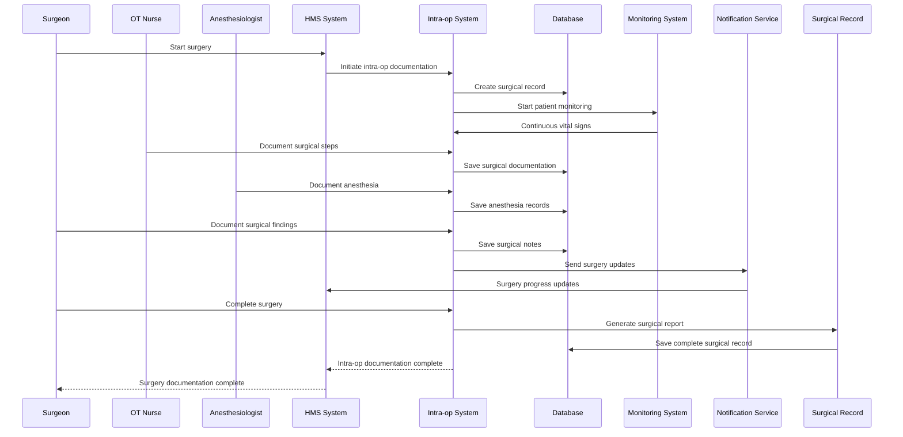
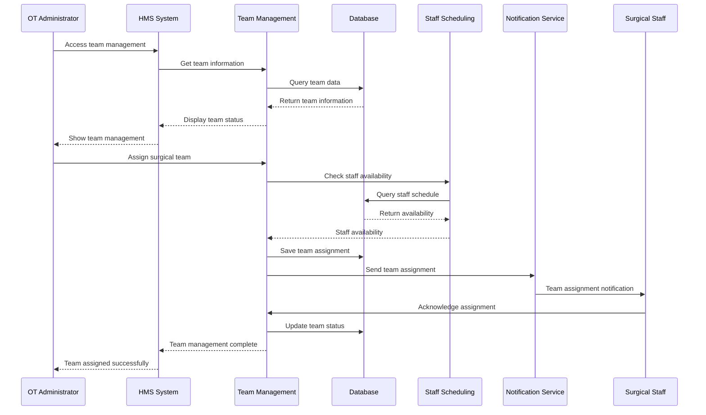
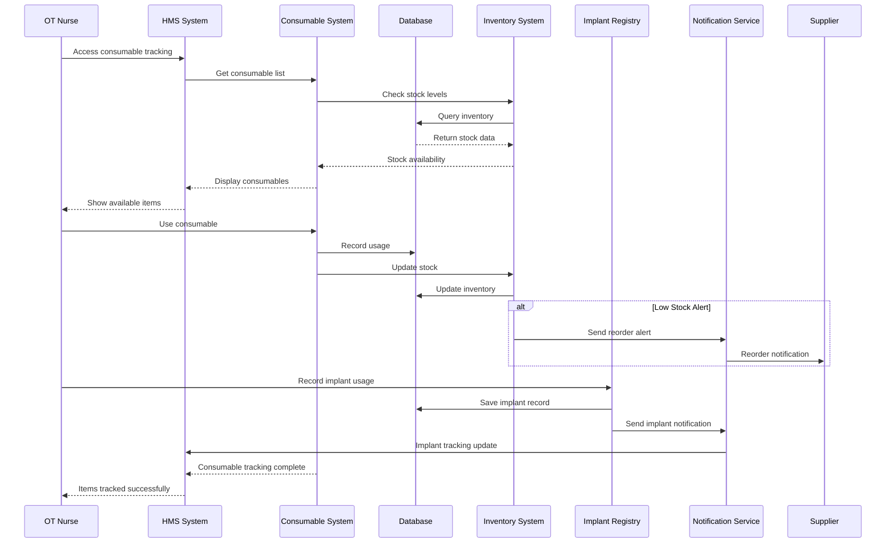
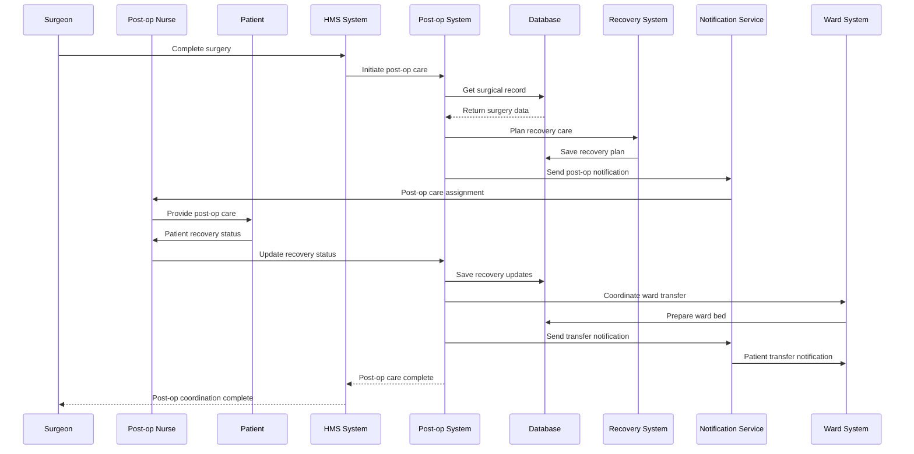
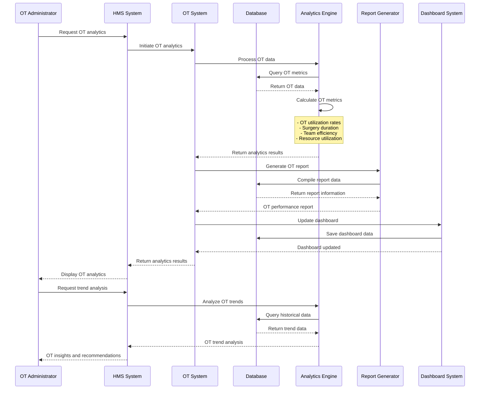
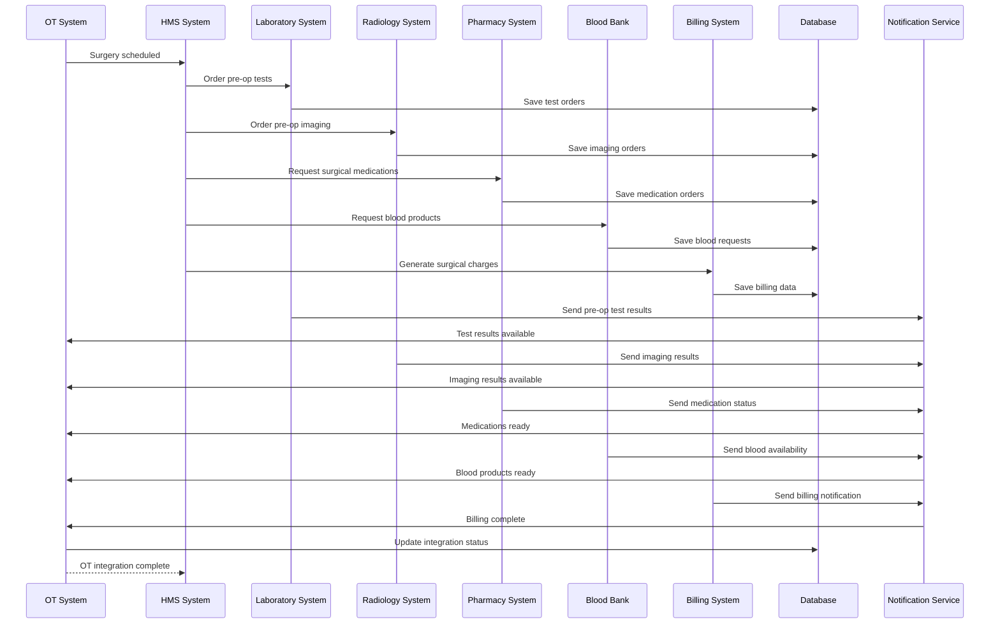
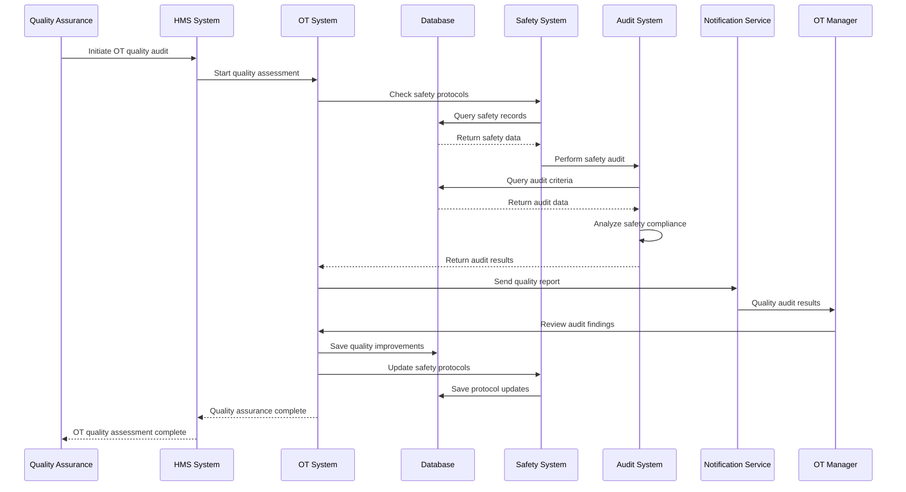
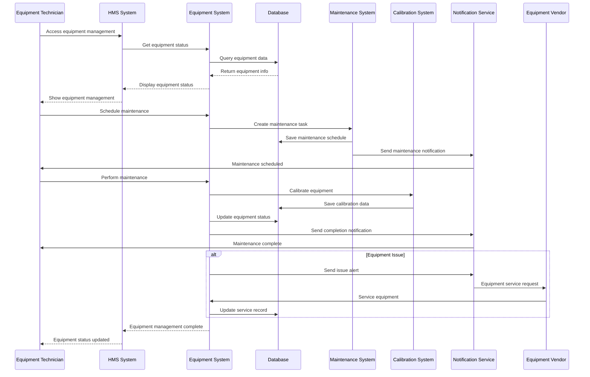

# Operation Theatre (OT) Management Module - End-to-End Sequence Diagram

## OT Scheduling and Resource Management Flow

## Pre-Operative Assessment and Preparation Flow

## Intra-Operative Documentation Flow

## Surgical Team Management Flow

## Consumables and Implant Tracking Flow

## Post-Operative Care Coordination Flow

## OT Utilization and Performance Analytics Flow

## OT Integration Flow

## OT Quality Assurance and Safety Flow

## OT Equipment Management and Maintenance Flow

