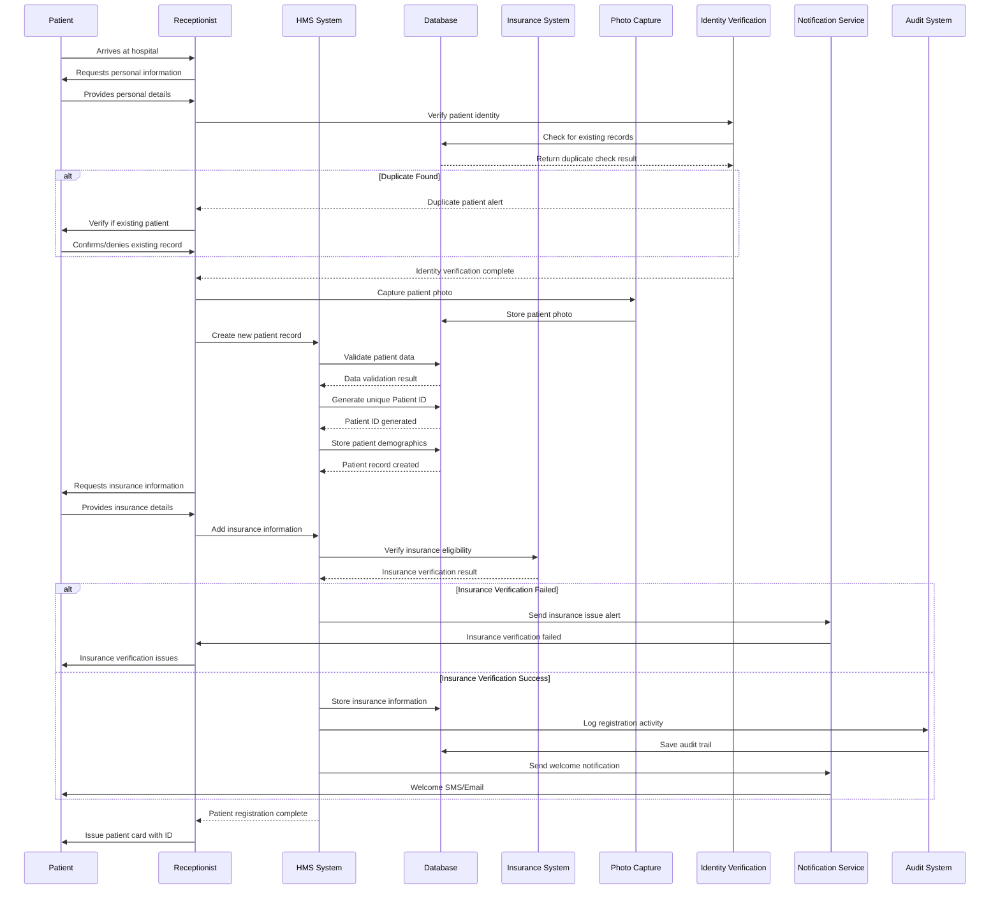
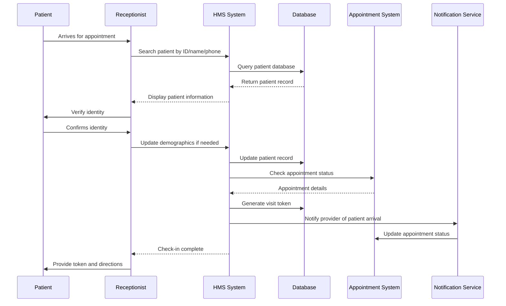
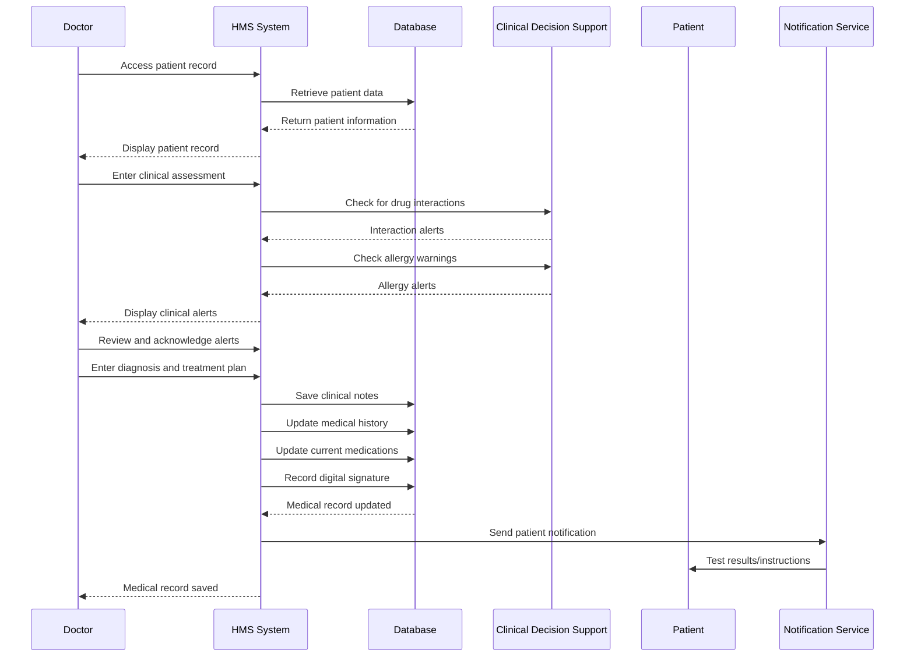
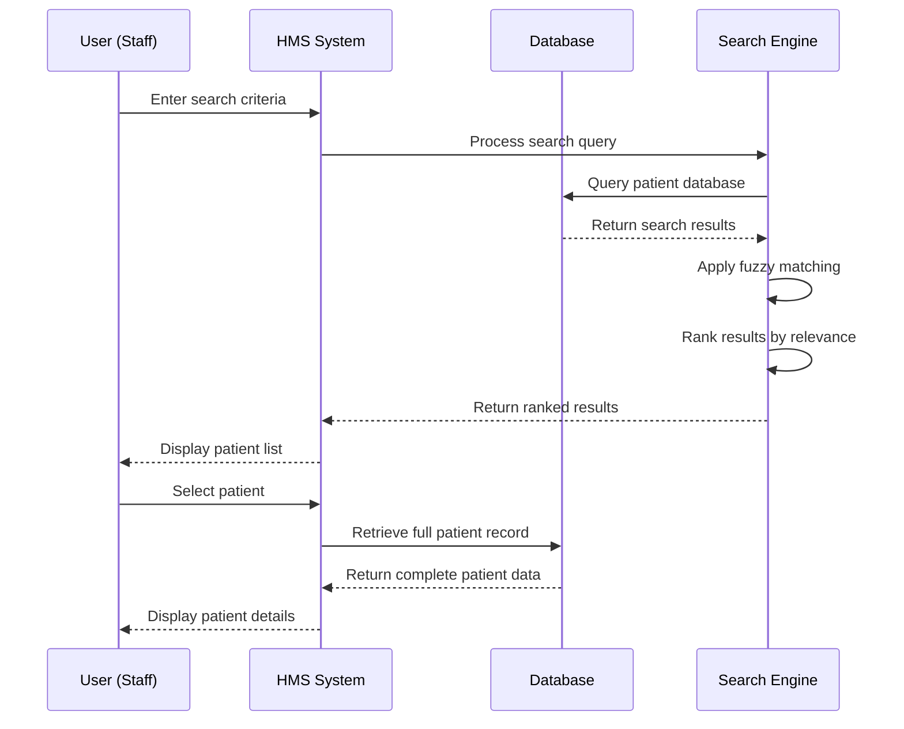
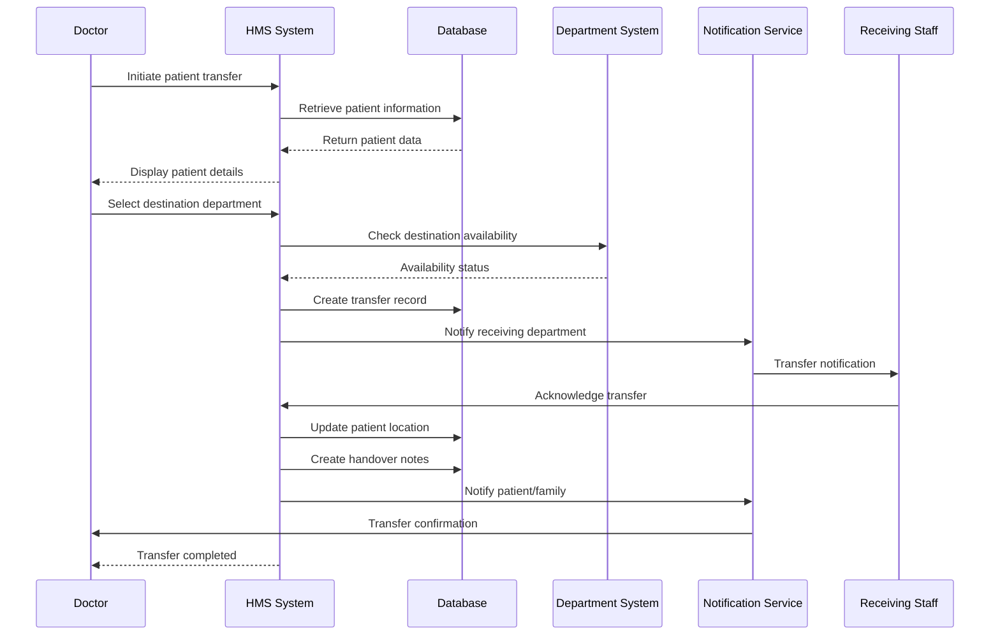
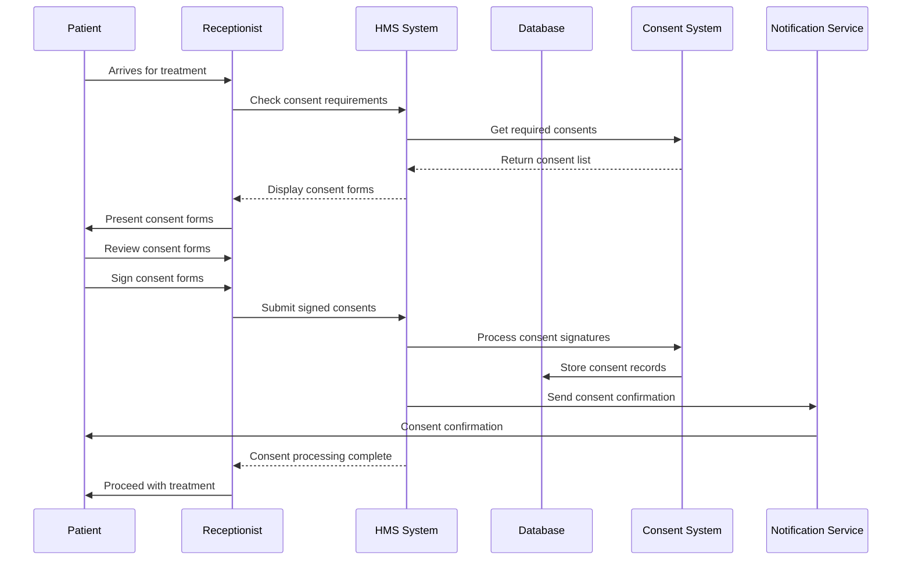
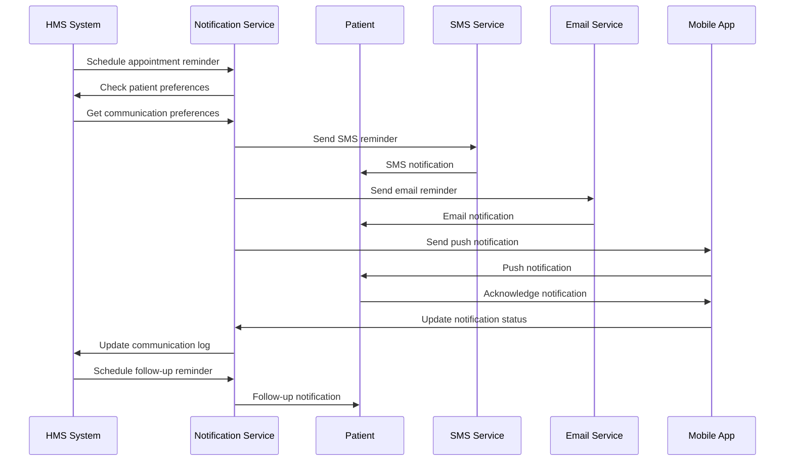
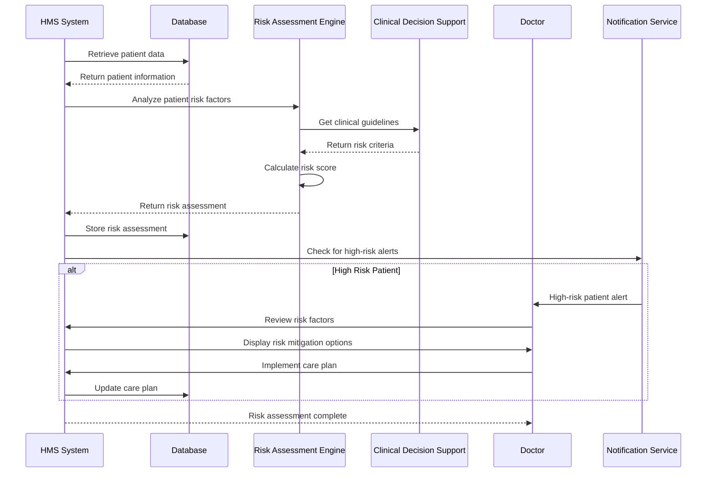

# Patient Management Module - End-to-End Sequence Diagram

## New Patient Registration Flow

## Patient Check-in Flow

## Medical Record Update Flow

## Patient Search and Retrieval Flow

## Patient Transfer Flow

## Consent Management Flow

## Patient Communication Flow

## Patient Risk Stratification Flow

