# Pharmacy Management Module - End-to-End Sequence Diagram

## Prescription Processing Flow

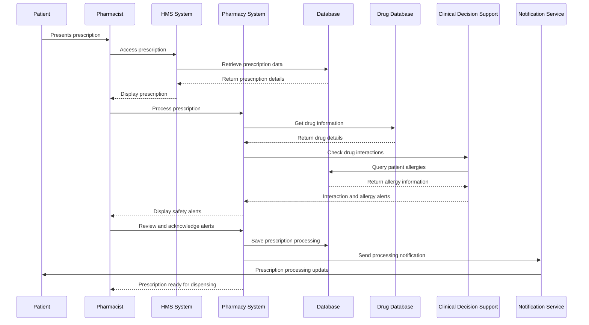

## Drug Dispensing Flow

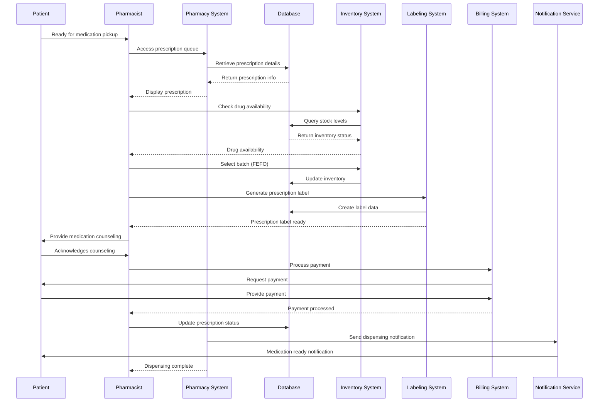

## Inventory Management Flow

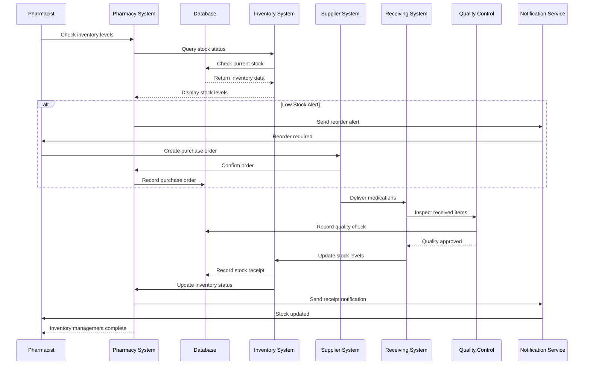

## Drug Interaction Checking Flow

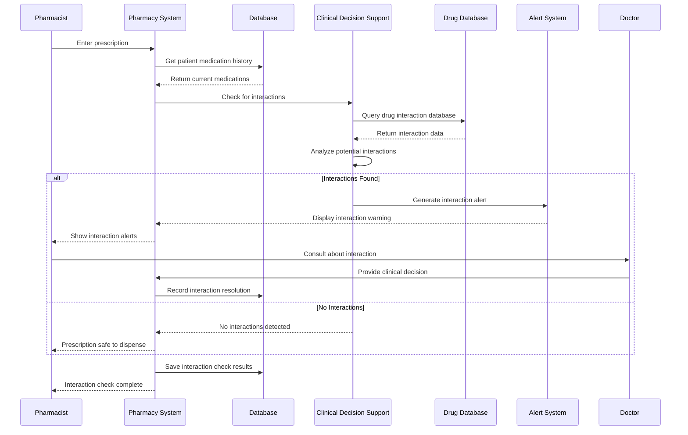

## Controlled Substance Management Flow

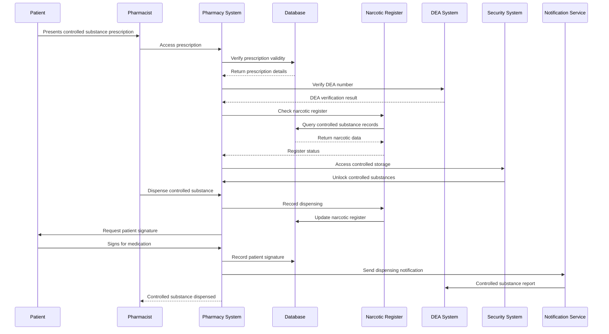

## Medication Reconciliation Flow

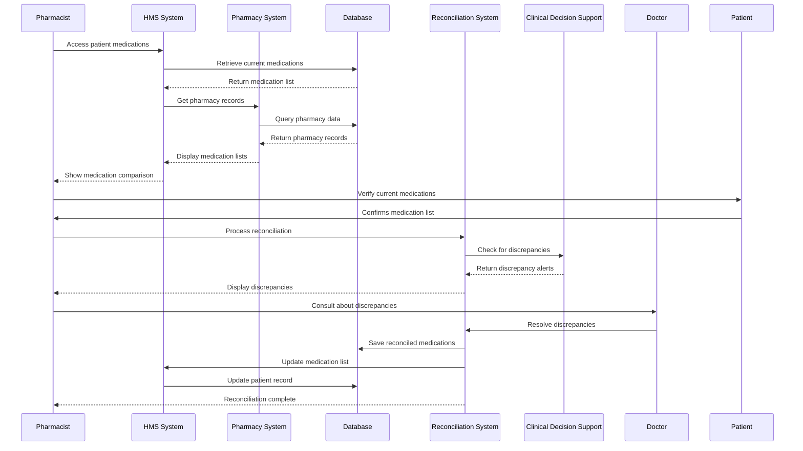

## Clinical Pharmacy Services Flow

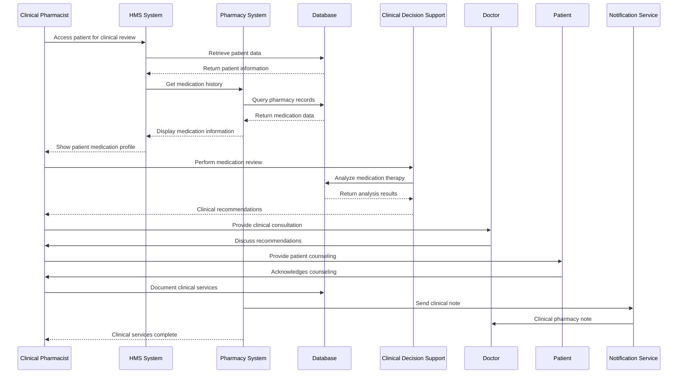

## Adverse Drug Reaction Reporting Flow

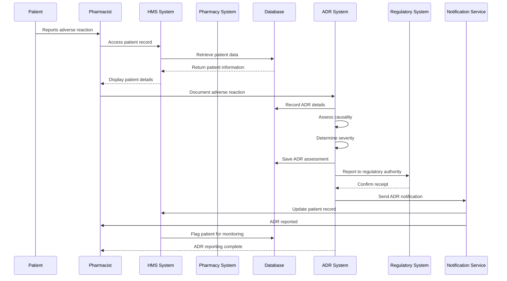

## Pharmacy Automation Flow

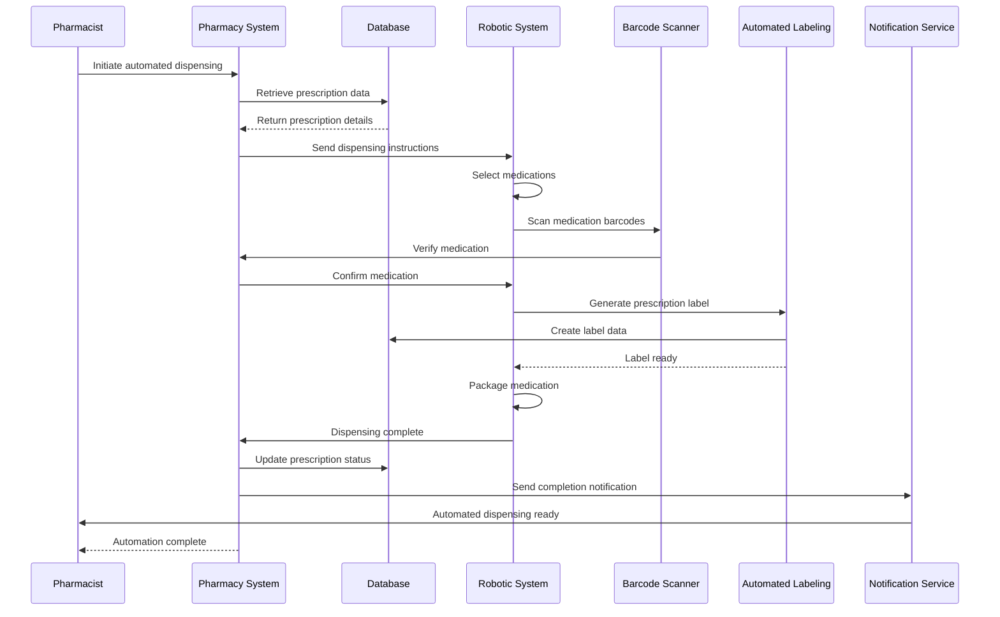

## Pharmacy Quality Assurance Flow

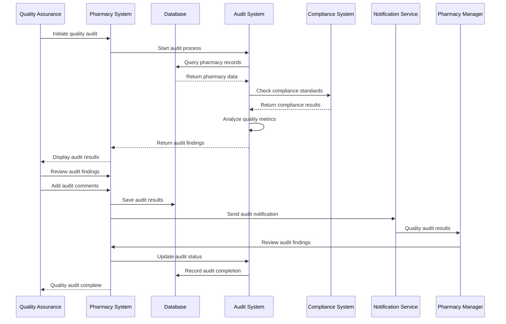

## Pharmacy Analytics and Reporting Flow

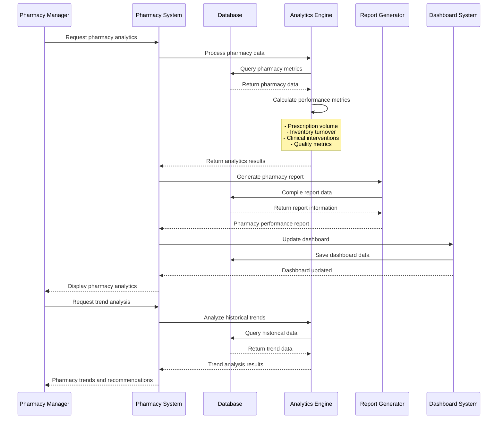

## Ward Pharmacy Management Flow

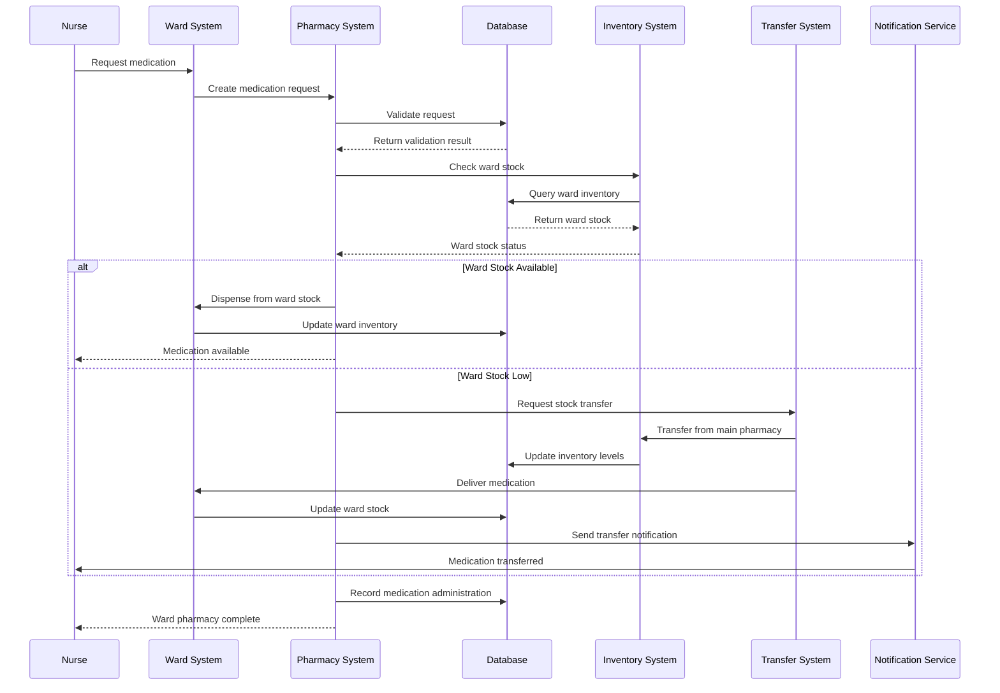

## Pharmacy Billing Integration Flow

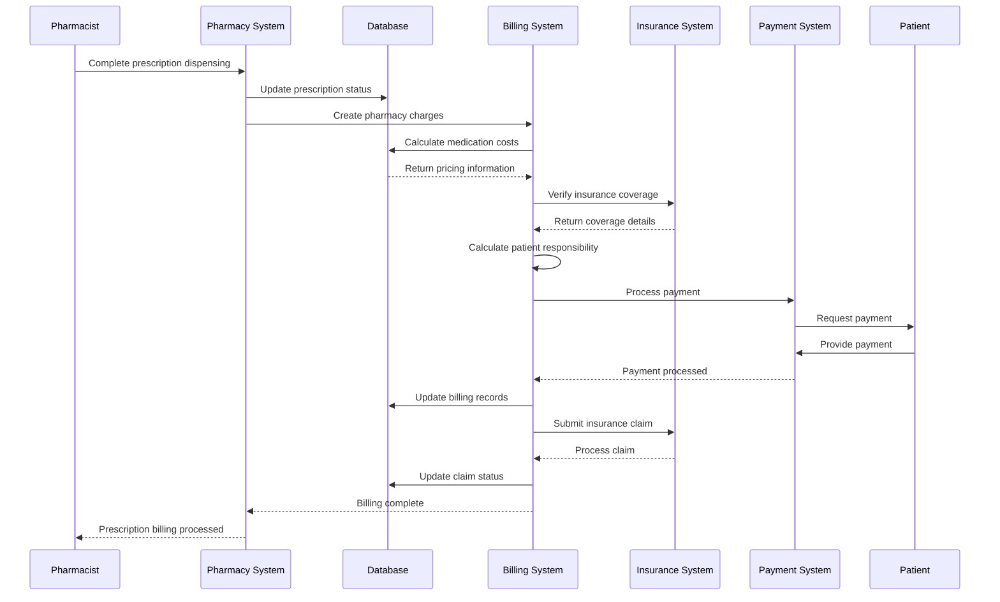
