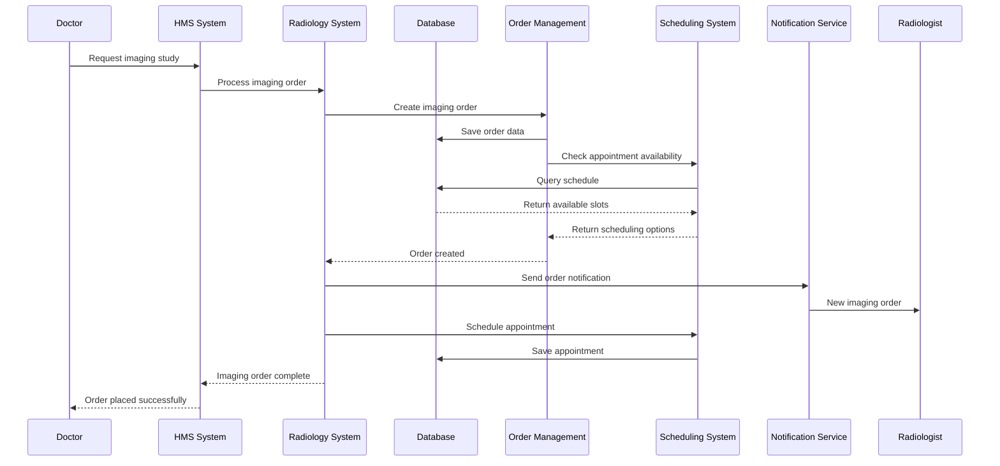
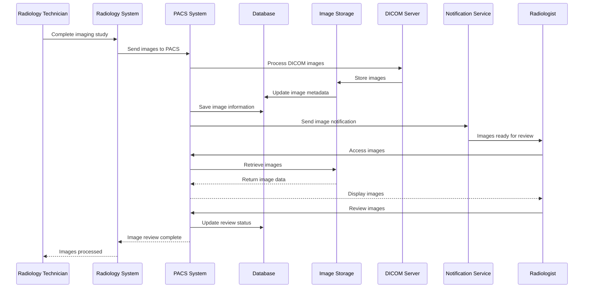
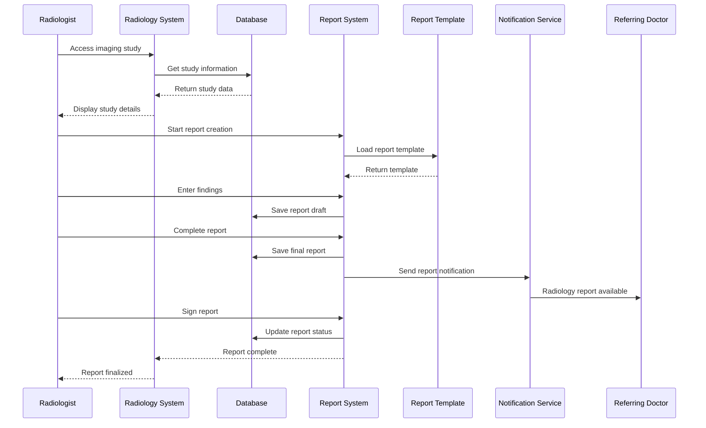
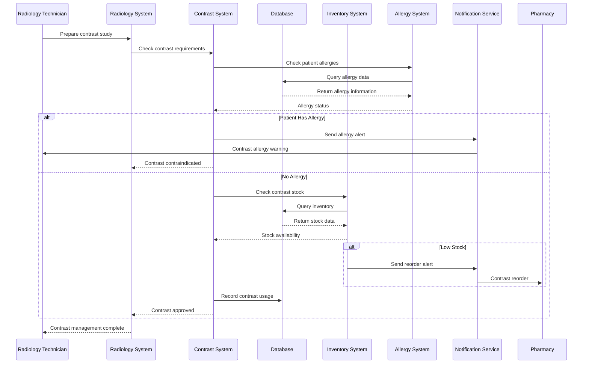
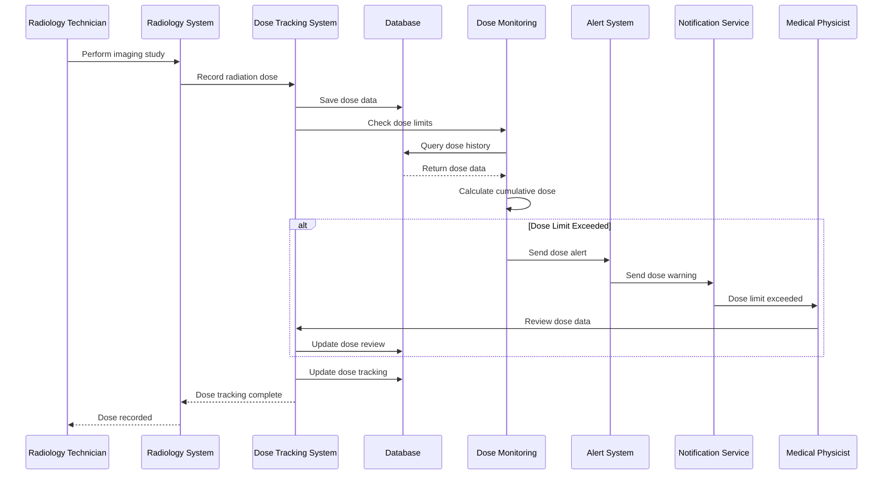
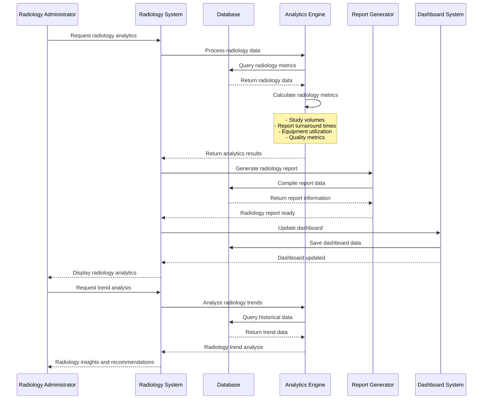
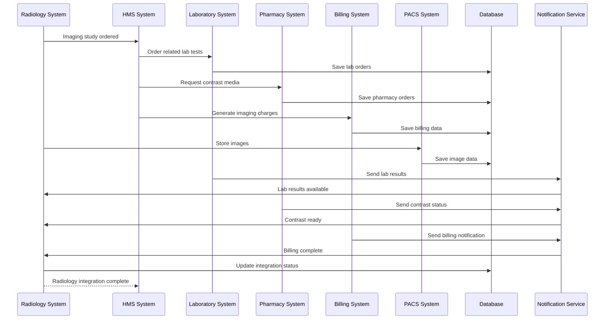
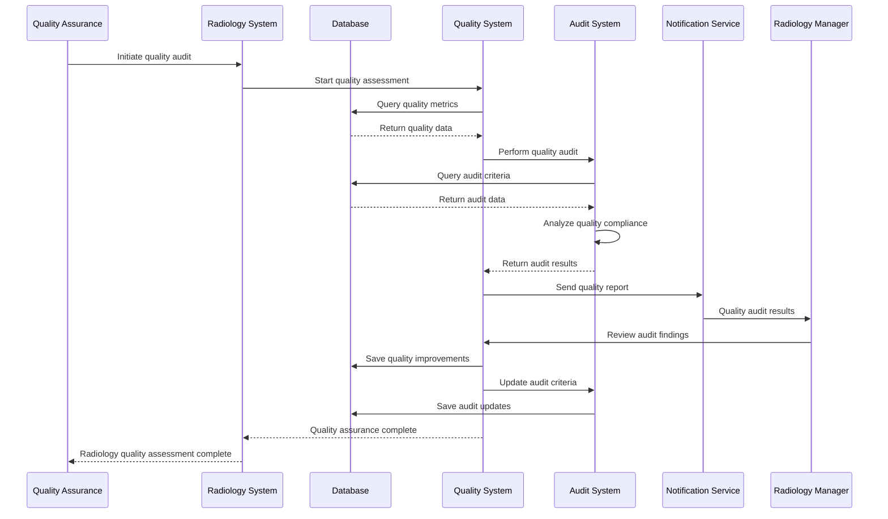
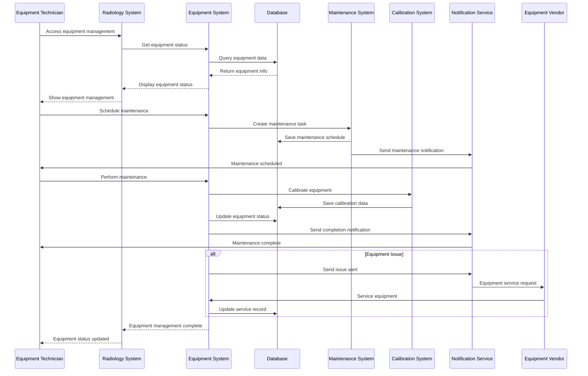

# Radiology & Imaging Module - End-to-End Sequence Diagram

## Imaging Order Management Flow



## PACS Integration and Image Storage Flow



## Radiologist Reporting and Workflow Flow



## Critical Results Management Flow

```mermaid
sequenceDiagram
    participant RADIOLOGIST as Radiologist
    participant RADIOLOGY as Radiology System
    participant CRITICAL as Critical Results System
    participant DB as Database
    participant NOT as Notification Service
    participant DR as Referring Doctor
    participant NURSE as Nurse
    participant ADMIN as Administrator

    RADIOLOGIST->>RADIOLOGY: Identify critical finding
    RADIOLOGY->>CRITICAL: Process critical result
    CRITICAL->>DB: Log critical finding
    CRITICAL->>NOT: Send critical alert
    NOT->>DR: Critical result call
    NOT->>NURSE: Critical result notification
    NOT->>ADMIN: Critical result alert
    DR->>CRITICAL: Acknowledge critical result
    CRITICAL->>DB: Record acknowledgment
    DR->>CRITICAL: Take clinical action
    CRITICAL->>DB: Record clinical response
    CRITICAL->>NOT: Send follow-up notification
    NOT->>RADIOLOGIST: Follow-up critical result
    RADIOLOGIST->>CRITICAL: Confirm critical result
    CRITICAL->>DB: Final critical result status
    CRITICAL-->>RADIOLOGY: Critical result managed
    RADIOLOGY-->>RADIOLOGIST: Critical result complete
```

## Contrast Media Management Flow



## Radiation Dose Tracking Flow



## Radiology Analytics and Reporting Flow



## Radiology Integration Flow



## Radiology Quality Assurance Flow



## Radiology Equipment Management Flow


