# Reports & Analytics Module - End-to-End Sequence Diagram

## Dashboard Generation Flow

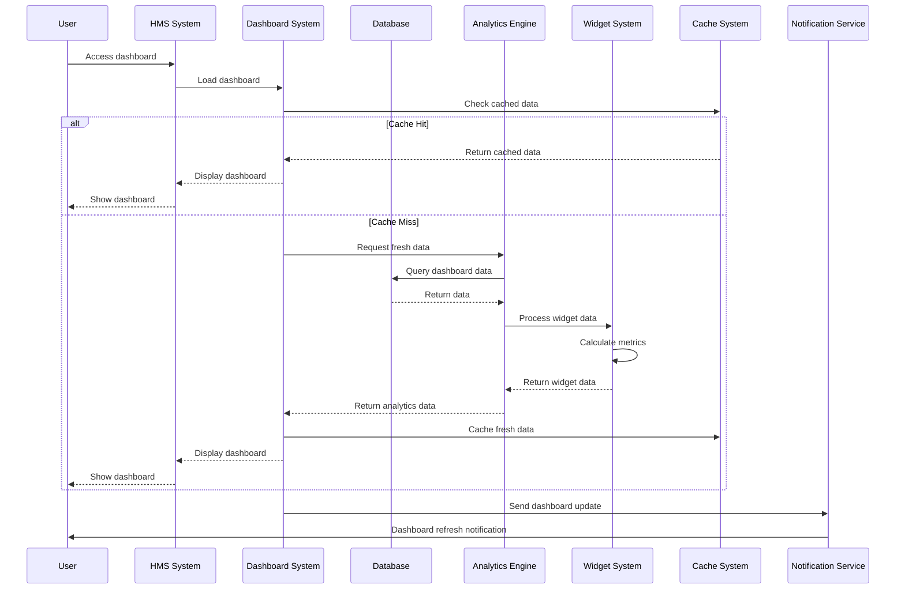

## Custom Report Generation Flow

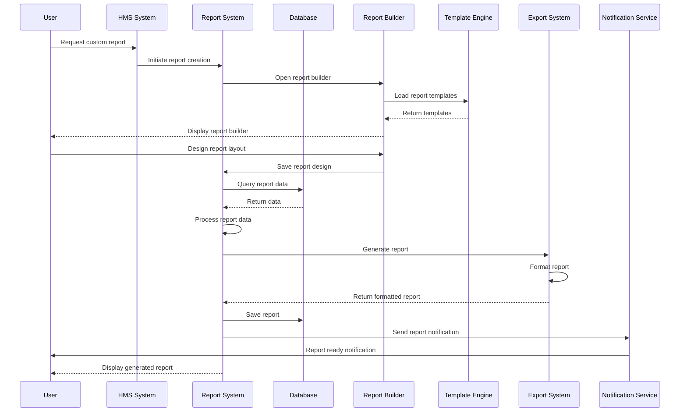

## Real-time Analytics Flow

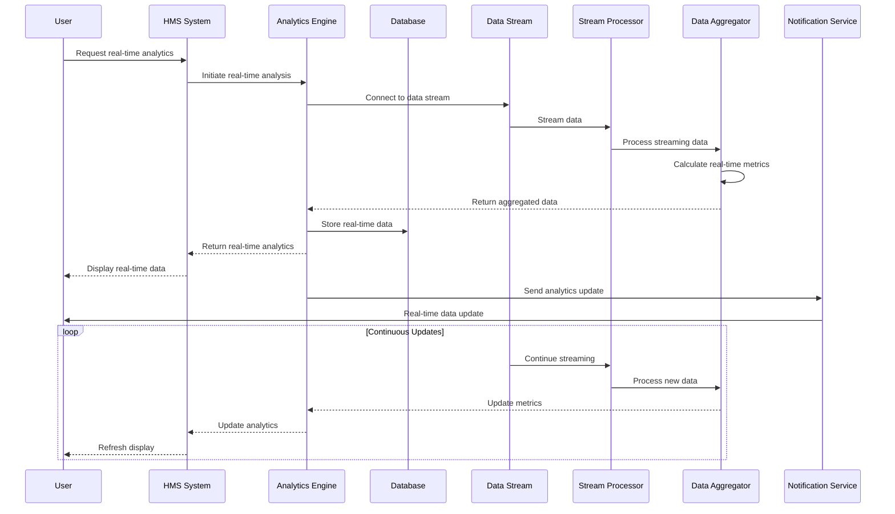

## Predictive Analytics Flow

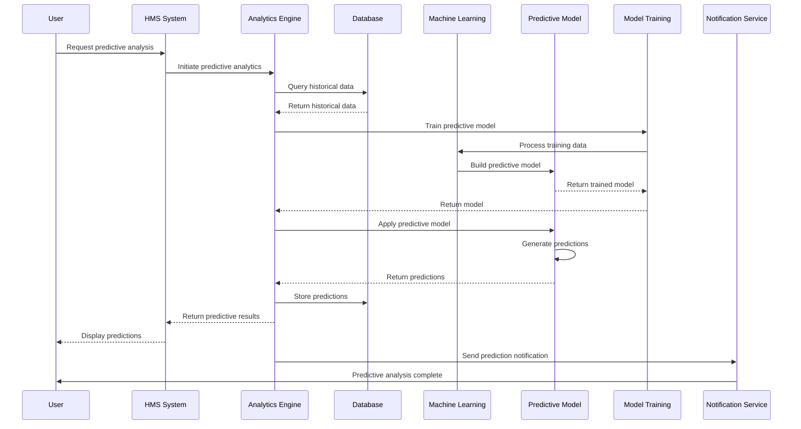

## Business Intelligence Flow

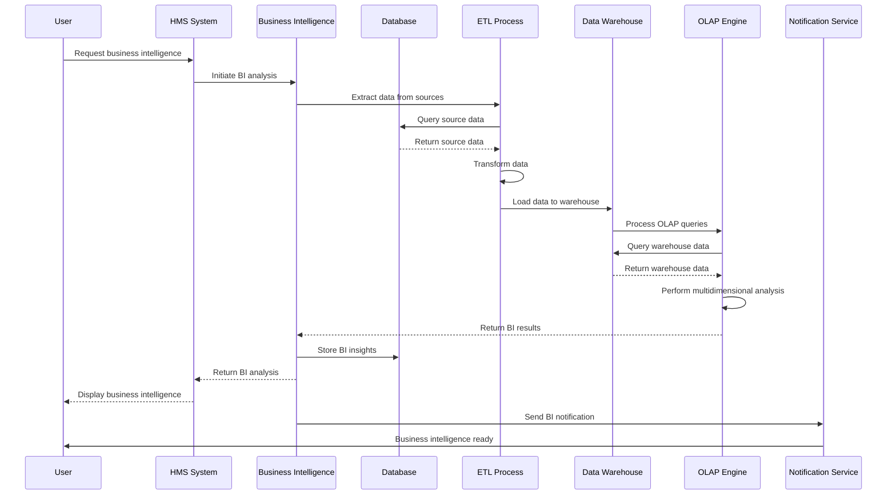

## Performance Metrics Flow

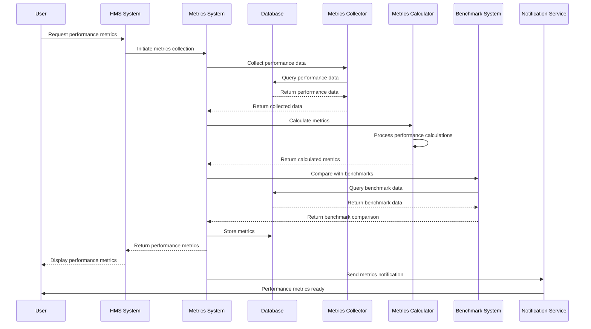

## Data Visualization Flow

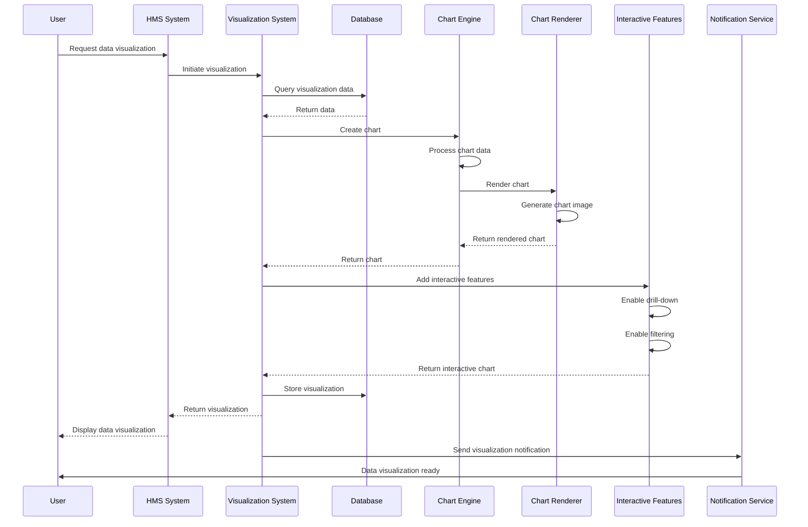

## Scheduled Report Flow

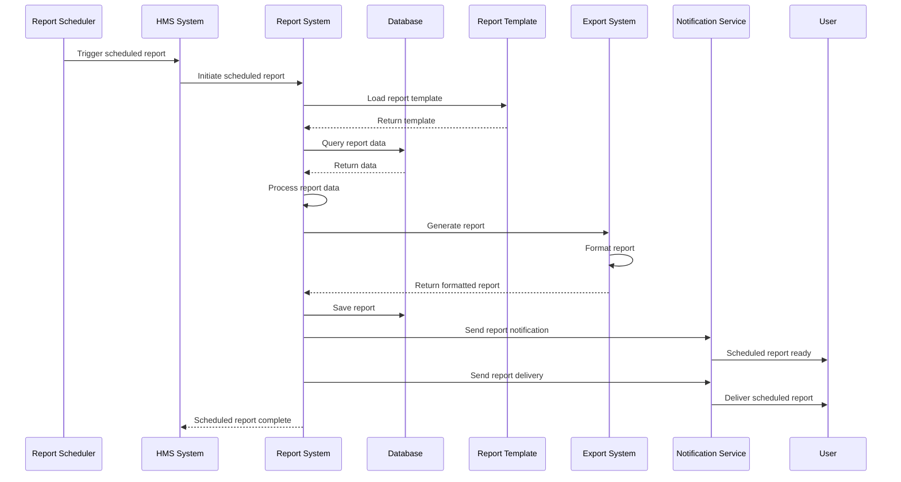

## Ad-hoc Query Flow

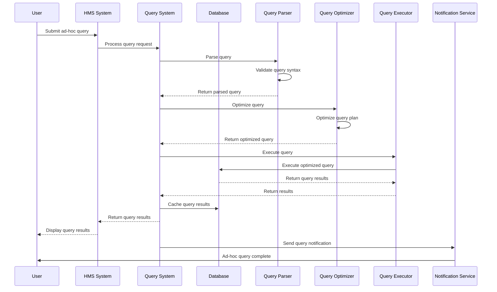

## Data Export Flow

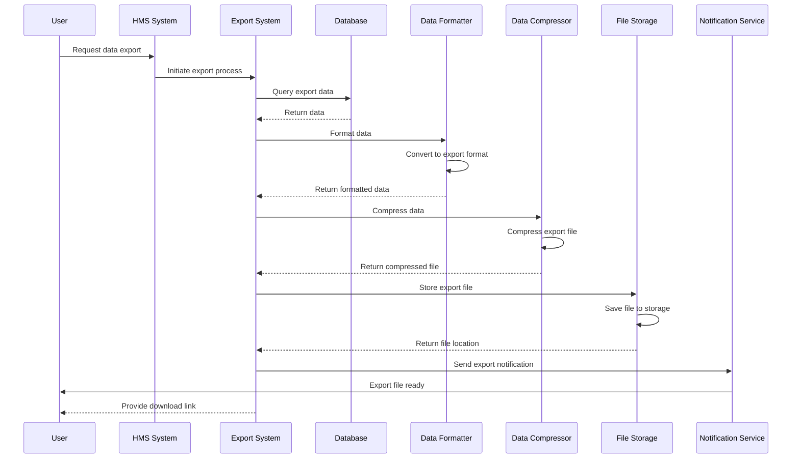

## Analytics Dashboard Flow

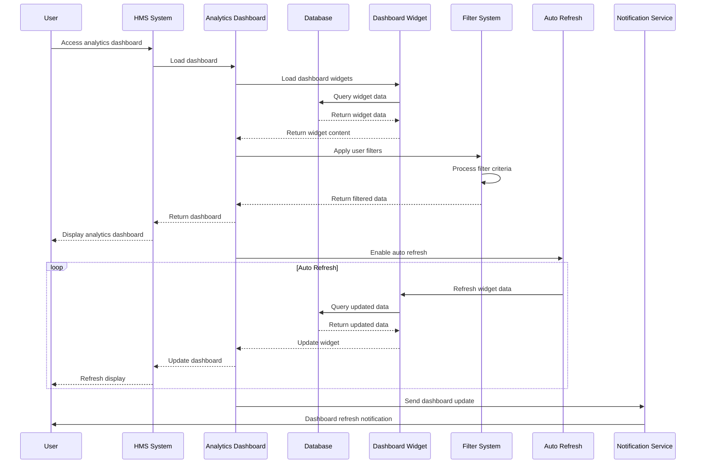

## Report Distribution Flow

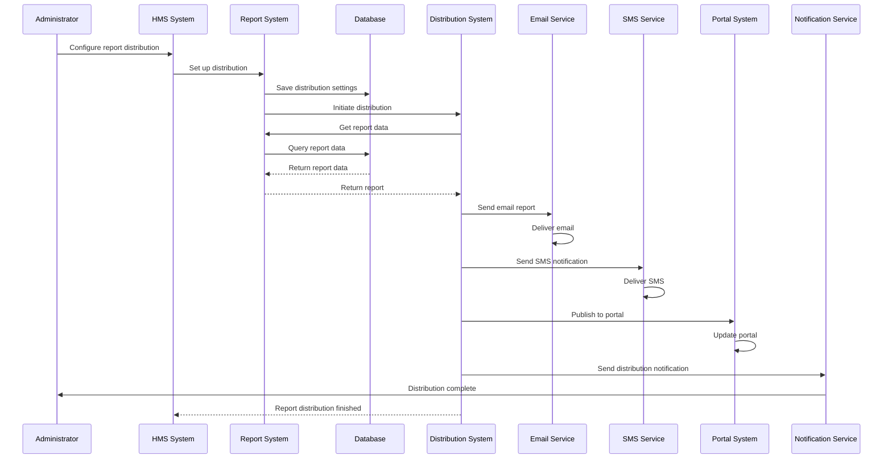
