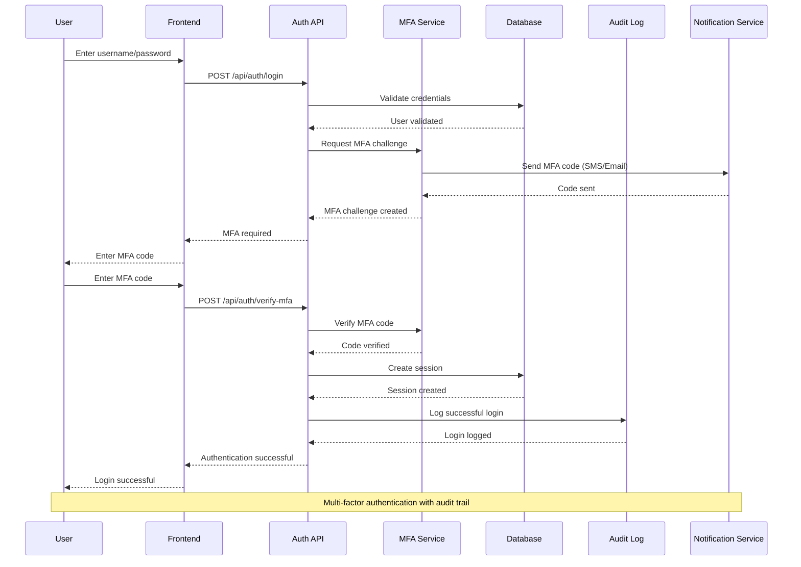
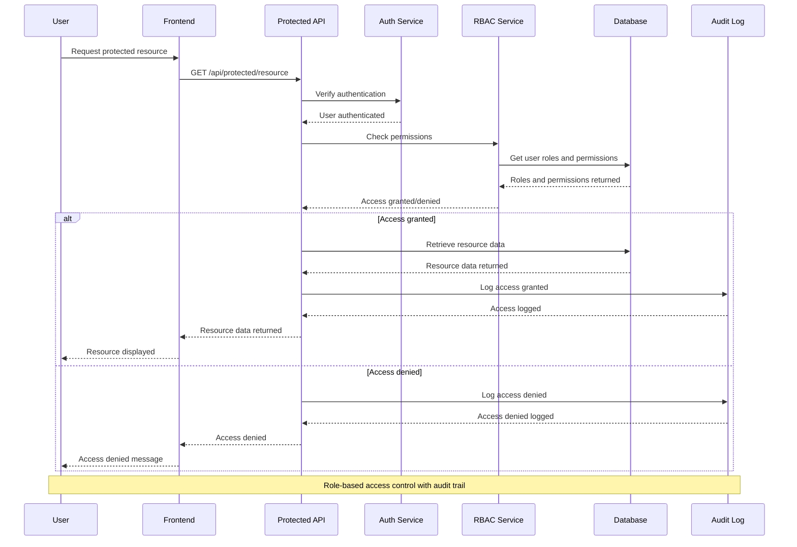
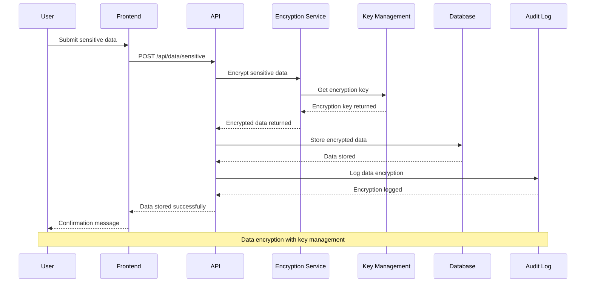
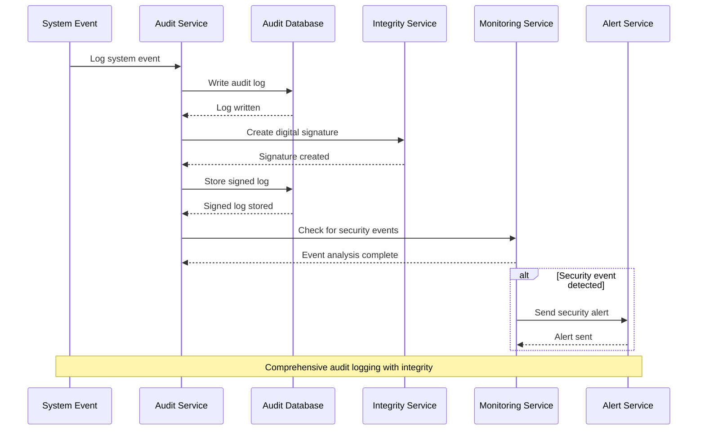
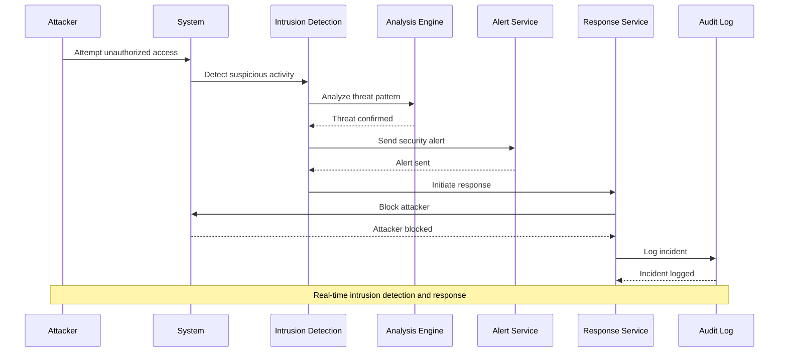
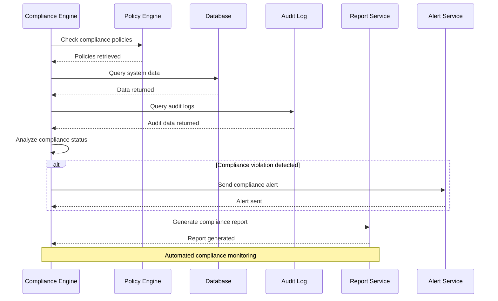
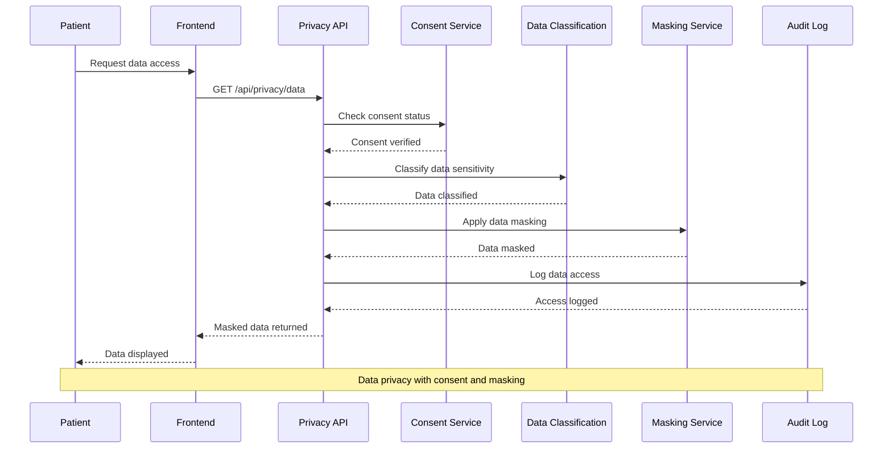
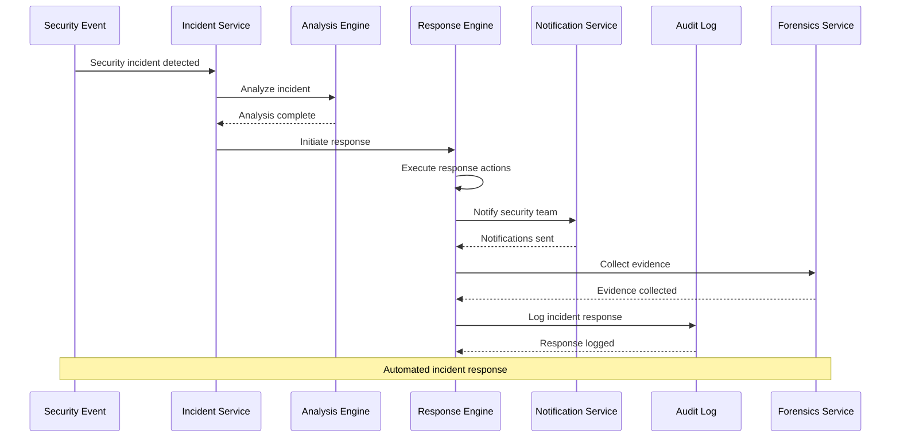
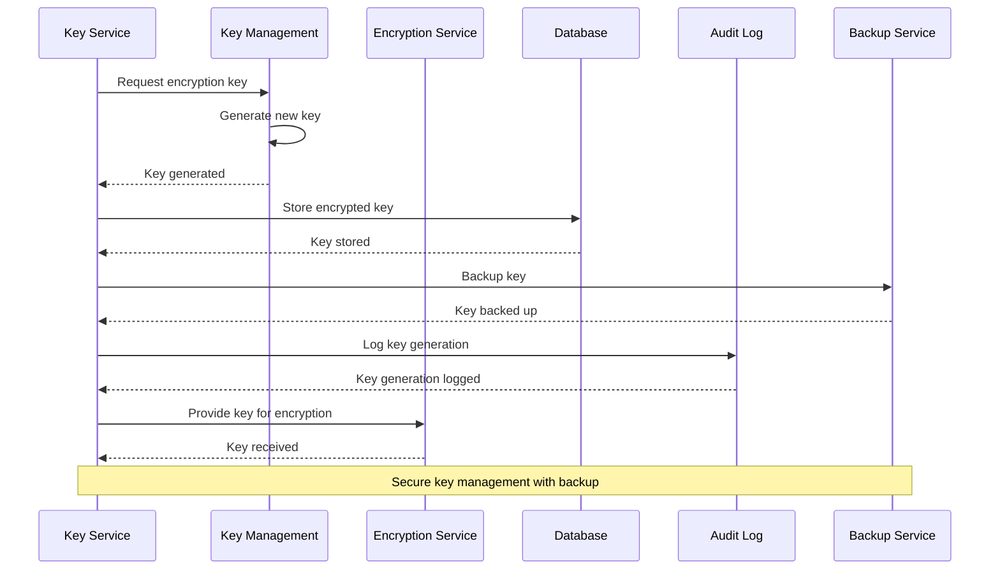
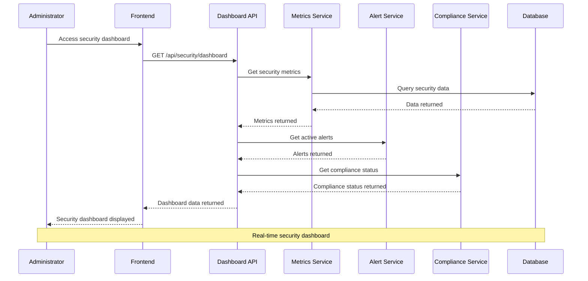

# Security & Audit Features - Enhanced Sequence Diagrams

## 1. Multi-Factor Authentication Workflow

## 2. Role-Based Access Control Workflow

## 3. Data Encryption Workflow

## 4. Audit Logging Workflow

## 5. Intrusion Detection Workflow

## 6. Compliance Monitoring Workflow

## 7. Data Privacy Management Workflow

## 8. Security Incident Response Workflow

## 9. Key Management Workflow

## 10. Security Dashboard Workflow

## Key Features of These Sequence Diagrams

### 1. **Comprehensive Security Coverage**
- Multi-factor authentication with multiple channels
- Role-based access control with granular permissions
- Data encryption with key management
- Intrusion detection and response
- Compliance monitoring and reporting

### 2. **Audit and Compliance**
- Complete audit trail for all security events
- Tamper-proof audit logs with digital signatures
- Automated compliance monitoring
- Regulatory reporting capabilities
- Privacy impact assessments

### 3. **Real-time Security**
- Live threat detection and analysis
- Immediate security alerting
- Automated incident response
- Real-time security dashboard
- Continuous monitoring

### 4. **Data Protection**
- End-to-end encryption
- Field-level data masking
- Consent management
- Data classification
- Privacy controls

### 5. **Integration Points**
- Multi-factor authentication services
- Certificate authorities
- Threat intelligence feeds
- Compliance monitoring tools
- Notification services

These sequence diagrams provide a comprehensive view of the security and audit workflows, ensuring that all security processes are properly documented, monitored, and compliant with regulatory requirements.
