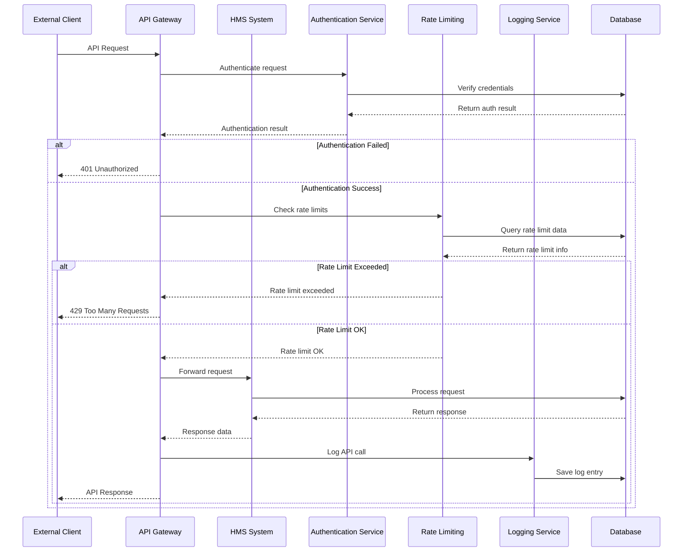
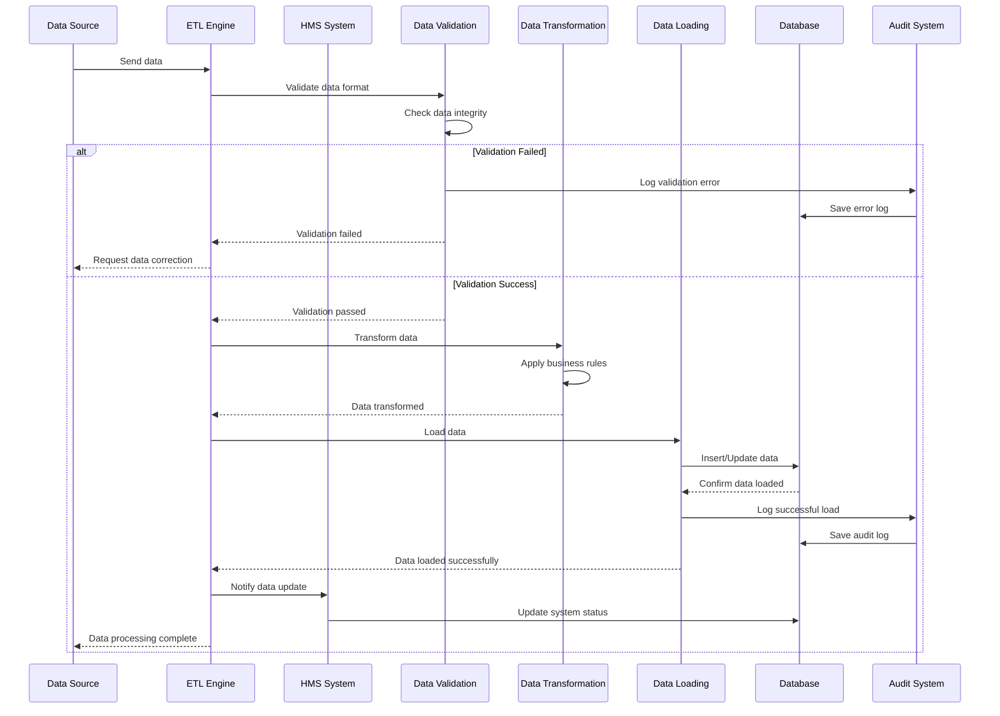
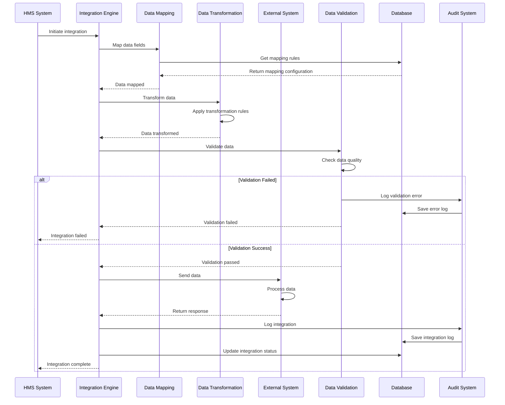
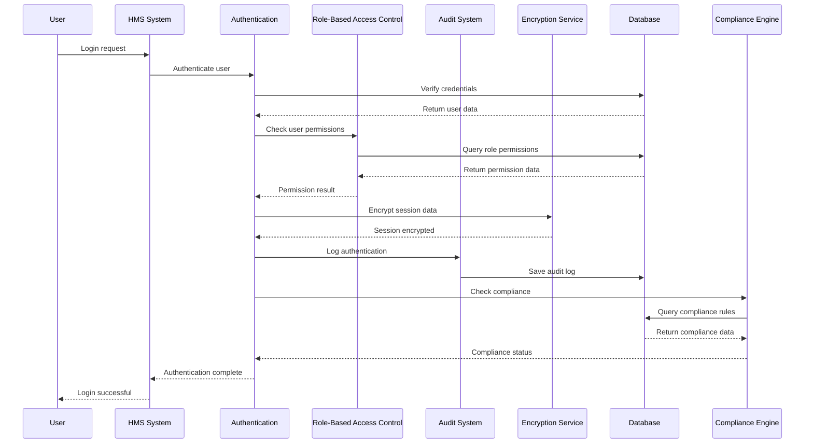
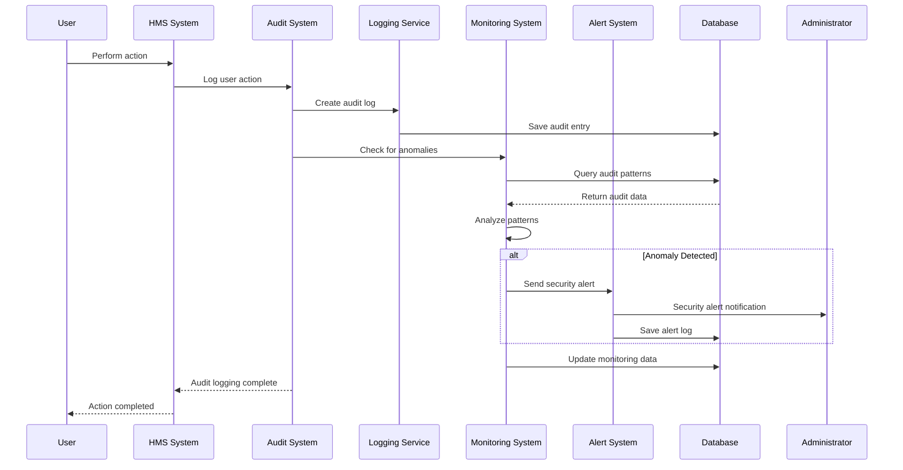
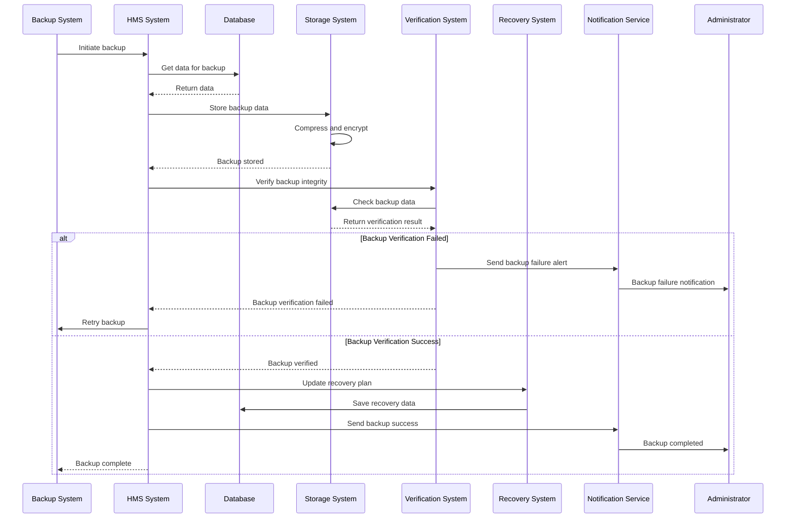
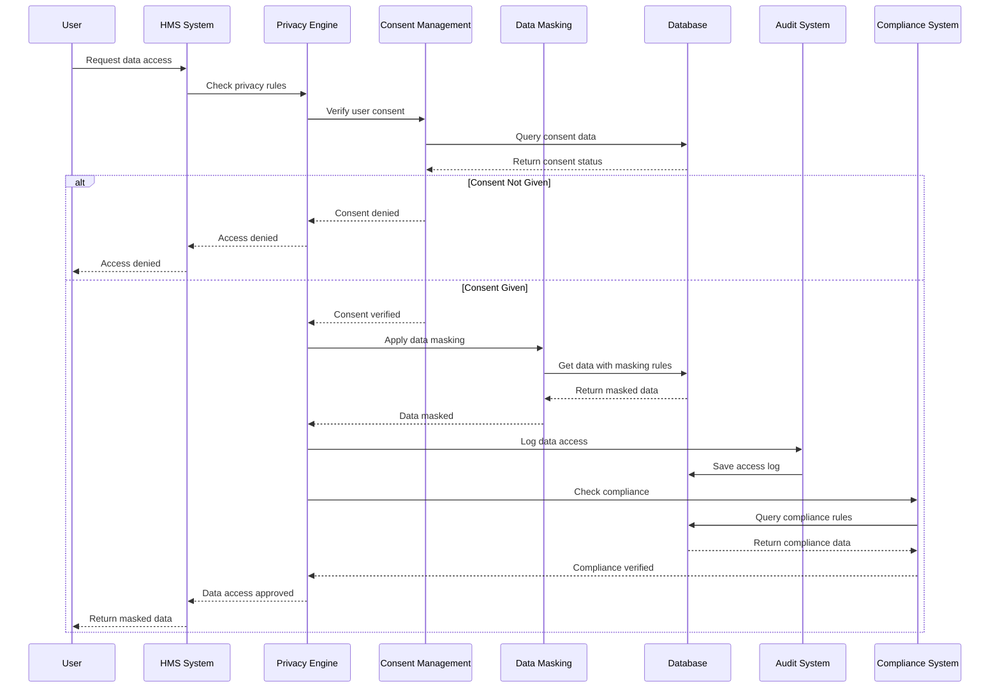
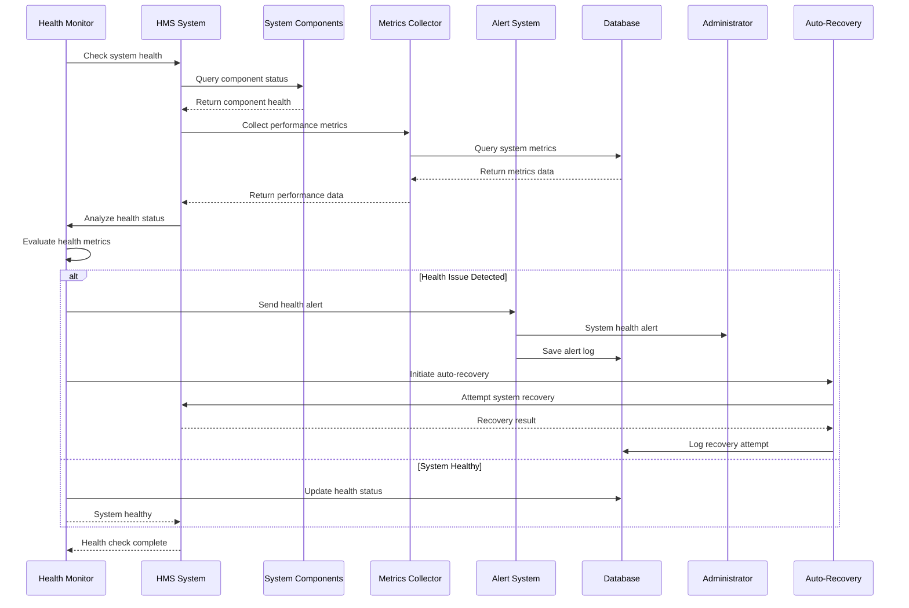
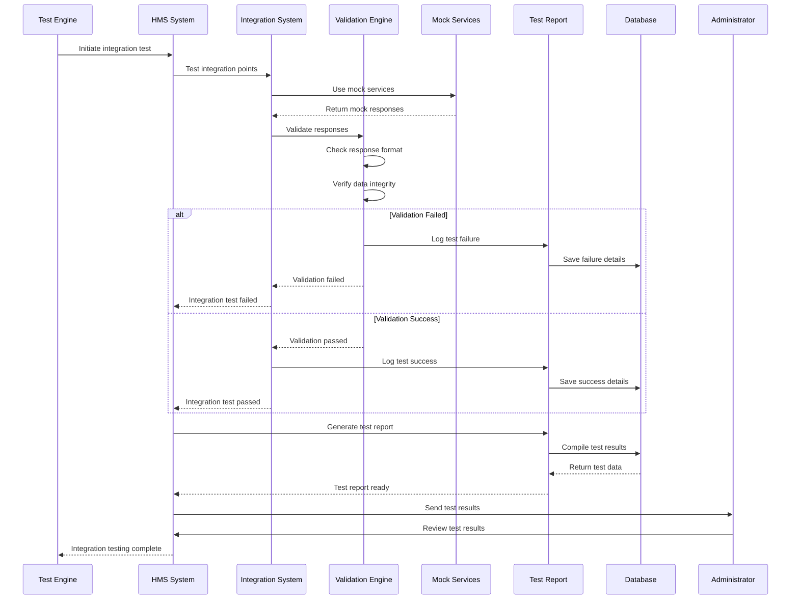
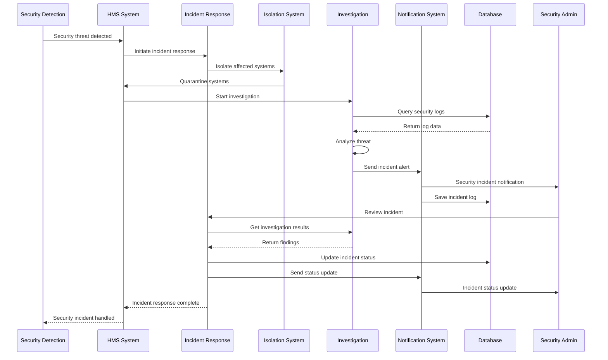

# System Integration & Security Module - End-to-End Sequence Diagram

## API Management and Integration Flow

## Data Integration and ETL Processes Flow

## Third-Party System Integration Flow

## Security Framework and Compliance Flow

## Audit Logging and Monitoring Flow

## Disaster Recovery and Backup Flow

## Data Privacy and Protection Flow

## System Health Monitoring Flow

## Integration Testing and Validation Flow

## Security Incident Response Flow

